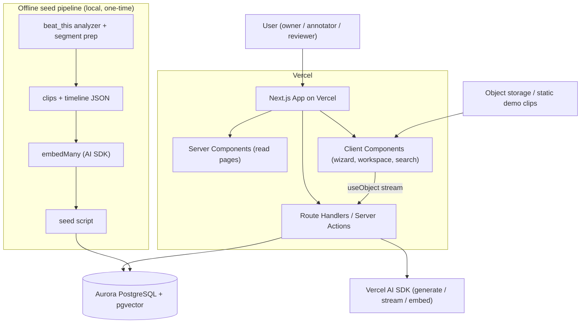

# Design Document

## Overview

AdaptiveLabel is a Next.js (App Router) application deployed on Vercel and backed
by Aurora PostgreSQL with the pgvector extension. It generates schema-driven
video-labeling workspaces from a plain-English description: the Vercel AI SDK
produces a Zod-validated `WorkspaceSchema` (configuration, not code), which is
persisted as an immutable version in Aurora and rendered by a deterministic
renderer into a domain-appropriate labeling studio. Two demo domains — bachata
dance (beat-grid timeline) and sign language (gloss-segment timeline) — run on
the same engine. pgvector powers cross-domain "find similar clips" retrieval over
embeddings computed offline at seed time.

This design covers the Tier 1 core spine (Requirements 1–8) in full, and
describes Tier 2 (Requirements 9–11) at the seam level so they can be added
without rework.

### Design goals
- **Config, not code:** all generated artifacts are validated data consumed by a
  fixed component registry. No runtime code generation or execution.
- **Serverless-safe:** no ffmpeg/Remotion/Python and no embedding generation in
  the request path. All media-derived data and embeddings are seeded offline.
- **Deliberate Aurora usage:** immutable schema versioning, relational workflow
  tables, and pgvector similarity as first-class features.
- **Reuse the pure domain logic** from the existing repo (beat/cycle math) and
  rebuild everything coupled to the local/Astro runtime.

### Non-goals (per plan cut list)
Multi-tenant orgs/roles, real-time collaboration, payments, live media
processing, runtime UI code generation.

## Architecture



### Runtime layers
- **Presentation:** App Router pages. Read-heavy pages (dashboard, workspace
  shell, clip detail) are Server Components; interactive pieces (generation
  wizard, labeling form, timelines, similarity panel) are Client Components.
- **API:** Route handlers under `app/api/*` plus server actions for mutations.
  All AI calls and DB access happen server-side only.
- **Data access:** a thin typed query layer (`lib/db`) over a pooled Postgres
  client. No ORM is required; parameterized SQL is sufficient and keeps the
  vector queries explicit.
- **AI:** `lib/ai` wraps the AI SDK `Output` API for schema generation and
  pre-labeling, and `embedMany` for offline embeddings.

### Offline seed pipeline (not deployed)
A local Node script (`scripts/seed.ts`) reads pre-computed clip/timeline JSON
(produced by running the existing Python `beat_this` analyzer on demo clips for
bachata, and hand/tool-authored gloss segments for sign language), builds each
clip's `search_text`, calls `embedMany` once, and writes projects, schemas,
clips (with embeddings), and tasks into Aurora. This is the only place embeddings
are generated.

## Components and Interfaces

### Configuration contract (`lib/schemas/workspace.ts`)
The single source of truth for generated configuration. Mirrors the plan.

```ts
import { z } from 'zod';

export const FieldType = z.enum([
  'text','textarea','select','multiselect','checkbox',
  'radio','slider','number','time_range','timeline_marker',
]);

export const LabelField = z.object({
  key: z.string().regex(/^[a-z0-9_]+$/),
  label: z.string(),
  help: z.string().nullable(),
  type: FieldType,
  required: z.boolean().default(false),
  options: z.array(z.string()).nullable(),
  min: z.number().nullable(),
  max: z.number().nullable(),
  group: z.string().nullable(),
});

export const TimelineMode = z.enum(['beat_grid','phase_rep','gloss_segments']);

export const WorkspaceSchema = z.object({
  domain: z.string(),
  workspaceName: z.string(),
  timelineMode: TimelineMode,
  fields: z.array(LabelField).min(3).max(24),
  workflowStages: z.array(z.string()),
});
export type WorkspaceSchema = z.infer<typeof WorkspaceSchema>;
```

### AI module (`lib/ai`)
- `generateWorkspaceSchema(description)` — `generateText` + `Output.object({ schema: WorkspaceSchema })`; returns a validated schema or throws. Used by the non-streaming route and as the basis for the streaming variant.
- `generateWorkspaceSchemaStream(description)` — `streamText` + `Output.object`; returns a text stream consumed by `useObject` on the client.
- `preLabelClip(schema, frameRefs)` — Tier 2; `Output.array({ element: FieldDraft })`.
- `embedTexts(values)` — `embedMany`; used only by the seed script.
- `PRESETS` — deterministic bachata and sign-language `WorkspaceSchema` objects used as the fallback (Req 1.9) and for seeding.

### Deterministic renderer (`components/render`)
- `FieldRenderer` — switch over `FieldType` → trusted component. Unknown types are skipped (Req 2.3).
- Field components: `TextField`, `TextAreaField`, `SelectField`, `MultiSelectField`, `CheckboxField`, `RadioField`, `SliderField`, `NumberField`, `TimeRangeField`, `TimelineMarkerField`.
- `WorkspaceForm` — groups fields by `group`, drives validation and submit.
- `TimelineForMode` — mounts `BeatGridTimeline`, `PhaseRepTimeline`, or `GlossSegmentTimeline` from `timelineMode`.

### Timeline modules
- `BeatGridTimeline` — consumes seeded beat/phrase data; reuses transplanted
  `cycle-builder`/`clip-manager`/`beat-marker-utils` (pure TS) for grid math.
- `GlossSegmentTimeline` — renders seeded gloss segment boundaries and
  phrase/sentence grouping.
- `PhaseRepTimeline` — stub for the roadmap (not seeded in the demo).

### Validation (`lib/validation`)
A generic, schema-driven validator (rebuilt; reuses the *patterns* of the
existing `schema-validator.ts`, not its hardcoded fields). Given a
`WorkspaceSchema` and a values object, it checks required presence, enum
membership (from `options`), and numeric range (`min`/`max`), returning a list of
`{ field, rule, message }`.

### API surface

Core (Tier 1):
```
POST /api/generate-schema            -> validated WorkspaceSchema (JSON)
POST /api/generate-schema-stream     -> streamed schema (text stream for useObject)
POST /api/projects/:id/activate-schema -> persist immutable version + fields
GET  /api/projects                   -> list demo projects
GET  /api/projects/:id/clips         -> clips for a project
PUT  /api/annotations/:taskId        -> save/submit annotation (validated)
GET  /api/clips/:id/similar          -> pgvector nearest clips (cross-domain opt)
POST /api/projects/:id/export?format=jsonl -> export artifact
```

Tier 2:
```
GET  /api/review/queue               -> submitted annotations
POST /api/annotations/:id/review     -> decision + audit event
POST /api/clips/:id/pre-label        -> AI draft annotation (source=ai_draft)
POST /api/projects/:id/export?format=csv|project_json
```

### Pages
- `/` dashboard (projects + "create workspace" CTA)
- `/wizard` streaming schema generation + activate
- `/projects/[id]` workspace (queue + video + timeline + adaptive form + similar panel)
- `/projects/[id]/export` export center

## Data Models

Relational core in Aurora (matches Requirement 7/Section 8 of the plan). Vector
column per Requirement 5.

```sql
create extension if not exists vector;

create table projects (
  id uuid primary key default gen_random_uuid(),
  name text not null,
  domain text not null,
  status text not null default 'active',
  created_at timestamptz not null default now()
);

create table label_schemas (
  id uuid primary key default gen_random_uuid(),
  project_id uuid not null references projects(id),
  version integer not null,
  name text not null,
  timeline_mode text not null,
  status text not null default 'active',     -- draft|active|retired
  generation_prompt text,
  created_at timestamptz not null default now(),
  activated_at timestamptz,
  unique (project_id, version)               -- versions are immutable
);

create table label_fields (
  id uuid primary key default gen_random_uuid(),
  schema_id uuid not null references label_schemas(id),
  key text not null,
  label text not null,
  help text,
  field_type text not null,
  required boolean not null default false,
  options_json jsonb not null default '[]',
  min numeric,
  max numeric,
  field_group text,
  order_index integer not null default 0,
  unique (schema_id, key)
);

create table media_assets (
  id uuid primary key default gen_random_uuid(),
  project_id uuid not null references projects(id),
  filename text not null,
  storage_key text not null,
  duration_seconds numeric,
  fps numeric,
  width integer,
  height integer,
  metadata_json jsonb not null default '{}'
);

create table clips (
  id uuid primary key default gen_random_uuid(),
  project_id uuid not null references projects(id),
  media_asset_id uuid references media_assets(id),
  clip_index integer not null,
  title text,
  domain text not null,
  start_frame integer,
  end_frame integer,
  start_seconds numeric,
  end_seconds numeric,
  metadata_json jsonb not null default '{}', -- seeded beat grid or gloss segments
  search_text text,
  embedding vector(1536)
);
create index clips_embedding_idx on clips using hnsw (embedding vector_cosine_ops);

create table labeling_tasks (
  id uuid primary key default gen_random_uuid(),
  project_id uuid not null references projects(id),
  clip_id uuid not null references clips(id),
  schema_id uuid not null references label_schemas(id),
  status text not null default 'queued',
  created_at timestamptz not null default now()
);

create table annotations (
  id uuid primary key default gen_random_uuid(),
  task_id uuid not null references labeling_tasks(id),
  schema_id uuid not null references label_schemas(id),
  source text not null default 'human',      -- human|ai_draft
  status text not null default 'submitted',  -- draft|submitted|approved|rejected
  values_json jsonb not null default '{}',
  confidence_json jsonb,
  validation_json jsonb,
  created_at timestamptz not null default now(),
  updated_at timestamptz not null default now()
);

-- Tier 2
create table annotation_reviews (
  id uuid primary key default gen_random_uuid(),
  annotation_id uuid not null references annotations(id),
  decision text not null,                    -- approved|changes_requested|rejected
  notes text,
  created_at timestamptz not null default now()
);

create table audit_events (
  id uuid primary key default gen_random_uuid(),
  project_id uuid references projects(id),
  actor text,
  event_type text not null,
  entity_type text,
  entity_id uuid,
  before_json jsonb,
  after_json jsonb,
  created_at timestamptz not null default now()
);

create table exports (
  id uuid primary key default gen_random_uuid(),
  project_id uuid not null references projects(id),
  format text not null,                      -- jsonl|csv|project_json
  status text not null default 'succeeded',
  storage_key text,
  filters_json jsonb not null default '{}',
  created_at timestamptz not null default now(),
  completed_at timestamptz
);
```

### Key flows
- **Schema activation:** insert `label_schemas` row with the next `version`, then
  `label_fields`; never mutate an existing version (Req 1.7).
- **Annotation submit:** validate against the active schema's fields; persist
  `annotations` with `values_json` keyed by field `key` (Req 4).
- **Similarity:** `order by embedding <=> $queryEmbedding` with optional
  cross-domain flag; query embedding is the *stored* embedding of the source clip
  (no embedding computed at request time) (Req 5.3–5.5).

## Technical Decisions

- **Aurora PostgreSQL + pgvector** over DynamoDB: relational workflow state,
  immutable versioning, and vector similarity are all first-class. Matches the
  plan's "deliberate data model" goal.
- **Parameterized SQL via a pooled client** (e.g., `pg` with a pooler / RDS
  Proxy-style approach) over an ORM: keeps vector queries explicit and avoids
  ORM/serverless cold-start friction within the time box (Req 7.3).
- **AI SDK `Output` API** for structured generation; pin `ai` / `@ai-sdk/react`
  versions and re-verify `Output`/`useObject` signatures on build day.
- **Embeddings offline only**, dimension `1536` matched to the embedding model;
  HNSW index built after seeding (Req 5.6).
- **Reuse pure TS** (`cycle-builder`, `clip-manager`, `beat-marker-utils`,
  slug/url utils, type/enum seeds); do not port subprocess/Remotion/local-persist
  code.

## Error Handling

- **Schema generation:** Zod validation failure → reject with a structured error;
  no persistence (Req 1.3). Live model failure → deterministic preset fallback
  (Req 1.9). Streaming errors handled via the AI SDK `onError` callback.
- **Renderer:** unknown field type → skip safely (Req 2.3); missing optional
  values → hidden; missing required values → block submit.
- **Annotation submit:** validation errors returned as `{ field, rule, message }`
  and surfaced inline; submission blocked (Req 4.3).
- **Similarity query:** if a clip has no embedding, return an empty result with a
  clear message rather than erroring.
- **DB:** parameterized queries only; pooled connections; fail closed on write
  errors with a user-visible error and no partial commit.

## Testing Strategy

- **Unit:** Zod schema acceptance/rejection; generic validator (required/enum/
  range); transplanted beat/cycle math (reuse existing tests); export serializers
  (JSONL/CSV/project-JSON).
- **Integration:** generate → activate → render → submit → export against a test
  Aurora/Postgres; similarity query returns ordered neighbors and supports the
  cross-domain flag.
- **Renderer:** snapshot/interaction tests that the bachata schema yields the
  beat-grid timeline and the sign-language schema yields the gloss timeline from
  the same renderer (Req 3).
- **Safety:** assert no code path executes generated strings; assert no
  ffmpeg/Python/embedding call occurs in request handlers.
- **Manual demo run-through:** the full Section 12 demo script end to end on the
  deployed Vercel URL before recording.

## Correctness Properties

These invariants should hold across the system and are good targets for
property-based and integration tests:

### Property 1: Schema validity
Any schema accepted for activation parses against `WorkspaceSchema`; field `key`s
are unique within a schema and match `^[a-z0-9_]+$`; field count is between 3 and
24.

**Validates: Requirements 1.2, 1.6**

### Property 2: Version immutability
Once a `label_schemas` row is activated, its fields never change; edits always
create a new `(project_id, version)`.

**Validates: Requirements 1.7**

### Property 3: Render totality
For any validated schema, the renderer produces UI without throwing and without
executing any generated string; unknown field types are skipped, not run.

**Validates: Requirements 2.2, 2.3, 8.2, 8.3**

### Property 4: Annotation/schema consistency
Every persisted annotation's `values_json` keys are a subset of the active
schema's field keys, and a submitted annotation satisfies all required/enum/range
rules.

**Validates: Requirements 4.2, 4.5**

### Property 5: Embedding/query separation
No request handler computes an embedding; every stored embedding has the same
dimension as the configured model.

**Validates: Requirements 5.5, 5.6, 8.4**

### Property 6: Similarity ordering
Results of `/api/clips/:id/similar` are sorted by non-decreasing cosine distance,
and the source clip is excluded from its own results.

**Validates: Requirements 5.3, 5.4**

### Property 7: Export fidelity
Every exported record references an existing clip and a valid schema version; the
record count equals the number of annotations matching the export filter.

**Validates: Requirements 6.1, 6.2**

## Requirements Coverage

- R1 → AI module + `/api/generate-schema(.stream)`, activation, presets/fallback.
- R2 → `FieldRenderer`/`WorkspaceForm` deterministic switch.
- R3 → `TimelineForMode` + bachata/sign-language seeds.
- R4 → annotation submit + generic validator + `annotations` table.
- R5 → pgvector column/index, offline `embedMany`, `/api/clips/:id/similar`.
- R6 → JSONL export + `exports` table.
- R7 → Vercel deploy, pooled Aurora access, seed script, env config.
- R8 → Zod-on-all-AI-output, no runtime codegen, no runtime media, IP-clean media.
- R9–R11 → review/audit tables + routes, pre-label route, CSV/project-JSON
  serializers (Tier 2 seams).
