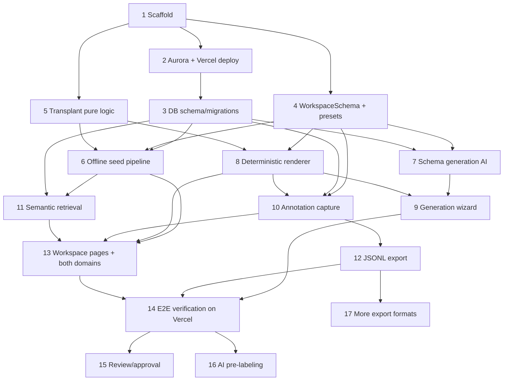

# Implementation Plan

## Overview

Tasks are ordered to ship the Tier 1 core spine first (a deployed, working
demo), then layer Tier 2. Each task references the requirements it implements.
Build incrementally: deploy early (Task 2) and keep the deployed link working.

## Tasks

- [x] 1. Scaffold the Next.js app and tooling
  - Create a new Next.js (App Router, TypeScript) project with Tailwind and a UI
    primitive set (shadcn-style).
  - Add `pg` (pooled client), `ai`, `@ai-sdk/react`, and `zod`; pin versions.
  - Set up env var scaffolding (`DATABASE_URL`, AI provider key, storage config).
  - Add Vitest and a test script.
  - _Requirements: 7.1, 7.5_

- [ ] 2. Provision Aurora + Vercel and verify the connection in production
  - Provision Aurora PostgreSQL; enable the `vector` extension.
  - Create the Vercel project; wire env vars; deploy the empty shell.
  - Add a `/api/health` route that runs a trivial Aurora query and confirm it
    returns OK on the deployed URL.
  - _Requirements: 7.1, 7.2, 7.3, 5.1_

- [x] 3. Create the database schema (migrations)
  - Write migration SQL for all Section "Data Models" tables: `projects`,
    `label_schemas`, `label_fields`, `media_assets`, `clips` (incl. `search_text`
    and `embedding vector(1536)`), `labeling_tasks`, `annotations`,
    `annotation_reviews`, `audit_events`, `exports`.
  - Add the HNSW index on `clips.embedding` (created after seeding).
  - Add a `lib/db` typed query layer over the pooled client.
  - _Requirements: 7.2, 7.3, 5.1, 1.7_

- [x] 4. Define the WorkspaceSchema contract and domain presets
  - Implement `lib/schemas/workspace.ts` (`FieldType`, `LabelField`,
    `TimelineMode`, `WorkspaceSchema`) exactly as in the design.
  - Implement deterministic `PRESETS` for bachata (`beat_grid`) and sign language
    (`gloss_segments`).
  - Unit tests: valid presets parse; invalid field types / out-of-range field
    counts / bad keys are rejected.
  - _Requirements: 1.2, 1.6, 8.1_ (Property 1)

- [x] 5. Transplant pure domain logic from the existing repo
  - Copy `cycle-builder.ts`, `clip-manager.ts`, `beat-marker-utils.ts`, and the
    slug/url utilities into the new app; port their existing unit tests.
  - Adapt imports/types; do not bring subprocess/Remotion/local-persistence code.
  - _Requirements: 3.1, 3.4_

- [x] 6. Build the offline seed pipeline
- [x] 6.1 Prepare seeded clip/timeline JSON for both domains
  - Run the existing Python `beat_this` analyzer locally on IP-clean bachata demo
    clips to produce beat grids; author gloss-segment JSON for sign-language demo
    clips. Output a `seed/*.json` dataset (projects, clips, timeline metadata).
  - _Requirements: 3.4, 3.5, 8.5_
- [x] 6.2 Compute embeddings and write seed to Aurora
  - In `scripts/seed.ts`, build each clip's `search_text`, call `embedMany` once,
    and insert projects, an activated schema version + fields (from PRESETS),
    clips (with embeddings), media assets, and labeling tasks.
  - Build the HNSW index after rows are inserted.
  - _Requirements: 5.2, 5.6, 7.4_ (Property 5)

- [x] 7. Implement schema generation (AI)
- [x] 7.1 Non-streaming generation + validation + fallback
  - `lib/ai/generateWorkspaceSchema(description)` using `generateText` +
    `Output.object({ schema: WorkspaceSchema })`.
  - `POST /api/generate-schema`: validate output, return it; on Zod failure return
    a structured error and persist nothing; on model failure return the matching
    deterministic preset.
  - Unit/integration tests for the validation-failure and fallback paths.
  - _Requirements: 1.1, 1.2, 1.3, 1.4, 1.5, 1.9, 8.1_
- [x] 7.2 Streaming generation route
  - `lib/ai/generateWorkspaceSchemaStream` using `streamText` + `Output.object`
    with an `onError` handler; expose `POST /api/generate-schema-stream`.
  - _Requirements: 1.8_
- [x] 7.3 Schema activation (immutable versioning)
  - `POST /api/projects/:id/activate-schema`: insert the next `label_schemas`
    version + `label_fields` rows; never mutate an existing version; store the
    generation prompt.
  - Integration test asserting version immutability.
  - _Requirements: 1.7_ (Property 2)

- [x] 8. Build the deterministic renderer
- [x] 8.1 Field components and FieldRenderer switch
  - Implement the field components and `FieldRenderer` (switch over `FieldType`);
    unknown types are skipped, never executed.
  - _Requirements: 2.2, 2.3, 8.2, 8.3_ (Property 3)
- [x] 8.2 WorkspaceForm with grouping and constraints
  - `WorkspaceForm` groups fields by `group`, applies `options`/`min`/`max`,
    tracks dirty state.
  - _Requirements: 2.1, 2.4, 2.5_
- [x] 8.3 Timeline modules and TimelineForMode
  - `TimelineForMode` mounts `BeatGridTimeline` (reusing transplanted beat math),
    `GlossSegmentTimeline`, and a `PhaseRepTimeline` stub, selected by
    `timelineMode`.
  - _Requirements: 2.6, 3.1, 3.2_

- [x] 9. Implement the generation wizard page
  - `/wizard` client page using `useObject` against the streaming route; render
    fields as they stream in; on accept, call activation (Task 7.3).
  - _Requirements: 1.1, 1.8_

- [x] 10. Implement annotation capture and persistence
- [x] 10.1 Generic schema-driven validator
  - `lib/validation`: given a schema + values, check required presence, enum
    membership (from `options`), and numeric range; return `{field,rule,message}`.
  - Unit tests covering each rule.
  - _Requirements: 4.2, 4.3_ (Property 4)
- [x] 10.2 Save/submit endpoint and workspace wiring
  - `PUT /api/annotations/:taskId`: validate against the active schema; on success
    persist to `annotations` (source `human`) with `values_json` keyed by field
    `key`; on failure return errors and block.
  - Wire `WorkspaceForm` submit to it.
  - _Requirements: 4.1, 4.4, 4.5_ (Property 4)

- [x] 11. Implement semantic retrieval (pgvector)
  - `GET /api/clips/:id/similar`: load the source clip's stored embedding, run the
    cosine-distance query (HNSW), exclude the source clip, support a cross-domain
    flag; never compute an embedding in the handler.
  - "Find similar movements" panel in the workspace.
  - Integration test asserting ordered neighbors, source exclusion, and
    cross-domain results.
  - _Requirements: 5.3, 5.4, 5.5, 8.4_ (Properties 5, 6)

- [x] 12. Implement JSONL export
  - `POST /api/projects/:id/export?format=jsonl`: stream one annotation per line
    incl. clip ref, schema version, values, and status; record a row in `exports`;
    return a downloadable artifact.
  - Unit test for the serializer; integration test for record count vs filter.
  - _Requirements: 6.1, 6.2, 6.3, 6.4_ (Property 7)

- [x] 13. Wire the project/workspace pages and seed both domains
  - `/` dashboard listing seeded projects; `/projects/[id]` workspace composing
    queue + video + `TimelineForMode` + `WorkspaceForm` + similar panel.
  - Confirm the bachata project renders the beat grid and the sign-language
    project renders the gloss timeline from the same renderer.
  - _Requirements: 3.1, 3.2, 3.3_

- [ ] 14. End-to-end verification of the core spine on Vercel
  - Run the full path on the deployed URL: generate → activate → label → submit →
    find similar → export JSONL.
  - Add a safety check/test asserting no request handler calls
    ffmpeg/Python/embedding.
  - Capture the AWS DB proof screenshot and confirm the public link works.
  - _Requirements: 7.1, 7.2, 8.4, 8.5_

---

### Tier 2 (should-have — only after the core spine is deployed and polished)

- [ ] 15. Review and approval workflow
  - Review queue (`GET /api/review/queue`); decision endpoint
    (`POST /api/annotations/:id/review`) updating status and writing an
    `audit_events` row; "approved-only" export filter.
  - _Requirements: 9.1, 9.2, 9.3, 9.4_

- [ ] 16. AI pre-labeling with confidence
  - `POST /api/clips/:id/pre-label` using `Output.array({ element: FieldDraft })`;
    persist as `annotations` source `ai_draft`; discard drafts whose keys are not
    in the active schema; highlight low-confidence fields in the form.
  - _Requirements: 10.1, 10.2, 10.3, 10.4, 10.5_

- [ ] 17. Additional export formats
  - CSV (column per field + clip/status) and project-JSON (schema version + all
    annotations); record each in `exports`.
  - _Requirements: 11.1, 11.2, 11.3_

## Task Dependency Graph

```json
{
  "waves": [
    { "wave": 1, "tasks": ["1"] },
    { "wave": 2, "tasks": ["2", "4", "5"] },
    { "wave": 3, "tasks": ["3"] },
    { "wave": 4, "tasks": ["6", "7", "8"] },
    { "wave": 5, "tasks": ["9", "10", "11"] },
    { "wave": 6, "tasks": ["12", "13"] },
    { "wave": 7, "tasks": ["14"] },
    { "wave": 8, "tasks": ["15", "16", "17"] }
  ]
}
```



## Notes

- Tier 1 = Tasks 1–14 (the must-ship core spine). Do not start Tier 2 (Tasks
  15–17) until Tasks 1–14 are deployed and working on Vercel.
- Deploy at Task 2 and re-verify the public link after each major task; protect
  the working deployment above all (Stage One is pass/fail).
- All embeddings and media-derived data come from the offline seed (Task 6); no
  ffmpeg/Python/embedding runs in any request handler.
- Pin `ai` / `@ai-sdk/react` versions and re-confirm `Output` / `useObject`
  signatures on build day; match the `vector(N)` dimension to the embedding model.
- Property references in tasks map to the design's Correctness Properties.
