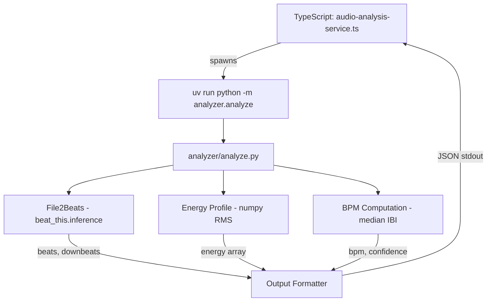

# Design Document: beat-this-integration

## Overview

This design replaces the librosa-based beat detection pipeline in `analyzer/analyze.py` with [beat_this](https://github.com/CPJKU/beat_this) (CPJKU/beat_this), a transformer-based beat and downbeat tracker from ISMIR 2024. The migration is a clean swap of the inference backend — the CLI interface, output JSON contract, and TypeScript service integration remain unchanged.

Key design decisions:
- **Direct File2Beats usage**: The `beat_this.inference.File2Beats` class handles audio loading, preprocessing, model inference, and postprocessing in a single call, returning beat and downbeat timestamp arrays.
- **BPM derived from beat timestamps**: Instead of relying on librosa's tempo estimation, BPM is computed as `60 / median(inter-beat intervals)` from the detected beat grid.
- **Native downbeat detection**: beat_this returns downbeats directly, eliminating the fragile RMS-based `_identify_downbeat` heuristic.
- **Energy profile via numpy/scipy**: RMS energy is computed with a simple numpy windowed computation (no librosa needed).
- **No changes to TypeScript layer**: The `audio-analysis-service.ts` spawns the same CLI command and parses the same JSON shape.

## Architecture



The architecture remains a subprocess-based pipeline. The Python analyzer is the only component that changes internally. The TypeScript service continues to spawn `uv run python -m analyzer.analyze <wav_path> --fps <fps>` and parse the JSON output.

### Module Structure (after migration)

```
analyzer/
├── __init__.py
├── __main__.py          # Entry point (unchanged)
├── analyze.py           # Main module — rewritten internals
└── tests/
    ├── __init__.py
    ├── conftest.py
    └── test_analyze.py  # Updated tests
```

No new files are introduced. The `analyze.py` module is rewritten in place with the same public API (`analyze(wav_path, fps) -> dict` and `main()`).

## Components and Interfaces

### 1. Beat Detection Component (File2Beats)

**Responsibility**: Load audio, run the beat_this transformer model, return beat and downbeat timestamps.

```python
from beat_this.inference import File2Beats

# Instantiated once at module level (lazy singleton)
_file2beats: File2Beats | None = None

def _get_file2beats() -> File2Beats:
    """Lazy-initialize the File2Beats inference object."""
    global _file2beats
    if _file2beats is None:
        import torch
        device = "cuda" if torch.cuda.is_available() else "cpu"
        _file2beats = File2Beats(checkpoint_path="final0", device=device, dbn=False)
    return _file2beats
```

**Interface**: `File2Beats.__call__(audio_path: str) -> tuple[np.ndarray, np.ndarray]`
- Returns `(beats, downbeats)` — both are 1D numpy arrays of timestamps in seconds.

**Design rationale**: Lazy initialization avoids loading the ~78MB model until actually needed (important for test imports). The singleton pattern avoids reloading the model on repeated calls within the same process.

### 2. BPM Computation Component

**Responsibility**: Derive BPM and confidence from beat timestamps.

```python
def _compute_bpm(beat_timestamps: np.ndarray) -> tuple[float, float]:
    """Compute BPM and confidence from beat timestamps.
    
    Returns (bpm, confidence) where:
    - bpm = 60 / median(inter-beat intervals), or 0.0 if < 2 beats
    - confidence = 1 - clamp(cv, 0, 1) where cv is the coefficient of variation
      of inter-beat intervals. Perfectly regular beats → confidence ≈ 1.0.
    """
    if len(beat_timestamps) < 2:
        return 0.0, 0.0
    
    ibis = np.diff(beat_timestamps)
    median_ibi = float(np.median(ibis))
    
    if median_ibi <= 0:
        return 0.0, 0.0
    
    bpm = 60.0 / median_ibi
    
    # Confidence: based on coefficient of variation of IBIs
    # Low CV = consistent intervals = high confidence
    std_ibi = float(np.std(ibis))
    cv = std_ibi / median_ibi  # coefficient of variation
    confidence = float(np.clip(1.0 - cv, 0.0, 1.0))
    
    return bpm, confidence
```

**Design rationale**: 
- Median is robust to occasional missed/extra beats (outlier-resistant).
- Coefficient of variation (std/mean) naturally measures interval consistency and maps to [0,1] after clamping.
- This replaces librosa's autocorrelation-based confidence which was coupled to librosa's onset envelope.

### 3. Energy Profile Component

**Responsibility**: Compute per-frame RMS energy without librosa.

```python
def _compute_energy_profile(wav_path: str, sr: int = 22050, hop_length: int = 512) -> list[float]:
    """Compute RMS energy profile using scipy for audio loading and numpy for RMS.
    
    Matches librosa's default behavior: sr=22050, hop_length=512, frame_length=2048.
    """
    from scipy.io import wavfile
    import numpy as np
    
    file_sr, audio = wavfile.read(wav_path)
    
    # Convert to float32 mono
    if audio.dtype == np.int16:
        audio = audio.astype(np.float32) / 32768.0
    elif audio.dtype == np.int32:
        audio = audio.astype(np.float32) / 2147483648.0
    elif audio.dtype != np.float32:
        audio = audio.astype(np.float32)
    
    # Mix to mono if stereo
    if audio.ndim == 2:
        audio = audio.mean(axis=1)
    
    # Resample to target sr if needed
    if file_sr != sr:
        from scipy.signal import resample
        num_samples = int(len(audio) * sr / file_sr)
        audio = resample(audio, num_samples).astype(np.float32)
    
    # Compute RMS with windowed frames (matching librosa defaults)
    frame_length = 2048
    # Pad audio to ensure we get frames for the full duration
    pad_length = frame_length // 2
    audio_padded = np.pad(audio, (pad_length, pad_length), mode='reflect')
    
    num_frames = 1 + (len(audio_padded) - frame_length) // hop_length
    energy = np.zeros(num_frames, dtype=np.float32)
    
    for i in range(num_frames):
        start = i * hop_length
        frame = audio_padded[start:start + frame_length]
        energy[i] = np.sqrt(np.mean(frame ** 2))
    
    return energy.tolist()
```

**Design rationale**:
- Uses `scipy.io.wavfile` for audio loading (already a transitive dependency of beat_this via torchaudio/scipy).
- Matches librosa's RMS defaults: `frame_length=2048`, `hop_length=512`, `sr=22050`, center-padded with reflect mode.
- Pure numpy computation — no external signal processing library needed beyond scipy for resampling.

### 4. Audio Validation Component

**Responsibility**: Validate input audio before processing.

```python
def _validate_audio(wav_path: str) -> np.ndarray:
    """Load and validate audio, returning the signal array.
    
    Raises:
        FileNotFoundError: if wav_path doesn't exist
        ValueError: if audio is too short (< 1 second) or silent
    """
    if not os.path.isfile(wav_path):
        raise FileNotFoundError(f"WAV file not found: {wav_path}")
    
    from scipy.io import wavfile
    sr, audio = wavfile.read(wav_path)
    
    # Convert to float
    if audio.dtype == np.int16:
        audio = audio.astype(np.float32) / 32768.0
    elif audio.ndim == 2:
        audio = audio.mean(axis=1)
    
    duration = len(audio) / sr
    if duration < 1.0:
        raise ValueError(f"Audio too short for analysis ({duration:.2f}s). Need at least 1 second.")
    
    if np.max(np.abs(audio)) < 1e-6:
        raise ValueError("Audio appears to be silent — no signal detected.")
    
    return audio
```

### 5. Output Formatter

**Responsibility**: Assemble and format the final JSON-compatible dict.

```python
def _format_output(
    bpm: float,
    confidence: float,
    downbeat_offset: float,
    beat_timestamps: np.ndarray,
    fps: float,
    energy_profile: list[float],
) -> dict:
    """Format analysis results into the output contract."""
    timestamps_list = sorted(float(t) for t in beat_timestamps)
    frames_list = [round(t * fps) for t in timestamps_list]
    
    return {
        "bpm": round(bpm, 2),
        "bpm_confidence": round(confidence, 4),
        "downbeat_offset_seconds": round(downbeat_offset, 6),
        "beat_timestamps": [round(t, 6) for t in timestamps_list],
        "beat_frames": frames_list,
        "energy_profile": [round(e, 6) for e in energy_profile],
    }
```

### 6. Main `analyze()` Function

```python
def analyze(wav_path: str, fps: float) -> dict:
    """Run beat_this analysis on the given WAV file.
    
    Returns a dict matching the JSON output contract.
    """
    # 1. Validate audio
    _validate_audio(wav_path)
    
    # 2. Run beat_this inference
    try:
        f2b = _get_file2beats()
    except Exception as exc:
        raise RuntimeError(f"Failed to load beat_this model: {exc}") from exc
    
    beats, downbeats = f2b(wav_path)
    
    # 3. Compute BPM and confidence
    bpm, confidence = _compute_bpm(beats)
    
    # 4. Determine downbeat offset
    downbeat_offset = float(downbeats[0]) if len(downbeats) > 0 else 0.0
    
    # 5. Compute energy profile
    energy_profile = _compute_energy_profile(wav_path)
    
    # 6. Format and return
    return _format_output(bpm, confidence, downbeat_offset, beats, fps, energy_profile)
```

### 7. TypeScript Service (No Changes)

The `src/services/audio-analysis-service.ts` remains unchanged. It spawns:
```
uv run python -m analyzer.analyze <wavPath> --fps <fps>
```
and parses the same `PythonAnalyzerOutput` interface. No modifications needed.

## Data Models

### Output JSON Contract (unchanged)

```typescript
interface PythonAnalyzerOutput {
  bpm: number;              // float, rounded to 2dp
  bpm_confidence: number;   // float in [0,1], rounded to 4dp
  downbeat_offset_seconds: number;  // float, rounded to 6dp
  beat_timestamps: number[];        // sorted floats in seconds, rounded to 6dp
  beat_frames: number[];            // sorted integers, frame = round(ts * fps)
  energy_profile: number[];         // non-negative floats, rounded to 6dp
}
```

### Internal Data Flow

```
WAV file path
    │
    ▼
┌─────────────────────┐
│ _validate_audio()   │ → FileNotFoundError / ValueError
└─────────────────────┘
    │
    ▼
┌─────────────────────┐
│ File2Beats(path)    │ → (beats: ndarray[float64], downbeats: ndarray[float64])
└─────────────────────┘
    │
    ▼
┌─────────────────────┐
│ _compute_bpm(beats) │ → (bpm: float, confidence: float)
└─────────────────────┘
    │
    ▼
┌──────────────────────────┐
│ _compute_energy_profile()│ → list[float]
└──────────────────────────┘
    │
    ▼
┌─────────────────────┐
│ _format_output()    │ → dict (JSON-serializable)
└─────────────────────┘
```

### Dependency Changes (pyproject.toml)

```toml
[project]
name = "bachata-audio-analyzer"
version = "0.2.0"
description = "Beat-this-based audio analyzer for bachata BPM detection, beat tracking, and energy profiling"
requires-python = ">=3.11"
dependencies = [
    "beat-this @ git+https://github.com/CPJKU/beat_this.git",
    "torch>=2.0.0",
    "torchaudio>=2.0.0",
    "numpy>=1.24.0",
    "scipy>=1.10.0",
    "yt-dlp>=2024.1.0",
]
```

**Removed**: `librosa>=0.10.0`  
**Added**: `beat-this` (from GitHub), `torch`, `torchaudio`, `scipy`

## Correctness Properties

*A property is a characteristic or behavior that should hold true across all valid executions of a system — essentially, a formal statement about what the system should do. Properties serve as the bridge between human-readable specifications and machine-verifiable correctness guarantees.*

### Property 1: Beat timestamps are sorted and correctly rounded

*For any* set of beat timestamps returned by the inference model, the output `beat_timestamps` array SHALL be sorted in strictly non-decreasing order and each value SHALL be rounded to exactly 6 decimal places.

**Validates: Requirements 1.2, 5.5**

### Property 2: Frame conversion correctness

*For any* beat timestamp `t` and any positive FPS value `f`, the corresponding entry in `beat_frames` SHALL equal `round(t * f)`, and the `beat_frames` array SHALL be sorted in non-decreasing order.

**Validates: Requirements 1.3, 5.6**

### Property 3: BPM equals 60 divided by median inter-beat interval

*For any* list of 2 or more beat timestamps (sorted, positive), the computed BPM SHALL equal `60.0 / median(diff(timestamps))` (within floating-point tolerance after rounding to 2dp).

**Validates: Requirements 3.1, 5.2**

### Property 4: BPM confidence is bounded in [0, 1]

*For any* list of beat timestamps (including empty lists), the computed `bpm_confidence` SHALL be a float in the range [0.0, 1.0].

**Validates: Requirements 3.3, 5.3**

### Property 5: Downbeat offset equals first downbeat timestamp

*For any* non-empty downbeat array, `downbeat_offset_seconds` SHALL equal the first element of that array (rounded to 6dp). For an empty downbeat array, it SHALL be 0.0.

**Validates: Requirements 2.1, 2.2, 5.4**

### Property 6: Energy profile is non-empty with non-negative values and correct length

*For any* valid audio signal (duration ≥ 1s, non-silent), the `energy_profile` SHALL be a non-empty list where every value is ≥ 0.0, and the length SHALL be approximately `ceil(num_samples / hop_length)` (within ±2 frames tolerance).

**Validates: Requirements 4.1, 4.2, 4.3, 5.7**

### Property 7: Output contract structure

*For any* valid analysis result, the output dictionary SHALL contain exactly the keys `{bpm, bpm_confidence, downbeat_offset_seconds, beat_timestamps, beat_frames, energy_profile}` with no additional or missing keys.

**Validates: Requirements 5.1**

### Property 8: Inter-beat interval consistency

*For any* analysis result where `bpm > 0`, at least 85% of inter-beat intervals SHALL be within 15% of the expected interval (`60 / bpm`).

**Validates: Requirements 10.2**

## Error Handling

| Condition | Exception | Message Pattern |
|-----------|-----------|-----------------|
| WAV file doesn't exist | `FileNotFoundError` | `"WAV file not found: {path}"` |
| Audio < 1 second | `ValueError` | `"Audio too short for analysis ({duration}s)..."` |
| Audio is silent | `ValueError` | `"Audio appears to be silent..."` |
| Model fails to load | `RuntimeError` | `"Failed to load beat_this model: {detail}"` |
| Zero beats detected | *No exception* | Returns contract with empty arrays, bpm=0.0 |

The CLI wrapper (`main()`) catches all exceptions, prints `"Error: {message}"` to stderr, and exits with code 1. On success, it writes JSON to stdout and exits with code 0.

**Model download failures**: If beat_this cannot download weights (network error), the `File2Beats` constructor raises an exception which is caught and re-raised as `RuntimeError` with context.

## Testing Strategy

### Property-Based Tests (pytest + hypothesis)

The feature is well-suited for property-based testing because the core logic consists of pure functions (BPM computation, frame conversion, output formatting, energy computation) with clear mathematical properties that hold across all valid inputs.

**Library**: `hypothesis` (Python PBT library)  
**Minimum iterations**: 100 per property  
**Tag format**: `# Feature: beat-this-integration, Property {N}: {title}`

Each correctness property maps to a single hypothesis test that generates random valid inputs and verifies the property holds. The beat_this model itself is mocked in property tests (we test our logic, not the neural network).

Property tests to implement:
1. **Sorted timestamps** — generate random float arrays, pass through formatter, verify sorted + rounded
2. **Frame conversion** — generate random (timestamp, fps) pairs, verify `frame == round(ts * fps)`
3. **BPM formula** — generate random sorted timestamp arrays (2+ elements), verify BPM formula
4. **Confidence bounds** — generate random timestamp arrays, verify confidence ∈ [0, 1]
5. **Downbeat offset** — generate random downbeat arrays, verify first-element selection
6. **Energy profile invariants** — generate random audio arrays, verify non-negative + correct length
7. **Output contract keys** — generate random valid inputs, verify exactly 6 keys present
8. **IBI consistency** — generate regular beat grids with small jitter, verify 85% within 15% tolerance

### Unit Tests (pytest)

Example-based tests for:
- Edge cases: empty beats, single beat, silent audio, short audio, missing file
- CLI argument parsing: default fps, fractional fps, missing arguments
- Zero-beat output contract: all fields present with correct zero/empty values
- Removal verification: `_identify_downbeat` no longer exists in module

### Integration Tests (pytest, marked slow)

- End-to-end CLI test with a real WAV file (click track)
- Verify JSON output parses correctly
- Verify exit codes for success and failure
- Verify `uv run python -m analyzer.analyze` invocation works

### Test Adaptation Plan

The existing `analyzer/tests/test_analyze.py` needs these changes:
1. **Remove import of `_identify_downbeat`** — function no longer exists
2. **Remove import of `_compute_bpm_confidence`** — replaced by `_compute_bpm` which returns both values
3. **Keep all `TestAnalyzeOutputContract` tests** — they test the output contract which is unchanged
4. **Keep all `TestEdgeCases` tests** — update threshold from 0.5s to 1.0s for "too short" check
5. **Keep all `TestCLI` tests** — CLI interface is unchanged
6. **Add new property tests** in a separate file or section using hypothesis
