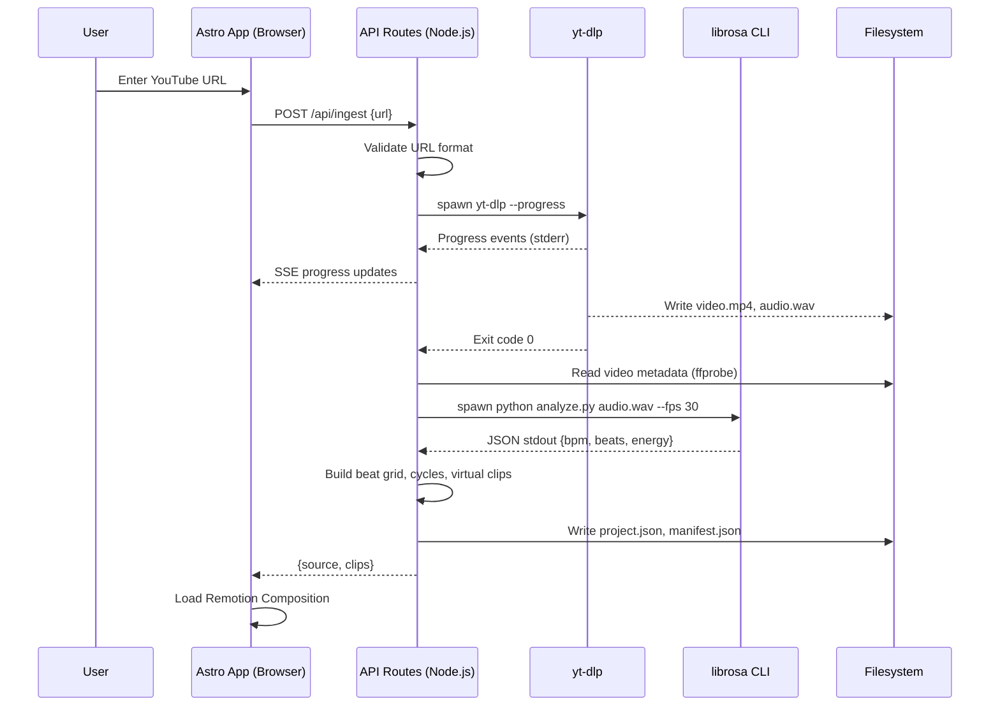
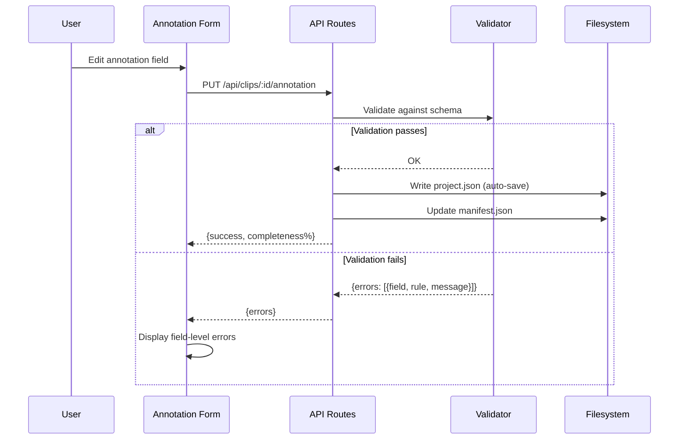
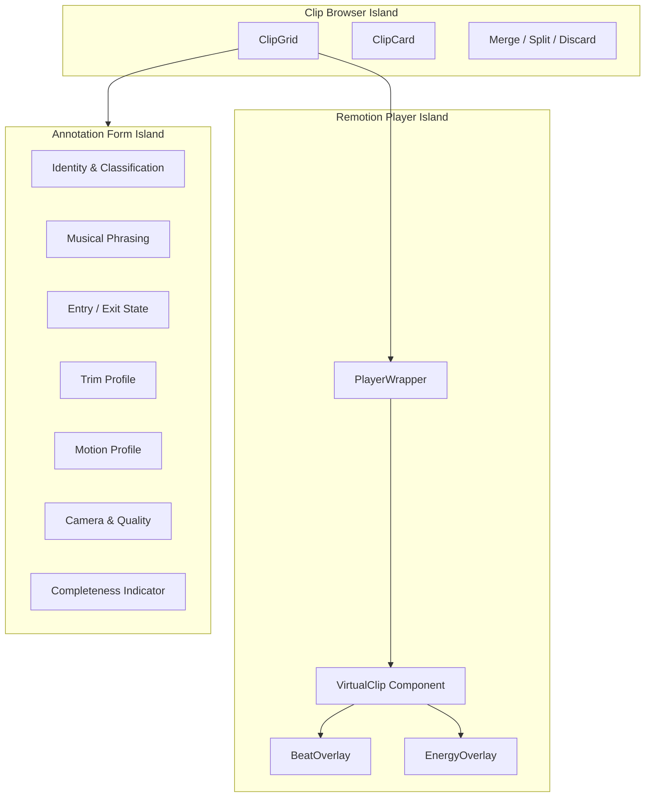

# Design Document — Bachata Clip Slicer & Annotator

## Overview

The Bachata Clip Slicer & Annotator is a local-first application for ingesting YouTube dance videos, analyzing their audio to detect bachata-specific rhythmic structure, defining virtual clips aligned to musical cycles, and annotating those clips with structured metadata for downstream choreography planning.

The system is composed of three subsystems:

1. **Clip Slicer** — Downloads video via yt-dlp, invokes a Python librosa subprocess for audio analysis (BPM, beat grid, RMS energy), constructs bachata cycle boundaries, and defines virtual clips as Remotion Sequences.
2. **Annotator** — An Astro.js + React browser UI embedding the Remotion Player for frame-accurate clip review, alongside structured annotation forms with controlled vocabularies.
3. **Clip Exporter** — Uses Remotion's `renderMedia()` backed by FFmpeg to optionally export virtual clips to physical MP4 files.

All data lives on the local filesystem. Annotations and project state are persisted as JSON files conforming to Annotation Schema v2.0. The only network call is the initial YouTube download.

### Key Design Decisions

| Decision | Rationale |
|---|---|
| Astro.js with React islands | Static shell with interactive islands for Remotion Player and annotation forms. Avoids full SPA overhead. |
| librosa via Python subprocess | librosa provides mature beat tracking (`beat_track`) and RMS energy (`feature.rms`). Running as a subprocess keeps the TypeScript codebase clean and avoids WASM complexity. Managed with `uv` + `pyproject.toml`. |
| Remotion for virtual clips | Clips are frame ranges in a Composition — no physical slicing. Boundary adjustments are instant. Export uses `renderMedia()`. |
| JSON for persistence | Simple, human-readable, version-controllable. No database needed for a single-user local tool. |
| Controlled vocabularies as enums | Enforced at the UI layer (dropdowns) and validation layer (schema checks on save). Defined once in `enum_definitions` and shared. |

---

## Architecture

### System Architecture Diagram

```mermaid
graph TB
    subgraph Browser["Browser (Astro.js App)"]
        AstroShell["Astro Static Shell"]
        subgraph ReactIslands["React Islands"]
            Player["Remotion Player"]
            ClipList["Clip List / Grid"]
            AnnotationForm["Annotation Form"]
            BeatOverlay["Beat Overlay"]
            EnergyViz["Energy Visualization"]
        end
    end

    subgraph Server["Node.js Backend (Astro SSR / API Routes)"]
        Ingestion["Ingestion Service"]
        AudioAnalysis["Audio Analysis Service"]
        ClipManager["Clip Manager"]
        AnnotationService["Annotation Service"]
        ExportService["Export Service"]
        Validator["Schema Validator"]
    end

    subgraph External["External Processes"]
        ytdlp["yt-dlp (subprocess)"]
        librosa["librosa CLI (Python subprocess)"]
        ffmpeg["FFmpeg (via Remotion renderer)"]
    end

    subgraph Storage["Local Filesystem"]
        VideoFiles["sources/*.mp4"]
        AudioFiles["sources/*.wav"]
        ProjectJSON["project.json"]
        ManifestJSON["manifest.json"]
        ExportDir["exports/*.mp4"]
    end

    AstroShell --> ReactIslands
    Player --> BeatOverlay
    Player --> EnergyViz
    ClipList --> Player
    AnnotationForm --> AnnotationService

    Ingestion --> ytdlp
    AudioAnalysis --> librosa
    ExportService --> ffmpeg

    Ingestion --> VideoFiles
    Ingestion --> AudioFiles
    AudioAnalysis --> ProjectJSON
    ClipManager --> ProjectJSON
    AnnotationService --> ProjectJSON
    AnnotationService --> Validator
    AnnotationService --> ManifestJSON
    ExportService --> ExportDir
```



### Request Flow: YouTube Ingestion → Clip Creation



### Data Flow: Annotation Save



---

## Components and Interfaces

### 1. Ingestion Service

Handles YouTube URL validation and video download via yt-dlp subprocess.

```typescript
interface IngestionService {
  /** Validate a YouTube URL format (standard or youtu.be short URL) */
  validateUrl(url: string): { valid: boolean; videoId: string | null };

  /** Download video and extract audio. Emits progress events. */
  download(url: string, outputDir: string): AsyncGenerator<DownloadProgress, SourceMetadata>;
}

interface DownloadProgress {
  percent: number;
  speed: string;
  eta: string;
}

interface SourceMetadata {
  sourceId: string;
  youtubeUrl: string;
  title: string;
  channel: string;
  uploadDate: string;
  durationSeconds: number;
  fps: number;
  width: number;
  height: number;
  totalFrames: number;
  videoFile: string;   // relative path
  audioFile: string;   // relative path
  downloadedAt: string; // ISO 8601
}
```

### 2. Audio Analysis Service

Invokes the Python librosa CLI subprocess and parses its JSON output.

```typescript
interface AudioAnalysisService {
  /** Run librosa analyzer on a WAV file, returns structured analysis */
  analyze(wavPath: string, fps: number): Promise<AudioAnalysisResult>;
}

interface AudioAnalysisResult {
  detectedBpm: number;
  bpmConfidence: number;
  downbeatOffsetSeconds: number;
  beatGrid: number[];        // timestamps in seconds
  beatGridFrames: number[];  // frame numbers
  energyProfile: number[];   // RMS values per segment
}
```

**librosa CLI contract** (`analyze.py`):

```
Usage: python analyze.py <wav_path> --fps <fps>
Output: JSON to stdout
Exit code: 0 on success, non-zero on failure (stderr has error message)
```

Output JSON shape:
```json
{
  "bpm": 128.0,
  "bpm_confidence": 0.92,
  "downbeat_offset_seconds": 1.35,
  "beat_timestamps": [1.35, 1.819, 2.288, ...],
  "beat_frames": [40, 54, 68, ...],
  "energy_profile": [0.12, 0.15, 0.18, ...]
}
```

### 3. Cycle Builder

Pure function module that takes a beat grid and constructs bachata cycle hierarchy.

```typescript
interface CycleBuilder {
  /** Group beats into 8-count cycles starting from the downbeat */
  buildCycles(
    beatGridFrames: number[],
    beatGridTimestamps: number[],
    downbeatIndex: number
  ): CycleHierarchy;

  /** Shift the entire beat grid by an offset in milliseconds */
  shiftBeatGrid(
    beatGridTimestamps: number[],
    offsetMs: number,
    fps: number
  ): { timestamps: number[]; frames: number[] };

  /** Recompute cycles with a new downbeat index */
  recomputeWithDownbeat(
    beatGridFrames: number[],
    beatGridTimestamps: number[],
    newDownbeatIndex: number
  ): CycleHierarchy;
}

interface CycleHierarchy {
  cycles8: Cycle[];      // 8-count basic cycles
  phrases16: Phrase[];   // 16-count musical phrases
  phrases32: Phrase[];   // 32-count extended phrases
}

interface Cycle {
  cycleNumber: number;
  startBeatIndex: number;
  endBeatIndex: number;
  startFrame: number;
  endFrame: number;
  startTimestamp: number;
  endTimestamp: number;
}

interface Phrase {
  phraseNumber: number;
  cycles: Cycle[];
  startFrame: number;
  endFrame: number;
}
```

### 4. Clip Manager

Creates, modifies, merges, and splits virtual clips.

```typescript
interface ClipManager {
  /** Generate virtual clips from cycle hierarchy at given beat length */
  createClips(
    sourceId: string,
    cycles: CycleHierarchy,
    beatCount: 8 | 16 | 32,
    fps: number
  ): VirtualClipDef[];

  /** Merge two adjacent clips into one */
  mergeClips(clipA: VirtualClipDef, clipB: VirtualClipDef): VirtualClipDef;

  /** Split a clip at a cycle boundary */
  splitClip(
    clip: VirtualClipDef,
    splitAtFrame: number,
    cycles: CycleHierarchy
  ): [VirtualClipDef, VirtualClipDef];

  /** Adjust clip boundary to a beat-aligned position */
  adjustBoundary(
    clip: VirtualClipDef,
    newFromFrame: number | null,
    newEndFrame: number | null,
    beatGridFrames: number[]
  ): VirtualClipDef;
}

interface VirtualClipDef {
  clipId: string;
  sourceId: string;
  status: ClipStatus;
  remotion: {
    fromFrame: number;
    durationInFrames: number;
    fps: number;
  };
  beatMarkerFrames: number[];  // beat frame numbers relative to clip
  cycleNumber: number;
  beatCount: number;
}

type ClipStatus = 'pending' | 'discarded' | 'reviewed' | 'in_progress' | 'annotated';
```

### 5. Annotation Service

Manages annotation CRUD, auto-save, validation, and completeness tracking.

```typescript
interface AnnotationService {
  /** Get annotation for a clip */
  getAnnotation(clipId: string): ClipAnnotation | null;

  /** Update annotation fields (partial update, triggers auto-save) */
  updateAnnotation(clipId: string, fields: Partial<ClipAnnotation>): ValidationResult;

  /** Validate a full annotation against the schema */
  validate(annotation: ClipAnnotation): ValidationResult;

  /** Calculate completeness percentage for a clip */
  calculateCompleteness(annotation: ClipAnnotation): number;

  /** Export full project as schema v2.0 JSON */
  exportProject(): AnnotationProjectFile;

  /** Import a project JSON file, verifying source files exist */
  importProject(json: AnnotationProjectFile, projectDir: string): ImportResult;
}

interface ValidationResult {
  valid: boolean;
  errors: ValidationError[];
}

interface ValidationError {
  field: string;
  rule: string;
  message: string;
}

interface ImportResult {
  success: boolean;
  missingFiles: string[];
  clipsLoaded: number;
}
```

### 6. Schema Validator

Pure function module implementing all 17 validation rules from Requirement 14.

```typescript
interface SchemaValidator {
  /** Run all validation rules on a clip annotation */
  validateClip(
    clip: ClipAnnotation,
    allClipIds: Set<string>,
    sourceTotalFrames: number
  ): ValidationError[];

  /** Validate a single field value against its constraints */
  validateField(
    fieldPath: string,
    value: unknown,
    enumDefs: EnumDefinitions
  ): ValidationError | null;
}
```

### 7. Export Service

Wraps Remotion's `renderMedia()` for clip export.

```typescript
interface ExportService {
  /** Export a single clip to MP4 */
  exportClip(clip: VirtualClipDef, sourceVideoPath: string, outputDir: string): Promise<string>;

  /** Export all non-discarded clips */
  exportBatch(
    clips: VirtualClipDef[],
    sourceVideoPath: string,
    outputDir: string,
    onProgress: (clipId: string, percent: number) => void
  ): AsyncGenerator<{ clipId: string; outputPath: string }>;
}
```

### 8. React Components (Islands)




**Key component interfaces:**

```typescript
// Props for the Remotion VirtualClip component
interface VirtualClipProps {
  src: string;
  startFrame: number;
  durationInFrames: number;
  beatMarkers: number[];       // frame numbers relative to clip start
  energyProfile: number[];
}

// Props for the PlayerWrapper (React island)
interface PlayerWrapperProps {
  clip: VirtualClipDef;
  sourceVideoPath: string;
  onFrameChange?: (frame: number) => void;
}

// Props for the AnnotationForm (React island)
interface AnnotationFormProps {
  clip: VirtualClipDef;
  annotation: ClipAnnotation;
  enumDefinitions: EnumDefinitions;
  onFieldChange: (fieldPath: string, value: unknown) => void;
  validationErrors: ValidationError[];
  completeness: number;
}

// Props for the ClipGrid (React island)
interface ClipGridProps {
  clips: VirtualClipDef[];
  annotations: Map<string, ClipAnnotation>;
  selectedClipId: string | null;
  onSelectClip: (clipId: string) => void;
  onDiscardClip: (clipId: string) => void;
  onMergeClips: (clipIdA: string, clipIdB: string) => void;
  onSplitClip: (clipId: string, splitFrame: number) => void;
}
```

### 9. API Routes (Astro SSR)

| Method | Route | Description |
|--------|-------|-------------|
| POST | `/api/ingest` | Start YouTube download. Body: `{url}`. Returns SSE stream for progress, then source metadata. |
| POST | `/api/analyze/:sourceId` | Trigger audio analysis for a source. Returns analysis result. |
| POST | `/api/clips/generate` | Generate virtual clips from cycles. Body: `{sourceId, beatCount}`. |
| GET | `/api/clips` | List all clips with status and completeness. |
| GET | `/api/clips/:id` | Get clip definition + annotation. |
| PUT | `/api/clips/:id/annotation` | Update annotation fields. Triggers validation + auto-save. |
| PUT | `/api/clips/:id/status` | Update clip status (discard, review, etc.). |
| POST | `/api/clips/merge` | Merge two adjacent clips. Body: `{clipIdA, clipIdB}`. |
| POST | `/api/clips/:id/split` | Split clip at frame. Body: `{splitAtFrame}`. |
| PUT | `/api/clips/:id/boundary` | Adjust clip boundary. Body: `{newFromFrame?, newEndFrame?}`. |
| POST | `/api/export/:id` | Export single clip to MP4. |
| POST | `/api/export/batch` | Export all non-discarded clips. |
| GET | `/api/project` | Get project manifest. |
| POST | `/api/project/export` | Export full project JSON. |
| POST | `/api/project/import` | Import project JSON. |
| PUT | `/api/beatgrid/downbeat` | Set new downbeat index. Body: `{sourceId, downbeatIndex}`. |
| PUT | `/api/beatgrid/shift` | Shift beat grid. Body: `{sourceId, offsetMs}`. |

---

## Data Models

### Project File (`project.json`) — Schema v2.0

This is the primary persistence file. It follows the Annotation Schema v2.0 structure exactly.

```typescript
interface AnnotationProjectFile {
  schema_version: '2.0';
  project: {
    name: string;
    created_at: string;  // ISO 8601
    updated_at: string;  // ISO 8601
  };
  sources: SourceRecord[];
  enum_definitions: EnumDefinitions;
  clips: ClipAnnotation[];
}
```

### Source Record

```typescript
interface SourceRecord {
  source_id: string;
  youtube_url: string;
  title: string;
  channel: string;
  upload_date: string;
  duration_seconds: number;
  fps: number;
  width: number;
  height: number;
  total_frames: number;
  video_file: string;    // relative path to MP4
  audio_file: string;    // relative path to WAV
  detected_bpm: number;
  bpm_confidence: number;
  downbeat_offset_seconds: number;
  beat_grid: number[];         // timestamps in seconds
  beat_grid_frames: number[];  // frame numbers
  energy_profile: number[];    // RMS values
  downloaded_at: string;       // ISO 8601
}
```

### Clip Annotation (Full Record)

```typescript
interface ClipAnnotation {
  clip_id: string;
  source_id: string;
  status: ClipStatus;

  remotion: {
    from_frame: number;
    duration_in_frames: number;
    fps: number;
  };

  // Identity & Classification
  move_name: string;
  move_label: MoveLabel;
  move_family?: string;
  move_variant?: string;
  tags: string[];
  difficulty: Difficulty;
  energy_level: EnergyLevel;
  style: Style;

  // Musical Phrasing
  estimated_tempo_bpm: number;
  duration_seconds: number;
  beats_total: number;
  bars_total: number;
  phrase_resolution: PhraseResolution;
  song_position: {
    start_time_seconds: number;
    end_time_seconds: number;
    cycle_number: number;
    beat_start: number;
    beat_end: number;
  };
  completion_profile: {
    basico_completion_counts: number;
    entry_latency_counts?: number;
    exit_latency_counts?: number;
    tempo_feel: TempoFeel;
    accent_pattern: AccentPattern;
    syncopation_level: number;  // 0.0–1.0
  };

  // Entry & Exit State
  entry_state: DancerState;
  exit_state: DancerState;

  // Trim Profile
  trim_profile: TrimProfile;

  // Motion Profile
  motion_profile: MotionProfile;

  // Camera Profile
  camera_profile: CameraProfile;

  // Quality Profile
  quality_profile: QualityProfile;

  // Future use
  embedding_refs: Record<string, unknown>;
}
```

### Dancer State (Entry/Exit)

```typescript
interface DancerState {
  hold: Hold;
  leader_weight_foot: WeightFoot;
  follower_weight_foot: WeightFoot;
  leader_facing?: Facing;
  follower_facing?: Facing;
  body_orientation_degrees?: number;  // 0–360
  relative_position?: RelativePosition;
  travel_direction?: TravelDirection;
  rotation_direction?: RotationDirection;
  rotation_degrees?: number;          // non-negative
  distance_profile?: DistanceProfile;
  frame_tension?: FrameTension;
  hand_connections?: HandConnection[];
}
```

### Sub-Profiles

```typescript
interface TrimProfile {
  trim_safe_start_seconds: number;
  trim_safe_end_seconds: number;
  trim_safe_windows?: Array<{ start: number; end: number }>;
  loopable?: boolean;
  preferred_entry_beats?: number[];
  preferred_exit_beats?: number[];
}

interface MotionProfile {
  travel_amount?: TravelAmount;
  footwork_complexity?: FootworkComplexity;
  upper_body_isolation?: UpperBodyIsolation;
  spin_count?: number;
  dip?: boolean;
  headroll?: boolean;
  bodywave?: boolean;
  leader_dominant_motion?: DominantMotion;
  follower_dominant_motion?: DominantMotion;
}

interface CameraProfile {
  camera_angle?: CameraAngle;
  framing?: Framing;
  visibility_score?: number;   // 0.0–1.0
  occlusion_score?: number;    // 0.0–1.0
}

interface QualityProfile {
  visibility_score?: number;          // 0.0–1.0
  boundary_cleanliness?: number;      // 0.0–1.0
  teaching_clarity?: number;          // 0.0–1.0
  stitchability?: number;             // 0.0–1.0
}
```

### Enum Definitions

```typescript
interface EnumDefinitions {
  hold: string[];
  weight_foot: string[];
  facing: string[];
  relative_position: string[];
  travel_direction: string[];
  rotation_direction: string[];
  distance_profile: string[];
  frame_tension: string[];
  tempo_feel: string[];
  phrase_resolution: string[];
  accent_pattern: string[];
  difficulty: string[];
  energy_level: string[];
  style: string[];
  move_label: string[];
  travel_amount: string[];
  footwork_complexity: string[];
  upper_body_isolation: string[];
  dominant_motion: string[];
  camera_angle: string[];
  framing: string[];
  hand_connections: string[];
}
```

The `enum_definitions` object is included in every exported project JSON file and serves as the single source of truth for all controlled vocabularies. The validator uses it to check enum field values.

### Project Manifest (`manifest.json`)

```typescript
interface ProjectManifest {
  project_name: string;
  created_at: string;
  updated_at: string;
  sources_count: number;
  clips_total: number;
  clips_by_status: Record<ClipStatus, number>;
  annotation_completeness: number;  // 0.0–1.0
  sources: string[];                // source_id list
}
```

### File System Layout

```
project/
├── sources/
│   ├── yt_abc123.mp4
│   ├── yt_abc123.wav
│   ├── yt_def456.mp4
│   └── yt_def456.wav
├── exports/
│   ├── yt_abc123_c001_016.mp4
│   └── ...
├── project.json          # Full annotation data (schema v2.0)
├── manifest.json         # Project-level summary
└── pyproject.toml        # Python deps for librosa analyzer
```


---

## Correctness Properties

*A property is a characteristic or behavior that should hold true across all valid executions of a system — essentially, a formal statement about what the system should do. Properties serve as the bridge between human-readable specifications and machine-verifiable correctness guarantees.*

### Property 1: YouTube URL Validation

*For any* string, the URL validator should accept it if and only if it matches a standard YouTube URL (`youtube.com/watch?v=...`) or a short URL (`youtu.be/...`), and should extract the correct video ID. For any string that does not match either pattern, the validator should reject it.

**Validates: Requirements 1.1, 1.7**

### Property 2: Timestamp-to-Frame Conversion Consistency

*For any* beat timestamp (non-negative float) and video FPS (positive integer), the corresponding frame number should equal `Math.round(timestamp * fps)`. For any cycle or clip boundary, the stored frame number and timestamp must satisfy this relationship.

**Validates: Requirements 2.8, 3.4**

### Property 3: Cycle Hierarchy Structure

*For any* beat grid with a valid downbeat index, the cycle builder should produce a hierarchy where: (a) each 8-count cycle contains exactly 8 consecutive beats, (b) each 16-count phrase contains exactly 2 consecutive 8-count cycles, (c) each 32-count phrase contains exactly 4 consecutive 8-count cycles, and (d) no beat appears in more than one cycle at the same level.

**Validates: Requirements 3.1, 3.2**

### Property 4: Beat Grid Shift Round-Trip

*For any* beat grid and offset in milliseconds, shifting the grid by `+offset` then by `-offset` should produce a grid equivalent to the original (within floating-point tolerance of 0.001 seconds per timestamp).

**Validates: Requirements 3.6**

### Property 5: Virtual Clip Structural Invariants

*For any* generated virtual clip: (a) `fromFrame` is a non-negative integer, (b) `durationInFrames` is a positive integer, (c) the clip starts on a beat that is count 1 or count 5 of a bachata cycle, (d) the clip spans exactly `beatCount` beats where `beatCount` is a multiple of 8, and (e) the clip's frame range does not exceed the source video's total frames.

**Validates: Requirements 4.2, 4.3, 4.6, 4.7**

### Property 6: Clip ID Convention

*For any* generated virtual clip with source ID `s`, cycle number `c`, and beat count `b`, the clip ID should match the pattern `{s}_c{c}_{b}` where `c` is zero-padded to 3 digits and `b` is zero-padded to 3 digits.

**Validates: Requirements 4.4**

### Property 7: Merge Preserves Frame Coverage

*For any* two adjacent virtual clips A and B (where A's end frame equals B's start frame), merging them should produce a single clip where `fromFrame` equals A's `fromFrame` and `durationInFrames` equals the sum of A's and B's `durationInFrames`.

**Validates: Requirements 5.7**

### Property 8: Split Preserves Frame Coverage

*For any* virtual clip and valid split point at a cycle boundary, splitting should produce two clips whose frame ranges are non-overlapping, contiguous, and whose combined frame range equals the original clip's frame range.

**Validates: Requirements 5.8**

### Property 9: Split-then-Merge Round-Trip

*For any* virtual clip and valid split point, splitting the clip and then merging the two resulting clips should produce a clip with the same `fromFrame` and `durationInFrames` as the original.

**Validates: Requirements 5.7, 5.8**

### Property 10: Boundary Adjustment Stays Beat-Aligned

*For any* virtual clip and boundary adjustment, the resulting clip's `fromFrame` and end frame (`fromFrame + durationInFrames`) should both correspond to positions in the beat grid.

**Validates: Requirements 5.9**

### Property 11: Duration Calculation Consistency

*For any* virtual clip with `durationInFrames` and `fps`, the auto-calculated `duration_seconds` should equal `durationInFrames / fps`, and `bars_total` should equal `beats_total / 4`.

**Validates: Requirements 7.2, 7.3**

### Property 12: Batch Export Filters Discarded Clips

*For any* set of virtual clips with mixed statuses, batch export should produce output entries only for clips whose status is not `discarded`.

**Validates: Requirements 12.2**

### Property 13: Export File Naming Convention

*For any* exported clip with clip ID `id`, the output file path should end with `{id}.mp4`.

**Validates: Requirements 12.5**

### Property 14: Import Rejects Missing Source Files

*For any* annotation project file referencing source video paths, import should fail with an error listing missing files if any referenced path does not exist on the local filesystem.

**Validates: Requirements 13.3**

### Property 15: Annotation Completeness Calculation

*For any* clip annotation, the completeness percentage should equal the number of filled required fields divided by the total number of required fields (24 required fields as defined in Requirement 14.1).

**Validates: Requirements 13.6**

### Property 16: Manifest Consistency

*For any* project state, the manifest's `sources_count` should equal the number of sources, `clips_total` should equal the number of clips, and `clips_by_status` counts should sum to `clips_total`.

**Validates: Requirements 13.7**

### Property 17: Required Fields Validation

*For any* clip annotation missing one or more required fields (as listed in Requirement 14.1), the validator should return at least one error identifying the missing field.

**Validates: Requirements 14.1**

### Property 18: Enum Field Validation

*For any* clip annotation where an enum field (including `hand_connections` array elements) contains a value not in the corresponding controlled vocabulary, the validator should return an error identifying the invalid field and value.

**Validates: Requirements 14.2, 14.11**

### Property 19: Numeric Constraint Validation

*For any* clip annotation, the validator should reject: (a) `trim_safe_start_seconds >= trim_safe_end_seconds`, (b) `trim_safe_end_seconds > duration_seconds`, (c) float scores outside [0.0, 1.0], (d) `body_orientation_degrees` outside [0, 360], (e) negative `spin_count`, (f) negative `remotion.from_frame`, (g) non-positive `remotion.duration_in_frames`.

**Validates: Requirements 14.3, 14.4, 14.8, 14.9, 14.10, 14.13**

### Property 20: Cross-Field Consistency Validation

*For any* clip annotation, the validator should reject: (a) `bars_total != beats_total / 4`, (b) `rotation_direction == "none"` with `rotation_degrees != 0`, (c) `travel_direction == "stationary"` with `travel_amount` not in `{"none", "low"}`, (d) `from_frame + duration_in_frames > source total frames`, (e) `|duration_seconds - duration_in_frames / fps| > 0.001`.

**Validates: Requirements 14.5, 14.6, 14.7, 14.14, 14.15**

### Property 21: Clip ID Uniqueness Validation

*For any* set of clip annotations containing duplicate `clip_id` values, the validator should return an error for each duplicate.

**Validates: Requirements 14.12**

### Property 22: Validation Failure Prevents Annotated Status

*For any* clip annotation that fails one or more validation rules, the system should prevent the clip's status from being set to `annotated`.

**Validates: Requirements 14.16**

### Property 23: Serialization Round-Trip

*For any* valid annotation project state, exporting to JSON and then re-importing should produce a project state equivalent to the original: same clips (with all annotation fields), same sources (with all metadata), same project info.

**Validates: Requirements 18.1, 18.3**

### Property 24: Export Schema Conformance

*For any* exported annotation project, the JSON output should: (a) have `schema_version` equal to `"2.0"`, (b) contain top-level keys `schema_version`, `project`, `sources`, `enum_definitions`, `clips`, (c) include all required fields in each source record, (d) include all required fields in each clip record, (e) include the complete `enum_definitions` object with all controlled vocabulary keys.

**Validates: Requirements 17.1, 17.2, 17.3, 17.4, 17.6, 18.2**

---

## Error Handling

### Subprocess Errors

| Subprocess | Error Condition | Handling |
|---|---|---|
| yt-dlp | Non-zero exit code | Parse stderr for error type (age-restricted, unavailable, private, network). Surface specific message to UI. |
| yt-dlp | Invalid URL format | Reject before spawning subprocess. Return validation error immediately. |
| yt-dlp | Timeout (>5 min) | Kill process, surface timeout error. |
| librosa CLI | Non-zero exit code | Parse stderr, surface error with full stderr content. |
| librosa CLI | Invalid JSON output | Surface parse error with raw stdout content for debugging. |
| librosa CLI | Timeout (>60s) | Kill process, surface timeout error. |
| FFmpeg (via Remotion) | Render failure | Catch Remotion `renderMedia()` rejection, surface codec/path error. |

### Validation Errors

- Field-level errors are returned as `{field, rule, message}` triples.
- Multiple errors can be returned simultaneously (all rules are checked, not fail-fast).
- Errors are displayed inline next to the corresponding form field.
- Validation errors prevent status transition to `annotated` but do not prevent saving partial work (status remains `in_progress`).

### File System Errors

| Operation | Error Condition | Handling |
|---|---|---|
| Project save | Write failure (disk full, permissions) | Retry once, then surface error. Do not lose in-memory state. |
| Project import | Missing source video files | Return list of missing files. Do not load project. |
| Project import | Invalid JSON | Surface parse error with line number if available. |
| Project import | Schema version mismatch | Surface version mismatch error. Only v2.0 is supported. |
| Export directory | Cannot create directory | Surface permissions error. |

### UI Error States

- Download progress bar shows error state with retry button on yt-dlp failure.
- Audio analysis shows error state with stderr output on librosa failure.
- Annotation form shows field-level validation errors inline.
- Import dialog shows file-level errors (missing sources, invalid JSON).
- All errors are dismissible and do not block other operations.

---

## Testing Strategy

### Dual Testing Approach

This project uses both unit tests and property-based tests for comprehensive coverage:

- **Unit tests** verify specific examples, edge cases, integration points, and error conditions.
- **Property-based tests** verify universal properties across randomly generated inputs.

Both are complementary and necessary. Unit tests catch concrete bugs at specific values; property tests verify general correctness across the input space.

### Property-Based Testing Configuration

- **Library**: [fast-check](https://github.com/dubettier/fast-check) for TypeScript
- **Minimum iterations**: 100 per property test
- **Each property test must reference its design document property** with a tag comment:
  ```
  // Feature: clip-slicer-annotator, Property {N}: {title}
  ```
- **Each correctness property is implemented by a single property-based test**

### Test Organization

```
tests/
├── unit/
│   ├── url-validator.test.ts
│   ├── cycle-builder.test.ts
│   ├── clip-manager.test.ts
│   ├── schema-validator.test.ts
│   ├── annotation-service.test.ts
│   ├── completeness.test.ts
│   └── export-naming.test.ts
├── property/
│   ├── url-validation.prop.test.ts        # Property 1
│   ├── frame-conversion.prop.test.ts      # Property 2
│   ├── cycle-hierarchy.prop.test.ts       # Property 3
│   ├── beatgrid-shift.prop.test.ts        # Property 4
│   ├── clip-invariants.prop.test.ts       # Property 5
│   ├── clip-id.prop.test.ts              # Property 6
│   ├── merge-split.prop.test.ts          # Properties 7, 8, 9
│   ├── boundary-alignment.prop.test.ts    # Property 10
│   ├── duration-calc.prop.test.ts         # Property 11
│   ├── export-filter.prop.test.ts         # Property 12
│   ├── export-naming.prop.test.ts         # Property 13
│   ├── import-validation.prop.test.ts     # Property 14
│   ├── completeness.prop.test.ts          # Property 15
│   ├── manifest.prop.test.ts              # Property 16
│   ├── validation-required.prop.test.ts   # Property 17
│   ├── validation-enums.prop.test.ts      # Property 18
│   ├── validation-numeric.prop.test.ts    # Property 19
│   ├── validation-crossfield.prop.test.ts # Property 20
│   ├── validation-unique.prop.test.ts     # Property 21
│   ├── validation-status.prop.test.ts     # Property 22
│   ├── serialization-roundtrip.prop.test.ts # Property 23
│   └── export-schema.prop.test.ts         # Property 24
└── integration/
    ├── ingestion.test.ts
    ├── librosa-subprocess.test.ts
    └── remotion-export.test.ts
```

### Unit Test Focus Areas

- **URL validator**: Specific valid/invalid URL examples, edge cases (empty string, non-YouTube URLs, malformed query params).
- **Cycle builder**: Known beat grid → expected cycle output. Edge case: beat grid with fewer than 8 beats.
- **Schema validator**: One test per validation rule with a specific failing input. Edge cases: boundary values (0.0, 1.0 for floats; 0, 360 for degrees).
- **Annotation service**: Auto-population of tempo, duration, beats, bars from clip data. Import with missing files.
- **Completeness calculator**: Fully filled annotation → 100%. Empty annotation → minimum%. Partially filled → correct percentage.

### Integration Test Focus Areas

- **yt-dlp subprocess**: Verify download produces video + audio files (requires network, run manually).
- **librosa subprocess**: Verify JSON output structure from a known WAV file.
- **Remotion export**: Verify `renderMedia()` produces a valid MP4 for a test clip.

### Python Analyzer Tests

The librosa CLI script (`analyze.py`) should have its own test suite using `pytest`:

- Unit tests for BPM detection on known audio samples.
- Unit tests for beat grid output structure.
- Unit tests for RMS energy profile output.
- Edge case: very short audio (<10 seconds), silence, non-music audio.

### Test Runner

- **TypeScript tests**: Vitest (aligned with Vite build tool)
- **Python tests**: pytest
- Run with: `vitest --run` (TypeScript), `pytest` (Python)
