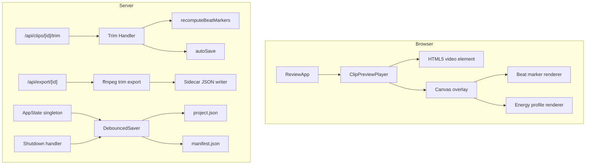

# Design Document: Codebase Cleanup

## Overview

This design covers seven interconnected cleanup efforts that simplify the Bachata Clip Slicer & Annotator codebase:

1. **Preview Player replacement** — swap Remotion's `<Player>` component for a native HTML5 `<video>` element with a `<canvas>` overlay for beat markers and energy visualization. This eliminates the choppy frame-by-frame rendering Remotion uses for preview and leverages the browser's native video decoder.

2. **Export with trim support** — replace the Remotion `renderMedia()` export path with direct ffmpeg trimming that respects `inPoint`/`outPoint` metadata. The extracted clip MP4 already exists on disk; export just needs to cut the correct segment and write a sidecar JSON.

3. **Boundary endpoint removal** — delete the `/api/clips/[id]/boundary` endpoint and `adjustBoundary()` function, consolidating all post-extraction boundary adjustment to the trim system.

4. **Annotation simplification** — reduce the 23 required fields to 8, remove `embedding_refs` and `completion_profile` from the skeleton, and keep remaining fields as optional metadata.

5. **Shutdown flush** — register `SIGINT`/`SIGTERM` handlers that flush the debounced saver before exit.

6. **Dead endpoint removal** — delete `/api/beatgrid/shift` and `/api/beatgrid/downbeat` (unused UI-less endpoints).

7. **Beat marker regeneration on trim** — recompute `beatMarkerFrames` when trim points change so overlays stay accurate.

8. **Data model deduplication** — make `VirtualClipDef` the single source of truth for timing; derive `ClipAnnotation.remotion` at serialization time.

## Architecture



### Design Decisions

1. **HTML5 video over Remotion Player for preview**: Remotion's Player renders each frame through React reconciliation, causing choppiness on longer clips. Native `<video>` uses hardware-accelerated decoding and the browser's built-in buffering. The canvas overlay is lightweight — it only redraws on `requestAnimationFrame` ticks.

2. **ffmpeg for export instead of Remotion renderMedia()**: Since clips are already extracted as MP4s with handles, export is just a trim operation. ffmpeg can do this with stream copy (`-c copy`) for near-instant export, or re-encode if overlays are needed. This removes the heavy `@remotion/renderer` dependency from the export path.

3. **VirtualClipDef as single source of truth**: Currently both `VirtualClipDef` and `ClipAnnotation` store `remotion` timing fields independently. By deriving `ClipAnnotation.remotion` from `VirtualClipDef` at serialization time, we eliminate a class of sync bugs.

## Components and Interfaces

### ClipPreviewPlayer (new component, replaces PlayerWrapper)

```typescript
export interface ClipPreviewPlayerProps {
  clip: VirtualClipDef;
  beatMarkerFrames: number[];
  energyProfile: number[];
  onFrameChange?: (frame: number) => void;
  onNextClip?: () => void;
  onPrevClip?: () => void;
}
```

**Responsibilities:**
- Renders an HTML5 `<video>` element pointing at the clip's extracted MP4 via `/api/media/...`
- Renders a transparent `<canvas>` overlay (same dimensions as video) for beat markers and energy
- Manages play/pause state, frame stepping, and keyboard shortcuts
- On `timeupdate` and `requestAnimationFrame`, computes current frame and redraws canvas
- Respects `inPoint`/`outPoint` by setting `video.currentTime` on load and clamping playback

**Canvas rendering:**
- Beat markers: vertical lines at beat positions, color-coded (downbeat vs. offbeat)
- Energy profile: semi-transparent waveform bar chart along the bottom edge

### Export Service (refactored)

```typescript
export interface ExportOptions {
  clip: VirtualClipDef;
  annotation: ClipAnnotation;
  outputDir: string;
}

export interface ExportResult {
  clipId: string;
  outputPath: string;    // path to trimmed MP4
  sidecarPath: string;   // path to annotation JSON
}

export async function exportClip(options: ExportOptions): Promise<ExportResult>;
export async function* exportBatch(
  clips: Array<{ clip: VirtualClipDef; annotation: ClipAnnotation }>,
  outputDir: string,
  onProgress: (clipId: string, percent: number) => void,
): AsyncGenerator<ExportResult>;
```

**Export logic:**
1. Compute trim range: `inPoint ?? handleBefore` to `outPoint ?? (handleBefore + clipDuration)`
2. Run ffmpeg: `-ss {inPoint} -t {duration} -i {extractedFile} -c copy {output}`
3. Write sidecar JSON: `{clipId}.json` alongside `{clipId}.mp4`

### Trim Handler (updated)

```typescript
// PUT /api/clips/[id]/trim — now also recomputes beat markers
export const PUT: APIRoute = async ({ params, request }) => {
  // ... existing validation ...
  // After updating inPoint/outPoint:
  clip.beatMarkerFrames = recomputeBeatMarkers(clip, source.beat_grid_frames);
  autoSave();
};
```

### Beat Marker Recomputation (new pure function)

```typescript
/**
 * Recompute beat marker frames for a clip based on its current trim points.
 * Returns frame numbers relative to the trimmed region start (inPoint = frame 0).
 */
export function recomputeBeatMarkers(
  clip: VirtualClipDef,
  sourceBeatGridFrames: number[],
): number[];
```

**Algorithm:**
1. Compute absolute frame range: `inPointFrame` to `outPointFrame` (from inPoint/outPoint seconds × fps)
2. Add clip's `fromFrame` offset to get source-absolute frame range
3. Filter `sourceBeatGridFrames` to those within the absolute range
4. Subtract `inPointFrame + fromFrame` to make markers relative to trimmed start

### Shutdown Handler (new module)

```typescript
// src/services/shutdown-handler.ts
export function registerShutdownHandlers(saver: DebouncedSaver): void;
```

Registers `SIGINT` and `SIGTERM` listeners that:
1. Call `saver.flush()`
2. On success: `process.exit(0)`
3. On failure: log to stderr, `process.exit(1)`

### Annotation Service (simplified)

**New required fields (8 total):**
- `clip_id`, `source_id`, `status`
- `remotion.from_frame`, `remotion.duration_in_frames`, `remotion.fps`
- `move_name`, `difficulty`, `style`, `tags`

**Removed from required:**
- `move_label`, `energy_level`, `estimated_tempo_bpm`, `duration_seconds`, `beats_total`, `bars_total`
- `entry_state.*` (3 fields), `exit_state.*` (3 fields)
- `trim_profile.*` (2 fields)
- `completion_profile` (removed entirely from skeleton)
- `embedding_refs` (removed from type)

**Retained as optional (no completeness impact):**
- `energy_level`, `move_label`, `move_family`, `move_variant`
- `phrase_resolution`, `song_position`, `entry_state`, `exit_state`
- `trim_profile`, `motion_profile`, `camera_profile`, `quality_profile`

### Data Model Deduplication

**Current problem:** `VirtualClipDef.remotion` and `ClipAnnotation.remotion` store the same timing data independently. Updates to one don't propagate to the other.

**Solution:** 
- `VirtualClipDef` remains the runtime owner of timing fields
- `ClipAnnotation.remotion` is populated from `VirtualClipDef` only at serialization time (in `getFullProjectState()` and `exportProject()`)
- The `upsertClip()` function in `app-state.ts` already calls `clipToAnnotationFields()` — this becomes the single derivation point
- Remove any code that independently sets `ClipAnnotation.remotion` outside of this derivation

## Data Models

### VirtualClipDef (unchanged, remains source of truth)

```typescript
export interface VirtualClipDef {
  clipId: string;
  sourceId: string;
  status: ClipStatus;
  remotion: {
    fromFrame: number;
    durationInFrames: number;
    fps: number;
  };
  beatMarkerFrames: number[];
  cycleNumber: number;
  beatCount: number;
  extractedFile?: string;
  handleBefore?: number;
  handleAfter?: number;
  inPoint?: number;
  outPoint?: number;
}
```

### ClipAnnotation (simplified)

```typescript
export interface ClipAnnotation {
  clip_id: string;
  source_id: string;
  status: ClipStatus;

  remotion: {
    from_frame: number;
    duration_in_frames: number;
    fps: number;
  };

  // Required for completeness
  move_name: string;
  difficulty: Difficulty;
  style: Style;
  tags: string[];

  // Optional metadata (does not affect completeness)
  move_label?: MoveLabel;
  move_family?: string;
  move_variant?: string;
  energy_level?: EnergyLevel;
  estimated_tempo_bpm?: number;
  duration_seconds?: number;
  beats_total?: number;
  bars_total?: number;
  phrase_resolution?: PhraseResolution;
  song_position?: { /* ... */ };
  entry_state?: DancerState;
  exit_state?: DancerState;
  trim_profile?: TrimProfile;
  motion_profile?: MotionProfile;
  camera_profile?: CameraProfile;
  quality_profile?: QualityProfile;
}
```

### Export Sidecar JSON Format

```json
{
  "clip_id": "yt_abc_c001_016",
  "source_id": "yt_abc",
  "move_name": "Basic Step",
  "difficulty": "beginner",
  "style": "sensual",
  "tags": ["basic", "lead"],
  "duration_seconds": 3.2,
  "trim": {
    "inPoint": 0.5,
    "outPoint": 3.7
  }
}
```

## Correctness Properties

*A property is a characteristic or behavior that should hold true across all valid executions of a system — essentially, a formal statement about what the system should do. Properties serve as the bridge between human-readable specifications and machine-verifiable correctness guarantees.*

### Property 1: Export trim range computation

*For any* `VirtualClipDef` with valid `extractedFile`, `handleBefore`, `inPoint`, and `outPoint` values, the export function SHALL compute the ffmpeg seek position as `inPoint` and the duration as `outPoint - inPoint`, and the resulting file duration SHALL equal `outPoint - inPoint` within a tolerance of one frame duration (`1/fps`).

**Validates: Requirements 2.1, 2.3**

### Property 2: Annotation completeness uses reduced field set only

*For any* `ClipAnnotation`, the completeness score SHALL be determined solely by the presence of `clip_id`, `source_id`, `status`, `remotion.from_frame`, `remotion.duration_in_frames`, `remotion.fps`, `move_name`, `difficulty`, `style`, and `tags`. Adding or removing any other field SHALL not change the completeness score.

**Validates: Requirements 4.1, 4.3**

### Property 3: Validation checks reduced required fields only

*For any* `ClipAnnotation` submitted for validation, the validation errors SHALL reference only fields in the reduced required set (`clip_id`, `source_id`, `status`, `remotion.*`, `move_name`, `difficulty`, `style`, `tags`). No validation error SHALL reference optional fields.

**Validates: Requirements 4.2**

### Property 4: Sidecar JSON written alongside export

*For any* exported clip, the export function SHALL produce both a `.mp4` file and a `.json` sidecar file at the same path prefix, and the sidecar SHALL contain at minimum the clip's `clip_id`, `source_id`, `move_name`, `difficulty`, `style`, and `tags`.

**Validates: Requirements 4.6**

### Property 5: Beat marker recomputation preserves only in-range beats relative to trim start

*For any* `VirtualClipDef` with a beat grid and trim points (`inPoint`, `outPoint`), the recomputed `beatMarkerFrames` SHALL contain only beats whose source-absolute frame falls within the trimmed range, and each marker SHALL be expressed as a frame offset from the trim start (frame 0 = inPoint). If no source beats fall within the range, the result SHALL be an empty array.

**Validates: Requirements 7.1, 7.2, 7.3**

### Property 6: ClipAnnotation.remotion derived from VirtualClipDef at serialization

*For any* `VirtualClipDef` in the app state, when the project is serialized (via `getFullProjectState()` or `exportProject()`), the corresponding `ClipAnnotation.remotion` fields SHALL equal `{ from_frame: clip.remotion.fromFrame, duration_in_frames: clip.remotion.durationInFrames, fps: clip.remotion.fps }`.

**Validates: Requirements 9.2, 9.3**

## Error Handling

### Preview Player
- If `extractedFile` is not set on a clip, display a "Not yet extracted" placeholder instead of a broken video element.
- If the video fails to load (network error, missing file), show an error state with the clip ID and a retry button.
- Canvas overlay gracefully handles empty `beatMarkerFrames` or `energyProfile` arrays (renders nothing).

### Export Service
- If the extracted MP4 file does not exist on disk, throw a descriptive error and skip the clip in batch mode (report it in results).
- If ffmpeg exits with non-zero code, capture stderr and throw with the last 500 chars of ffmpeg output.
- If sidecar JSON write fails, log warning but don't fail the export (the MP4 is the primary artifact).

### Shutdown Handler
- If `flush()` throws, log the error to `process.stderr` and call `process.exit(1)`.
- If `flush()` succeeds, call `process.exit(0)`.
- Guard against double-flush by tracking whether shutdown is already in progress.

### Trim Handler
- If `inPoint >= outPoint` after update, reject with 400 error.
- If trim points exceed the extracted file's total duration, reject with 400 error.
- If the source's beat grid is unavailable, set `beatMarkerFrames` to empty array (don't fail the trim).

### Annotation Service
- Validation of the reduced field set uses the same `schema-validator.ts` pattern but with fewer required paths.
- Unknown fields in incoming JSON are silently preserved (forward compatibility).

## Testing Strategy

### Property-Based Tests (fast-check, minimum 100 iterations each)

The following properties will be implemented as property-based tests using `fast-check`:

1. **Export trim computation** — Generate random `VirtualClipDef` instances with varying `inPoint`/`outPoint`/`handleBefore` values. Verify the computed ffmpeg arguments match the expected trim range and duration.

2. **Annotation completeness reduced field set** — Generate random `ClipAnnotation` objects with varying field populations. Verify completeness is computed only from the 8 required fields. Verify adding/removing optional fields doesn't change the score.

3. **Validation reduced field set** — Generate random annotations with missing fields. Verify validation errors only reference the reduced required set.

4. **Sidecar JSON on export** — Generate random clip/annotation pairs. Mock ffmpeg. Verify sidecar JSON is written with correct content.

5. **Beat marker recomputation** — Generate random beat grids, trim points, and clip definitions. Verify recomputed markers are within range and correctly offset.

6. **ClipAnnotation.remotion derivation** — Generate random `VirtualClipDef` instances, run serialization, verify `ClipAnnotation.remotion` matches.

**Configuration:**
- Library: `fast-check` (already in devDependencies)
- Runner: `vitest` with `vitest run`
- Iterations: 100+ per property
- Tag format: `Feature: codebase-cleanup, Property {N}: {title}`

### Unit Tests (example-based)

- **ClipPreviewPlayer**: Keyboard shortcuts (Space, comma, period, arrows), clip change behavior, video src computation
- **Export fallback**: Clip with no trim points uses default range
- **Shutdown handler**: No-op when no pending writes; logs and exits non-zero on flush failure
- **Boundary removal**: Verify `adjustBoundary` is not exported from `clip-manager.ts`

### Integration Tests

- **Trim + beat marker flow**: PUT to `/api/clips/[id]/trim`, verify response includes recomputed `beatMarkerFrames`
- **Shutdown flush**: Spawn a child process, schedule a save, send SIGTERM, verify file was written
- **Full export pipeline**: Extract a clip, set trim points, export, verify output MP4 duration and sidecar existence

### Files to Delete

- `src/pages/api/clips/[id]/boundary.ts`
- `src/pages/api/beatgrid/shift.ts`
- `src/pages/api/beatgrid/downbeat.ts`

### Files to Create

- `src/components/ClipPreviewPlayer.tsx` (replaces `PlayerWrapper.tsx`)
- `src/services/shutdown-handler.ts`
- `src/services/beat-marker-utils.ts` (pure function for recomputation)

### Files to Modify

- `src/services/export-service.ts` — Replace Remotion with ffmpeg, add sidecar JSON
- `src/services/annotation-service.ts` — Reduce required fields, remove `embedding_refs`/`completion_profile`
- `src/services/app-state.ts` — Register shutdown handler, derive `ClipAnnotation.remotion` from `VirtualClipDef`
- `src/services/clip-manager.ts` — Remove `adjustBoundary` function
- `src/types/index.ts` — Simplify `ClipAnnotation` interface, remove `embedding_refs`
- `src/pages/api/clips/[id]/trim.ts` — Add beat marker recomputation after trim update
- `package.json` — Remove `@remotion/player` dependency (keep `@remotion/renderer` only if overlays needed, otherwise remove entirely)
