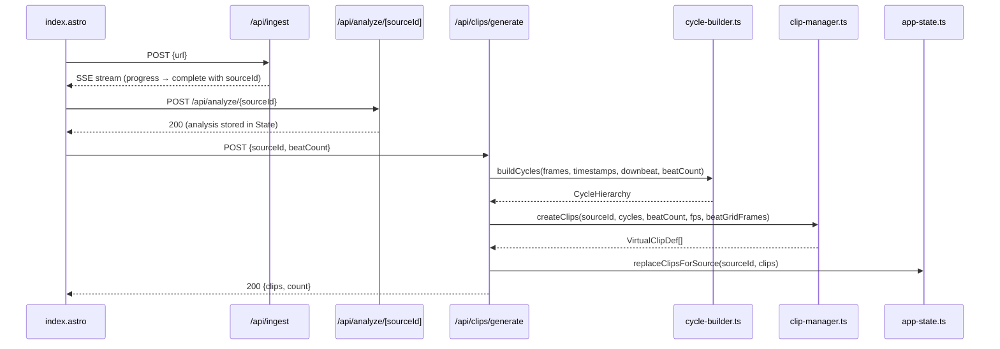
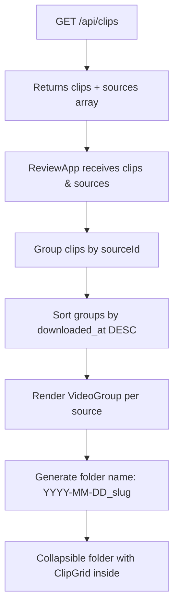

# Design Document: Configurable Beat Count

## Overview

This feature introduces a configurable beat count selector to the ingest page, replacing the hardcoded 16-beat clip generation with user-selectable values of 4, 8, 16, or 32 beats per clip. It also adds video grouping to the review page so clips are organized by source video in collapsible folders labeled with a date-prefixed slugified title.

The changes span three layers:
1. **UI layer** — Drop-down selector on the ingest page, collapsible video groups on the review page
2. **API layer** — Updated validation in `/api/clips/generate` to accept 4 as a valid beat count, default changed from 16 to 8
3. **Service layer** — Parameterized `buildCycles()` in cycle-builder, updated `createClips()` in clip-manager to handle 4-beat clips

## Architecture

### Data Flow: Ingest Page → Clip Generation



### Data Flow: Review Page Grouping



## Components and Interfaces

### 1. `src/pages/index.astro` — Ingest Page UI

**Changes:**
- Add a `<select id="beat-count-select">` element between the URL input row and the submit button
- Options: 4, 8, 16, 32 (default: 8)
- On page load: read `localStorage.getItem('beatCountPreference')` and set select value
- On change: write `localStorage.setItem('beatCountPreference', value)`
- On form submit: read selected value and pass it to the clip generation request
- Disable the select during pipeline execution (same as submit button)

**Current hardcoded value to change:**
```typescript
// Line in the script block that currently sends:
body: JSON.stringify({ sourceId, beatCount: 16 }),
// Changes to:
body: JSON.stringify({ sourceId, beatCount: parseInt(beatCountSelect.value, 10) }),
```

### 2. `src/services/cycle-builder.ts` — Parameterized Cycle Building

**Changes:**
- `buildCycles()` signature gains an optional `beatsPerCycle` parameter (default: 8)
- The internal `BEATS_PER_CYCLE` constant remains as the default but is overridden by the parameter
- Cycle grouping logic uses the parameter instead of the constant

**New signature:**
```typescript
export function buildCycles(
  beatGridFrames: number[],
  beatGridTimestamps: number[],
  downbeatIndex: number,
  beatsPerCycle: 4 | 8 | 16 | 32 = 8,
): CycleHierarchy
```

**Behavior change:** When `beatsPerCycle` is not 8, the `phrases16` and `phrases32` arrays are still computed relative to the base cycles. For `beatsPerCycle=4`, each cycle is 4 beats, so `phrases16` groups 4 cycles (16 beats) and `phrases32` groups 8 cycles (32 beats). For `beatsPerCycle=16`, each cycle is already 16 beats, so `phrases16` is just the cycles themselves and `phrases32` groups 2 cycles.

### 3. `src/services/clip-manager.ts` — 4-Beat Clip Support

**Changes:**
- `createClips()` type for `beatCount` parameter widens from `8 | 16 | 32` to `4 | 8 | 16 | 32`
- The `BEATS_PER_CYCLE` constant usage is replaced: instead of dividing `beatCount / BEATS_PER_CYCLE` to get `cyclesPerClip`, the function directly uses the cycles from the hierarchy (which are already sized to the requested beat count)
- When the cycle builder produces cycles at the requested beat count, each cycle maps 1:1 to a clip

**Updated approach:** Rather than the clip manager dividing cycles into groups, the cycle builder produces cycles at the requested size, and `createClips` maps each cycle to one clip. This simplifies the logic and eliminates the coupling between `BEATS_PER_CYCLE` in both files.

**New signature:**
```typescript
export function createClips(
  sourceId: string,
  cycles: CycleHierarchy,
  beatCount: 4 | 8 | 16 | 32,
  fps: number,
  beatGridFrames?: number[],
): VirtualClipDef[]
```

### 4. `src/pages/api/clips/generate.ts` — Endpoint Validation

**Changes:**
- Update `validBeatCounts` from `[8, 16, 32]` to `[4, 8, 16, 32]`
- Update default from `16` to `8`
- Update error message from `'beatCount must be 8, 16, or 32'` to `'beatCount must be 4, 8, 16, or 32'`
- Call `buildCycles` with the requested `beatCount` to produce correctly-sized cycles before passing to `createClips`

**Updated flow in the endpoint:**
```typescript
const validBeatCounts = [4, 8, 16, 32] as const;
const bc = (beatCount ?? 8) as 4 | 8 | 16 | 32;
if (!validBeatCounts.includes(bc)) {
  return errorResponse('beatCount must be 4, 8, 16, or 32');
}

// Rebuild cycles at the requested beat count
const analysis = state.analysisResults.get(sourceId);
const cyclesForBeatCount = buildCycles(
  source.beat_grid_frames,
  source.beat_grid,
  0, // downbeat index
  bc,
);

const clips = createClips(sourceId, cyclesForBeatCount, bc, source.fps, source.beat_grid_frames);
```

### 5. `src/components/ReviewApp.tsx` — Video Group Organization

**Changes:**
- After fetching clips and sources, group clips by `sourceId`
- Sort groups by `downloaded_at` (from `SourceRecord`) descending
- Render each group inside a new `VideoGroup` component
- Pass the grouped clips to `ClipGrid` within each group

**New state:**
```typescript
const [collapsedGroups, setCollapsedGroups] = useState<Set<string>>(new Set());
```

### 6. New Component: `src/components/VideoGroup.tsx`

**Props:**
```typescript
interface VideoGroupProps {
  sourceId: string;
  folderName: string;
  clipCount: number;
  collapsed: boolean;
  onToggle: () => void;
  children: React.ReactNode;
}
```

A collapsible container that renders a clickable header with the folder name and clip count, and conditionally renders its children (the clip cards) based on collapsed state.

### 7. New Utility: `src/services/slug-utils.ts`

**Exports:**
```typescript
export function slugify(title: string): string;
export function buildFolderName(downloadedAt: string, title: string, sourceId: string): string;
```

**`slugify` algorithm:**
1. Convert to lowercase
2. Replace any character that is not `[a-z0-9]` with `_`
3. Collapse consecutive underscores into a single underscore
4. Remove leading and trailing underscores
5. Truncate to 60 characters
6. Remove any trailing underscore introduced by truncation

**`buildFolderName` algorithm:**
1. Extract `YYYY-MM-DD` from the `downloadedAt` ISO 8601 string
2. If title is empty/falsy, use `sourceId` as the slug portion
3. Otherwise, apply `slugify(title)`
4. Return `${date}_${slug}`

## Data Models

### SourceRecord — No Schema Change Needed

The existing `SourceRecord` interface already has:
- `downloaded_at: string` — ISO 8601 timestamp (provides the YYYY-MM-DD for folder names)
- `title: string` — Video title (used for slugification)

These fields are already populated by the ingest pipeline (see `src/pages/api/ingest.ts` line where `downloaded_at: metadata.downloadedAt` is set).

### VirtualClipDef — No Change Needed

The `beatCount` field already exists on `VirtualClipDef` and accepts any number. The type constraint is enforced at the API/service level.

### localStorage Schema

| Key | Type | Values | Default |
|-----|------|--------|---------|
| `beatCountPreference` | string | `"4"`, `"8"`, `"16"`, `"32"` | `"8"` |

## Correctness Properties

*A property is a characteristic or behavior that should hold true across all valid executions of a system — essentially, a formal statement about what the system should do. Properties serve as the bridge between human-readable specifications and machine-verifiable correctness guarantees.*

### Property 1: Cycle builder produces correctly-sized cycles

*For any* valid beat grid (with at least `beatsPerCycle` beats) and any valid `beatsPerCycle` value in {4, 8, 16, 32}, calling `buildCycles` SHALL produce cycles where each cycle spans exactly `beatsPerCycle` beat indices (i.e., `endBeatIndex - startBeatIndex + 1 === beatsPerCycle`), and the total number of beats consumed equals `cycleCount * beatsPerCycle` with any remainder discarded.

**Validates: Requirements 3.1, 4.2, 4.4**

### Property 2: Clip creation produces correct clips for any valid beat count

*For any* valid `CycleHierarchy` with at least one cycle and any valid `beatCount` in {4, 8, 16, 32}, calling `createClips` SHALL produce clips where: (a) each clip's `beatCount` field equals the requested beat count, (b) each clip's `clipId` matches the pattern `{sourceId}_c\d{3}_\d{3}`, (c) each clip's `remotion.durationInFrames` is positive, and (d) the total number of clips equals the number of cycles in the hierarchy.

**Validates: Requirements 2.2, 3.2, 3.3**

### Property 3: Invalid beat count rejection

*For any* integer value that is not in the set {4, 8, 16, 32}, the beat count validation logic SHALL reject it, returning an error indication.

**Validates: Requirements 2.3, 5.3**

### Property 4: Clip grouping correctness

*For any* set of clips with varying `sourceId` values, grouping by `sourceId` SHALL produce exactly one group per unique `sourceId`, and every clip in a group SHALL have the same `sourceId` as the group key.

**Validates: Requirements 7.1, 7.2**

### Property 5: Video group ordering by download date

*For any* set of source records with distinct `downloaded_at` timestamps, the video groups SHALL be ordered such that for any adjacent pair of groups, the first group's download date is greater than or equal to the second group's download date (most recent first).

**Validates: Requirements 7.7**

### Property 6: Slugification correctness

*For any* input string, the `slugify` function SHALL produce output that: (a) contains only lowercase alphanumeric characters and underscores, (b) contains no consecutive underscores, (c) has no leading or trailing underscores (unless the result is empty), (d) has length at most 60 characters, and (e) if the input contains at least one alphanumeric character, the output is non-empty.

**Validates: Requirements 8.1, 8.2, 8.3, 8.5**

## Error Handling

### API Layer (`/api/clips/generate`)

| Condition | HTTP Status | Error Message |
|-----------|-------------|---------------|
| Invalid JSON body | 400 | `"Invalid JSON body"` |
| Missing `sourceId` | 400 | `"Missing required field: sourceId"` |
| Invalid `beatCount` (not 4, 8, 16, 32) | 400 | `"beatCount must be 4, 8, 16, or 32"` |
| Source not found | 404 | `"Source not found: {sourceId}"` |
| No analysis data | 400 | `"No cycle data for source: {sourceId}. Run analysis first."` |

### Cycle Builder

- If `beatGridFrames` has fewer beats than `beatsPerCycle`, returns an empty `CycleHierarchy` (no cycles, no phrases). This is not an error — it's a valid edge case.
- If `downbeatIndex` is beyond the array bounds, returns empty hierarchy.

### UI Layer

- If `localStorage.getItem('beatCountPreference')` returns a value not in {4, 8, 16, 32}, the selector falls back to the default of 8.
- If the clip generation request fails, the existing error display mechanism shows the error message (no change to error handling flow).

### Review Page Grouping

- If a source record is missing `downloaded_at`, use the epoch date (`1970-01-01`) as fallback for sorting.
- If a source record is missing `title`, use `sourceId` as the slug portion of the folder name.
- If the `/api/clips` response contains clips with a `sourceId` that has no matching source record, those clips are grouped under a fallback folder named with just the `sourceId`.

## Testing Strategy

### Property-Based Tests (fast-check, minimum 100 iterations each)

| Property | Test File | What It Validates |
|----------|-----------|-------------------|
| Property 1: Cycle builder sizing | `src/tests/property/cycle-builder.prop.test.ts` | Cycles have correct beat count, leftover discarded |
| Property 2: Clip creation | `src/tests/property/clip-creation.prop.test.ts` | Clips have correct beatCount, valid IDs, positive duration |
| Property 3: Beat count validation | `src/tests/property/beat-count-validation.prop.test.ts` | Invalid values rejected |
| Property 4: Clip grouping | `src/tests/property/clip-grouping.prop.test.ts` | One group per sourceId, correct assignment |
| Property 5: Group ordering | `src/tests/property/clip-grouping.prop.test.ts` | Groups sorted by date descending |
| Property 6: Slugification | `src/tests/property/slugify.prop.test.ts` | Output format invariants hold |

**Configuration:** Each property test uses `{ numRuns: 100 }` with `fc.assert()`.

**Tag format:** Each test file includes a comment: `// Feature: configurable-beat-count, Property {N}: {title}`

### Unit Tests (example-based)

| Test | File | What It Validates |
|------|------|-------------------|
| Default beat count is 8 | `src/services/cycle-builder.test.ts` | Backward compatibility (Req 4.3) |
| Select renders with correct options | Component test | UI structure (Req 1.1, 1.2) |
| localStorage round-trip | `src/pages/index.test.ts` | Persistence (Req 6.1, 6.2, 6.3) |
| Empty title fallback | `src/services/slug-utils.test.ts` | Edge case (Req 8.4) |
| Folder name format | `src/services/slug-utils.test.ts` | Format correctness (Req 8.1) |
| VideoGroup collapse toggle | Component test | UI interaction (Req 7.4, 7.5, 7.6) |
| Endpoint returns 400 for invalid | `src/pages/api/clips/generate.test.ts` | HTTP-level validation (Req 5.1, 5.2, 5.3) |

### Integration Tests

| Test | What It Validates |
|------|-------------------|
| Full pipeline: ingest → analyze → generate with beatCount=4 | End-to-end 4-beat clip generation |
| Review page loads grouped clips | Grouping renders correctly with real API data |
