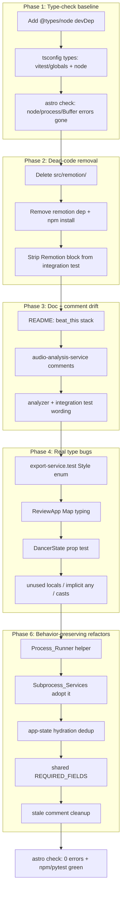

# Design Document: Type-Check and Dead-Code Cleanup

## Overview

This effort has two intertwined goals:

1. **Restore type-check visibility.** `npx astro check` currently reports 162 errors while `npm run test` passes. The discrepancy exists because Vitest transpiles per-file without whole-program type checking, while `astro check` runs the TypeScript compiler. The compiler is mis-configured: `tsconfig.json` sets `"types": ["vitest/globals"]`, which *replaces* TypeScript's default automatic `@types/*` inclusion. With an explicit `types` array, only the listed packages are loaded — so `@types/node` is excluded, and the package isn't even a declared dependency. The result is that every `node:fs` / `node:path` / `node:child_process` import and every use of `process` / `Buffer` fails to resolve (~120 of the 162 errors).

2. **Clean up after completed migrations.** Export moved from Remotion `renderMedia()` to `ffmpeg`; preview moved from Remotion `<Player>` to an HTML5 `<video>` + `<canvas>` (`ClipPreviewPlayer`); and analysis moved from `librosa` to `beat_this`. The Remotion composition code under `src/remotion/`, the `remotion` dependency, a `@remotion/renderer` integration test (the package isn't installed), and "librosa" wording across docs/comments are all leftover drift.

3. **Remove structural duplication in the service layer.** Three services hand-roll the same `spawn` + timeout + buffering + close/error pattern; `ingestion-service.ts` duplicates its yt-dlp error-classification block; `app-state.ts` duplicates state hydration between startup-restore and import; and the 10-item required-field list is defined twice (annotation service and validator). These are behavior-preserving refactors, sequenced last.

The ordering matters: fixing the type-check **first** turns the remaining genuine type bugs into visible, checkable diagnostics. Dead-code removal and type-bug fixes are verified against a clean `astro check` run, and the behavior-preserving refactors come last so each lands on an already-green baseline.

## Architecture



### Design Decisions

1. **Add `node` to `types` rather than removing the `types` array.** Removing `types` entirely would let TypeScript auto-include every `@types/*` in `node_modules`, which can pull in unexpected globals (e.g. multiple test runners) and change behavior subtly. The minimal, explicit fix is `"types": ["vitest/globals", "node"]`, which states exactly what the project needs.

2. **Pin `@types/node` to the Node 20 line.** The lockfile already expresses `^18 || ^20 || >=22`. Targeting `^20` (LTS) is a safe, conventional default and avoids accidentally adopting newer/older global shapes. The exact major can be adjusted to match the developer's installed Node if needed.

3. **Delete `src/remotion/` outright instead of keeping it "just in case."** Export uses ffmpeg and preview uses canvas; nothing in the runtime imports these compositions. Keeping them means keeping the `remotion` dependency, its type surface, and a maintenance burden for code that never executes. Git history preserves it if it is ever needed again.

4. **Remove the entire "Remotion renderer" describe block from the integration test** rather than swapping it for a `@remotion/renderer` install. The export path no longer uses Remotion, so the correct integration coverage is the existing ffmpeg/`uv`/analyzer checks. Re-adding a heavy renderer dependency purely to satisfy a test would contradict the migration.

5. **Treat documentation/comment changes as behavior-neutral.** The analyzer intentionally preserves librosa's RMS parameters (sr=22050, hop=512, frame=2048). Where a comment documents that the *values* match librosa's defaults, it will be reworded to "matching the previous librosa parameters (sr=22050, hop=512, frame=2048)" so the intent is preserved without implying librosa is imported. No numeric constants change.

6. **Fix type bugs at the source of truth, not with `as any`.** For example, `ReviewApp`'s `Map<unknown, unknown>` originates from untyped `.map()` tuple inference; the fix is to annotate the mapped entries (`[source.source_id, source] as const` / typed callback) so the `Map` is correctly `Map<string, T>` — not to cast the setter argument.

7. **Introduce a `Process_Runner` helper for non-streaming subprocess calls.** `ingestion-service.ts` (ffprobe, metadata fetch, audio extraction), `audio-analysis-service.ts` (analyzer), and `clip-extraction-service.ts` (per-clip ffmpeg) all repeat the same lifecycle: `spawn`, a `setTimeout` SIGKILL guard, stdout/stderr buffering, and a close/error promise. A single `runProcess(cmd, args, opts)` returning `{ stdout, stderr, code }` (or rejecting on timeout/spawn error) replaces ~5 copies. The **streaming** download path that yields incremental progress is intentionally left bespoke — its async-generator + cursor mechanics don't fit a simple buffered runner — but it reuses the shared error-classification helper and timeout constant.

8. **Extract the yt-dlp error classifier.** The age-restricted / private / unavailable branching appears in both `fetchVideoInfo` and `downloadVideo`. A single `classifyYtDlpError(stderrText, code): Error` is called from both, guaranteeing identical user-facing messages.

9. **Make `getAppState()` call `hydrateRuntimeState()`.** The startup-restore block inline-loads clips/cycles/analysis maps — the exact loop `hydrateRuntimeState()` already performs for `restoreProjectState()`. Routing both through one routine removes the divergence risk. The only nuance is that startup gates hydration on a successful `importProject`; the shared routine is called only after that check, preserving current behavior.

10. **Define `REQUIRED_FIELDS` once.** The identical 10-item dot-path list lives in both `annotation-service.ts` and `schema-validator.ts`. It moves to a single module (co-located with the annotation domain, e.g. exported from `schema-validator.ts` or a small shared constants module) and both import it; `TOTAL_REQUIRED_FIELDS` derives from `.length`. Field set and order are preserved exactly so completeness scores and validation are unchanged.

## Components and Interfaces

This effort changes configuration, deletes dead modules, and adjusts comments/types; it does not introduce new runtime components or interfaces. The "interfaces" affected are the build/type configuration and the public surface of files being edited.

### Phase 1 — Type-check baseline

**`package.json`**
- Add to `devDependencies`: `"@types/node": "^20.x"`.

**`tsconfig.json`**
```jsonc
// before
"types": ["vitest/globals"]
// after
"types": ["vitest/globals", "node"]
```

**Verification:** `npx astro check` — confirm the `ts(2307) node:*`, `ts(2591) process`, and `Buffer` errors are gone. The remaining errors are the genuine ones addressed in Phase 4.

### Phase 2 — Dead Remotion code

**Delete** the directory `src/remotion/`:
- `Root.tsx`, `VirtualClip.tsx`, `BeatOverlay.tsx`, `EnergyOverlay.tsx`, `index.ts`.

**`package.json`**
- Remove `"remotion": "^4.0.0"` from `dependencies`.
- Run `npm install` to update `package-lock.json`.

**Search-and-verify:** grep `src/**` for `remotion` / `Remotion` / `VirtualClip` / `BeatOverlay` / `EnergyOverlay`; the only remaining hits should be the unrelated `clip.remotion.*` timing fields on `VirtualClipDef` / `ClipAnnotation` (a domain field name, not the package) and historical references inside `.kiro/specs/**` (left as-is — specs are historical records).

### Phase 3 — Integration test fix

**`src/tests/integration/subprocess-pipelines.test.ts`**
- Remove the `describe('Remotion renderer', ...)` block (both `it` cases) and its imports of `@remotion/renderer` and `../../remotion/index.js`.
- Update the file header comment and the `librosa` describe labels/comments to say `beat_this`.
- Keep the `uv run yt-dlp` and analyzer subprocess tests unchanged (rename the analyzer describe from "librosa analyzer subprocess" to "beat_this analyzer subprocess").

### Phase 4 — Documentation drift

**`README.md`**
- Stack section: replace "Rendering/export: Remotion" with "Rendering/export: ffmpeg" and "Python analysis: Python 3.11+, `librosa`, `numpy`" with the actual `beat_this` + torch/scipy/numpy/soundfile stack.
- Any prose describing a "librosa analyzer" → "beat_this analyzer".

**`src/services/audio-analysis-service.ts`**
- File/function doc comments: "librosa analyzer" → "beat_this analyzer".

**`analyzer/analyze.py`**
- `_compute_energy_profile` docstring/comment: keep the parameter values but reword "Matches librosa's default behavior" → "Uses the previous librosa parameter values (sr=22050, hop_length=512, frame_length=2048) for output compatibility." No code change.

### Phase 5 — Genuine type bugs

| Location | Error | Fix |
|---|---|---|
| `export-service.test.ts:144` | `style: 'dominicana'` not a `Style` | Use a valid `Style` value (e.g. `'sensual'` or `'traditional'`). |
| `ReviewApp.tsx:62-63` | `Map<unknown, unknown>` not assignable | Type the `.map()` entries so `new Map(...)` infers `Map<string, ClipAnnotation>` / `Map<string, SourceRecord>` (typed callback params + tuple). |
| `validation-crossfield.prop.test.ts:99,121` | `DancerState.hold` widened to include `undefined` | Construct the state object so required fields keep their non-optional types (spread a complete base, or assert the arbitrary's required keys). |
| `cycle-builder.ts:6` | `BEATS_PER_CYCLE` unused | Remove the now-dead module constant (the per-call `beatsPerCycle` parameter supersedes it). |
| `ClipPreviewPlayer.tsx:48` | `hasSource` unused | Remove the unused local (or use it in the placeholder condition if intended). |
| `ClipGrid.tsx:20` | `annotations` param unused | Remove from destructured props if truly unused, or wire it into rendering if intended. Confirm via callers before removing from the prop type. |
| Test files | unused `React` / `vi` / `result` / `_promise` / `a` imports & locals | Remove the unused symbols. |
| `annotation-service.ts:136` | `Record<string,unknown>` → `ClipAnnotation` cast flagged | Route the cast through `as unknown as ClipAnnotation` (already the pattern elsewhere) or refine `deepMerge`'s return typing. |
| Subprocess handlers (`audio-analysis-service.ts`, `clip-extraction-service.ts`, `ingestion-service.ts`) | `code` / `err` / `l` implicit `any` | These resolve automatically once `@types/node` is present (Phase 1), since `proc.on('close', cb)` becomes typed. Re-verify after Phase 1; add explicit annotations only if any remain. |

> Note: many Phase 5 "implicit any" and `Buffer`/`process` errors are downstream of the missing `@types/node` and will disappear after Phase 1. The task plan re-runs `astro check` after Phase 1 to re-scope the genuinely-remaining errors before hand-fixing them.

### Phase 6 — Behavior-preserving refactors

**`Process_Runner` helper (new, e.g. `src/services/process-utils.ts`)**
```typescript
export interface RunProcessOptions {
  cwd?: string;
  env?: NodeJS.ProcessEnv;
  timeoutMs: number;
  timeoutMessage: string;
}
export interface ProcessResult { stdout: string; stderr: string; code: number | null; }
// Spawns cmd+args, buffers stdout/stderr, SIGKILLs on timeout, rejects on spawn error,
// resolves with { stdout, stderr, code } on close.
export function runProcess(cmd: string, args: string[], opts: RunProcessOptions): Promise<ProcessResult>;
```
- Adopters: `ffprobe()` and `fetchVideoInfo()`/`extractAudio()` in `ingestion-service.ts`, `analyze()` in `audio-analysis-service.ts`, and `runFfmpeg()` in `clip-extraction-service.ts`.
- Each adopter keeps its own *parsing* and *exit-code-to-error* logic; only the spawn/timeout/buffering shell is shared.

**yt-dlp error classifier (`ingestion-service.ts`)**
```typescript
function classifyYtDlpError(message: string, code: number | null): Error;
```
- Called by both the metadata and download paths; replaces the two duplicated if/else ladders.

**`app-state.ts` hydration**
- `getAppState()`'s inline restore loop is replaced with a call to `hydrateRuntimeState(instance, saved)` after a successful `importProject`, so startup-restore and `restoreProjectState()` share one routine. (Construct the maps first, build the instance, then hydrate — order adjusted minimally to allow reuse.)

**Shared `REQUIRED_FIELDS`**
- Move the 10-item list to one module; `annotation-service.ts` and `schema-validator.ts` import it. `TOTAL_REQUIRED_FIELDS = REQUIRED_FIELDS.length`.

**Stale comments**
- Remove/replace outdated `// Requirements: ...` headers (e.g. `clip-manager.ts`) with an accurate one-line description.

**Verification for this phase:** `astro check` (0 errors), `npm run test` (green, assertions unchanged), and—because subprocess and ingestion services are touched—a careful confirmation that existing service tests pass without assertion edits, proving behavior is preserved.

## Data Models

This effort does not change any persisted or runtime data models. The `VirtualClipDef`, `ClipAnnotation`, `SourceRecord`, and project-file shapes in `src/types/` are unchanged. The only type-level adjustments are:

- **Type inference corrections, not shape changes.** The type-bug phase corrects how existing values are *typed* at construction sites (e.g. `Map` entry inference in `ReviewApp`, `DancerState` construction in a prop test) so the inferred types match the already-correct runtime shapes. No interface fields are added, removed, or retyped.
- **Enum usage correction.** The `Style` enum (`src/types/enums.ts`) is unchanged; a test fixture is corrected to use a value the enum already defines.
- **New helper types only (Phase 6).** The refactors add internal helper types (`RunProcessOptions`, `ProcessResult`) and a shared `REQUIRED_FIELDS` constant. These are implementation details, not persisted data; the `VirtualClipDef` / `ClipAnnotation` / project-file shapes remain unchanged.

Because no persisted data model changes, no migration of `project.json` / `manifest.json` is required.

## Error Handling

- **Type-check failures** are the primary signal this effort manages. After each phase, `astro check` is re-run; a rising error count indicates a regression to investigate before proceeding.
- **Dependency install failures** (`npm install`) after editing `package.json` are surfaced by the command's non-zero exit and reviewed via the `package-lock.json` diff, which should be limited to the `remotion` removal and `@types/node` addition.
- **Missed Remotion references** are caught by a full-text search across `src/**` plus the `astro check` + test run; an unresolved import would fail compilation rather than silently passing.
- **Accidental analyzer behavior change** from the comment-only documentation edits is guarded by `uv run pytest` in the final verification phase.
- **Behavior change from the Phase 6 refactors** (subprocess runner, error classifier, hydration, shared constant) is guarded by requiring the existing service/validation tests to pass *without assertion edits* — if a refactor changes an error message, timeout, or completeness score, a test fails.

## Correctness Properties

### Property 1: Monotonic error reduction
The `astro check` error count is non-increasing across phases and reaches zero at completion.

**Validates: Requirements 1.3, 6.6, 7.1**

### Property 2: Test invariance
The set of passing Vitest tests at the end is a superset of the set that passed at the start (currently 317 passing / 2 skipped); no previously-passing test regresses.

**Validates: Requirements 1.4, 2.5, 7.2**

### Property 3: Behavior neutrality of docs/comments
Phase 4 changes are restricted to comments and prose; analyzer numeric constants and logic are unchanged, verified by `uv run pytest`.

**Validates: Requirements 5.4, 7.3**

### Property 4: No dangling references
After Remotion removal, zero imports resolve to `src/remotion/` or the `remotion`/`@remotion/*` packages within `src/**`.

**Validates: Requirements 2.3, 3.1**

### Property 5: Refactor behavior preservation
The Phase 6 refactors (subprocess runner, yt-dlp error classifier, app-state hydration dedup, shared `REQUIRED_FIELDS`) change no externally observable behavior: success outputs, error messages, timeouts, and completeness/validation results are identical, demonstrated by the existing tests passing without assertion changes.

**Validates: Requirements 7.5, 8.3, 9.4, 11.2**

## Testing Strategy

- **Type-check gate:** `npx astro check` after each phase; the error count must monotonically decrease to zero.
- **Unit/property tests:** `npm run test` after Phase 2 and at the end; must stay green (currently 317 passed / 2 skipped).
- **Analyzer tests:** `uv run pytest` at the end to confirm the comment-only analyzer edits changed nothing.
- **Refactor safety net:** the existing `ingestion`/`audio-analysis`/`clip-extraction`/`export`/`annotation`/`schema-validator`/`app-state` test files must pass after Phase 6 **without editing their assertions**; this is the primary guarantee that the refactors are behavior-preserving.
- **Integration smoke (optional):** if `uv` + `ffmpeg` are available, `INTEGRATION=1 npx vitest run src/tests/integration/` should run without the missing-module failure. This is optional because it depends on external binaries.
- **No new test frameworks** are introduced; existing Vitest + pytest are used.

## Risks and Mitigations

- **Risk:** Adding `node` types changes global types and surfaces *more* errors than expected. **Mitigation:** Phase 1 is isolated and verified on its own; if new errors appear they are real and folded into the type-bug phase scope.
- **Risk:** Removing `remotion` breaks an import that grep missed (e.g. dynamic import). **Mitigation:** full-text search for `remotion`/`@remotion` across `src/**` after removal, plus `astro check` + test run.
- **Risk:** `ClipGrid` `annotations` prop is used by a caller that relies on the prop existing. **Mitigation:** verify call sites before removing the prop from the type; if used externally, keep the prop and consume it instead of deleting.
- **Risk:** `npm install` after editing `package.json` pulls unexpected updates. **Mitigation:** only the two intended dependency lines change; review the `package-lock.json` diff is limited to `remotion` removal and `@types/node` addition.
- **Risk (Phase 6):** The `Process_Runner` abstraction subtly changes timeout or error semantics for one of the adopters. **Mitigation:** adopt it one service at a time, running that service's tests after each adoption; keep parsing/exit-code logic in the caller so only the spawn shell is shared.
- **Risk (Phase 6):** Reordering `getAppState()` to reuse `hydrateRuntimeState()` changes the startup gating on `importProject` success. **Mitigation:** call the shared routine only inside the existing `result.success` branch; `app-state` tests assert the restore behavior and must pass unchanged.
- **Risk (Phase 6):** Moving `REQUIRED_FIELDS` accidentally changes field set/order and shifts completeness scores. **Mitigation:** the shared constant is copied verbatim; completeness/validation property tests pass unchanged.
