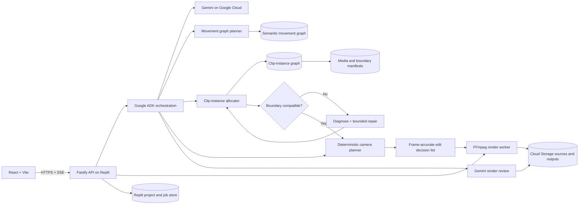

# ChoreoGraph Director

## Replit + Google Cloud technical implementation and hackathon delivery plan

Document status: implementation-ready revision 4  
Target event: Agentic Cinema: The Blockbuster Hackathon  
Target track: Replit  
Submitted product focus: agentic bachata choreography compilation and cinematic previsualization  
Core architecture: domain-agnostic movement graph with a first-party bachata domain pack  
Authoritative motion source: rights-cleared recorded movement clips  
Seed data: `bachata_knowledge_base.example.json`

---

## 1. Executive decision

Build **ChoreoGraph Director**, a web application that turns a director's natural-language brief into a physically authentic choreography edit assembled from rights-cleared performances.

The knowledge graph plans valid moves and transitions. Clip-level continuity metadata chooses the actual recordings and safe frame boundaries. Synchronized multicamera source footage provides real camera choices. A deterministic media pipeline renders the result and applies a motion-preserving visual treatment. Gemini interprets, directs, observes tool results, diagnoses failures, chooses bounded repairs, explains decisions, and critiques the render; it never invents the authoritative body motion.

The workflow is:

1. Parse a creative brief with Gemini.
2. Construct a transition-valid movement blueprint with deterministic TypeScript.
3. Allocate a specific source clip to every move.
4. Score actual clip boundaries for pose, contact, beat, velocity, performers, and camera continuity.
5. Reject graph-valid movement paths when the selected clip instances cannot form a valid continuous edit.
6. Diagnose each rejected clip edge and autonomously try a bounded repair: alternate trim, alternate recording, synchronized camera, recorded bridge, or local movement substitution.
7. Ask for user authority before changing performer pair, music, hard creative constraints, or continuous/editorial mode.
8. Choose synchronized source cameras according to the shot brief.
9. Compile a frame-accurate edit decision list.
10. Assemble the original performance frames in the required order.
11. Composite an authorized background where the source media supports clean matting.
12. Apply a deterministic, geometry-preserving visual style.
13. Ask Gemini to inspect the rendered output for visible seams, framing failures, and mismatch with the brief.
14. Repair and revalidate a failed render within budget, or let the user revise the choreography, edit, camera plan, or style.

The public product, terminology, data, expert review, and demo focus exclusively on bachata. The core planner and renderer use a `DomainPack` contract so another team could later add a separately authored screen-combat pack. No fight footage or fight-domain interface belongs in the hackathon submission.

The product principle is:

> Gemini directs and repairs; the movement graph proposes; the clip graph proves; recorded performers provide physics; deterministic editing preserves it.

### 1.1 What the product guarantees

When source labels and frame ranges are correct, the application can guarantee:

- The requested source moves appear in the compiled order.
- Every frame inside a selected source segment comes from a real performance.
- The edit manifest identifies exactly which source frames produced every output frame.
- Deterministic style presets do not change dancer geometry or movement timing.
- A multicamera angle comes from real synchronized footage, never an invented viewpoint.
- Re-rendering the same locked project, source hashes, and render version produces the same edit.

It cannot automatically guarantee:

- Continuous physics across a cut merely because two move-level graph states match.
- A seamless join between unrelated performers, studios, tempos, lenses, or takes.
- Exact character replacement through a generative video rewrite.
- A true side, rear, or overhead view when that view was never captured.
- A teachable or safe choreography solely because the edit looks plausible.

### 1.2 Two output modes

The UI must distinguish these modes visibly.

#### Continuous choreography mode

Use only clips whose measured boundary signatures are compatible or whose source contains the complete transition. This mode can claim continuous physical plausibility subject to instructor review.

Requirements:

- Same performer pair or an explicitly approved cut.
- Compatible entry and exit pose.
- Matching hand connections.
- Correct weight-bearing feet.
- Compatible root position, facing, and velocity.
- Same beat phase and acceptable tempo adjustment.
- Same synchronized take group for camera switches inside a move.
- No crossfade used to conceal an invalid physical transition.

#### Editorial montage mode

Allow intentional cinematic cuts between valid movements even when the bodies do not form one continuous physical trajectory. This output is useful as a shot concept or mood edit but must not be labeled a continuous choreography demonstration.

### 1.3 Meaning of style transfer

For the authoritative output, **style transfer** means a visual transformation that preserves source geometry and timing:

- color grading and tone curves
- film emulation, grain, bloom, glow, vignette
- posterization, duotone, edge treatment, halftone, graphic-novel treatment
- deterministic WebGL or FFmpeg shader effects
- background compositing from a valid matte or green-screen source

An experimental generative rewrite may be offered later as a separate preview. It must never replace the authoritative motion-preserving render or claim exact choreography preservation.

### 1.4 Non-negotiable architecture choices

- Create a new project and repository during the contest period.
- Use Replit Agent for meaningful implementation work and document it truthfully.
- Deploy the finished public application directly on `replit.app` or `replit.dev`.
- Use React + TypeScript + Vite for the frontend.
- Use Node.js + TypeScript for the backend, planner, edit compiler, and render orchestration.
- Use Google ADK for TypeScript and Gemini on Google Cloud for agentic interpretation, clip analysis, directing, and review.
- Store the small static movement graph as versioned JSON loaded into application memory.
- Store large media and outputs in Google Cloud Storage.
- Use only rights-cleared source video, music, choreography recordings, and performer likenesses.
- Keep exact source hashes and edit manifests for auditability.
- Use only Google Cloud AI and Replit's built-in AI features for the submission.
- Keep fight-domain logic out of the hackathon product.

### 1.5 Why no graph database is required

The expected graph is 500-2,000 moves and a few thousand or tens of thousands of edges. It is largely static. JSON plus in-memory indexes is simpler and faster than a database for runtime graph search.

On startup build:

- `moveById`
- `stateById`
- `outgoingByMoveId`
- `incomingByMoveId`
- `clipsByMoveId`
- `clipsByTakeGroupId`
- `anglesByTakeGroupId`
- indexes by style, family, difficulty, energy, state, tag, performer pair, tempo, and camera angle
- SHA-256 hashes for the graph and media manifests

A database is justified only for mutable projects, jobs, reviews, and user state. It is not needed to search the static movement graph.

### 1.6 Agentic product boundary

Do not position the product as an agent that merely translates a brief and picks clips. The defining behavior is a closed-loop **agentic continuity director**:

1. Pursue an explicit creative and continuity goal.
2. Plan a semantic movement path.
3. Ground that path in actual clip instances.
4. Observe deterministic boundary-validation results.
5. Diagnose why a proposed edit fails.
6. Select and execute the least-destructive authorized repair.
7. Revalidate after every repair.
8. Render and inspect the actual output.
9. Repair again or escalate a meaningful decision to the user.

Adding several role-playing agents would not make the project more agentic. One bounded orchestrator that observes evidence, changes course, and completes a multi-step production goal is preferable.

The render is the outcome. The core intelligence is constraint resolution under imperfect, incomplete, and sometimes contradictory media inventory.

---

## 2. Hackathon compliance gates

### 2.1 Replit track

The Replit track requires:

1. Meaningful use of Replit Agent during development.
2. Final hosting and deployment on a `replit.app` or `replit.dev` domain.

Actions:

- Create the new project in Replit.
- Give Replit Agent bounded implementation tasks with acceptance criteria.
- Review every generated change.
- Maintain `docs/replit-agent-development-log.md` with dates, task summaries, affected features, and validation performed.
- Connect the Replit project to the public repository.
- Verify the final deployment while signed out.
- Show the Replit URL and development evidence in the demo.

Official track page: https://agentic-cinema.devpost.com/details/replit-resources

### 2.2 New-project and existing-data rule

The submitted application must be newly created during the contest period.

- Do not submit or extend the current Astro annotator as the hackathon application.
- Create a new repository such as `choreograph-director`.
- Treat the movement graph and clip library as pre-existing external datasets.
- Disclose provenance, creation dates, licenses, performer releases, and transformation rights.
- Ask the organizer whether a new contest-period application can use this pre-existing dataset.
- Prepare a small contest-period recording set if the organizer does not approve the existing media foundation.

Suggested question:

> May a new application created entirely during the contest use a pre-existing, rights-cleared movement graph and recorded clip library as external data, with complete provenance disclosure and no reuse of pre-existing application code?

### 2.3 AI restriction

Allowed AI:

- Gemini and permitted Google Cloud AI services.
- Google ADK / Agent Builder tooling.
- Built-in Replit AI relevant to the selected track.

Do not use OpenAI, Anthropic, AWS AI, Microsoft AI, a non-Google generative video service, a third-party face-swap system, or a separate agent framework.

Ordinary deterministic software such as graph algorithms, FFmpeg, WebGL, color transforms, image hashing, and media containers is not being used as AI.

### 2.4 Submission checklist

- Hosted public Replit web application.
- Public repository and root-level open-source license.
- Genuine Replit Agent usage visible in the development record.
- Google Cloud SDK packages imported and called at runtime.
- Application behaves as shown in the demonstration.
- English interface and materials.
- Public demo video no longer than three minutes.
- Full disclosure of data sources, media rights, and limitations.
- No unlicensed music, performer likeness, choreography recording, game footage, film footage, logos, or trademarks.
- Submission complete by September 5, 2026.

Official sources:

- https://agentic-cinema.devpost.com/
- https://agentic-cinema.devpost.com/rules
- https://agentic-cinema.devpost.com/details/replit-resources

---

## 3. Product definition

### 3.1 Primary user

A choreographer, music-video director, editor, producer, or dance instructor who needs to transform a large movement-reference library into a coherent first edit and camera plan quickly.

### 3.2 Core user story

> As a director, I specify the duration, style, difficulty, energy arc, required movements, music, camera intent, and visual treatment. The system returns a traceable choreography edit built from real performances, explains every transition and camera choice, and lets me revise it conversationally.

### 3.3 Hero workflow

1. User chooses a rights-cleared music phrase or a demo beat grid.
2. User writes: "Create a 32-beat intermediate moderna sequence. Start open, build energy, include a follower turn and traveling move, avoid head rolls, finish in a wrap, begin on a front wide, move to three-quarter for the turn, and use the cinematic teal-and-amber preset."
3. Gemini returns a typed creative brief.
4. The deterministic planner returns three valid movement blueprints.
5. The clip allocator proposes actual recordings and frame ranges.
6. A selected pair passes the move graph but fails the clip graph because its hand connection, beat phase, root position, or velocity does not match.
7. The agent records the rejection, calls repair tools, replaces the minimum necessary clip or trim, and revalidates.
8. If no continuous repair exists, the agent explains the missing footage and requests approval before offering editorial mode.
9. The camera planner chooses views only from synchronized available source angles.
10. The user reviews the blueprint, decision ledger, seam grades, and edit decision list before rendering.
11. The render worker assembles the source frames, music, background plate, and style preset.
12. Gemini reviews the result for visible jumps, framing, and brief adherence.
13. The agent repairs a detected render issue within its budget or escalates it.
14. User says: "Keep the moves, but use the side angle for the traveling section and make the ending less stylized."
15. The system changes only the camera/style instructions and re-renders from the original sources.

### 3.4 MVP features

1. Natural-language brief plus structured controls.
2. Three graph-valid movement blueprints.
3. Two-layer movement-graph and clip-instance-graph validation.
4. Clip-instance allocation with explicit rejection reasons and continuity scores.
5. Bounded autonomous repair using alternate trims, takes, cameras, bridges, or local substitutions.
6. A visible Director's Decision Ledger containing structured observations, actions, and outcomes.
7. Frame-accurate edit timeline.
8. Front/side/three-quarter selection when synchronized sources exist.
9. Continuous-mode versus editorial-mode labeling.
10. Four deterministic style presets.
11. Optional generated or uploaded background plate when clean compositing is supported.
12. Server-side render job with progress events.
13. Final video, edit decision list, graph path, seam report, and source provenance.
14. Conversational movement, camera, and style revisions.
15. MP4, JSON manifest, and CSV shot-list export.
16. Public evidence page showing Replit, Gemini, data hash, repair trace, and evaluation results.

### 3.5 Stretch features

- Automatic beat-grid extraction using deterministic audio analysis.
- Green-screen or alpha-matted background replacement.
- Generated background plates using an allowed Google Cloud model.
- Camera-aware automatic reframing from a high-resolution wide source.
- Side-by-side comparison of alternative edits.
- Instructor annotations and approval.
- Experimental generative restyle clearly separated from the authoritative render.
- Domain-pack developer documentation.

### 3.6 Explicit non-goals

- No claim that unrelated clips become a physically continuous take through crossfades.
- No invented camera angle from a single flattened video.
- No generative character replacement in the authoritative MVP.
- No promise of face, hand, or foot preservation after experimental generative rewriting.
- No YouTube downloading.
- No face recognition.
- No autonomous dance teaching or safety certification.
- No full nonlinear video editor.
- No fight choreography in the submitted product.
- No game-asset extraction.

---

## 4. Success criteria

### 4.1 Product

- A judge creates a preview without documentation.
- Planning and clip allocation complete in under two seconds at p95 for 1,000 moves and 10,000 clips.
- The user sees every source clip, frame range, transition reason, and camera choice before rendering.
- The user sees why a graph-valid clip pairing was rejected and what repair was selected.
- An alternate camera edit can be re-rendered without replanning movement.
- A style change never modifies the authoritative movement timing.

### 4.2 Deterministic correctness

- 100% of output timeline segments reference existing move IDs, clip IDs, and valid frame ranges.
- Output movement order equals the selected blueprint.
- Zero-bridge movement edges pass state compatibility.
- Every continuous-mode seam passes the configured clip-boundary threshold.
- Every camera switch uses a real source from the same synchronized take group.
- Every output frame is traceable to a source frame or an explicitly labeled background/graphic layer.
- The same locked inputs produce the same edit manifest.

### 4.3 Quality targets

- At least 90% of continuous-mode seams receive no major continuity objection from expert reviewers.
- At least 80% of first-time users prefer the agent-selected edit over a random compatible-path baseline.
- At least 50% reduction in time to create a usable first choreography edit versus manual library search.
- At least 80% of deliberately invalid hero allocations are detected before render.
- At least 70% of repairable invalid allocations are repaired without manual clip selection.
- At least 80% of successful repairs preserve the original movement sequence.
- Zero source or output media without an approved rights record.
- No authoritative style preset changes body silhouette or source timing.

### 4.4 Hackathon

- Replit Agent and Replit hosting are obvious and credible.
- Gemini meaningfully interprets intent, analyzes evidence, calls planning/editing tools, and supports revision.
- The demo deliberately shows a movement-compatible but clip-incompatible pairing, structured rejection, autonomous minimal repair, exact move provenance, a real camera change, a style change, and a re-render.
- At least two bachata instructors and three media professionals review the product.
- The strongest measured claim is workflow acceleration plus continuity accuracy, not visual novelty alone.

---

## 5. System architecture



### 5.1 Replit application

Use one public Node deployment:

- Fastify serves `/api/v1/*` and the Vite production build.
- React uses REST for commands and SSE for job progress.
- A bounded job runner performs render orchestration.
- Job checkpoints survive page refresh and process restarts where the selected Replit store permits.
- The Replit URL is the only public application endpoint.

Avoid premature microservices. Move rendering to a separate Google Cloud job only if a measured Replit CPU, memory, timeout, or binary limitation blocks the MVP.

### 5.2 Google Cloud responsibilities

- **Gemini:** brief extraction, semantic move mapping, clip-analysis assistance, transition explanation, shot-plan rationale, rendered-output critique, and conversational revision.
- **Cloud Storage:** private source video, music, camera takes, mattes, background plates, rendered previews, and evaluation artifacts.
- **Optional Google image/video generation:** background plates only, never authoritative dancer motion.
- **Optional Pub/Sub:** render completion notifications only if a separate cloud render job becomes necessary.

### 5.3 Authentication from Replit

Preferred order:

1. Workload identity federation if Replit can expose a stable supported external identity.
2. A dedicated least-privilege service account key stored in Replit Secrets for the contest.

Fallback key rules:

- Store only as `GCP_SERVICE_ACCOUNT_JSON_BASE64`.
- Decode server-side.
- Prefer in-memory credentials.
- If an SDK requires ADC, create one owner-only temporary credential file and remove it on shutdown.
- Grant only Gemini invocation and access to the exact GCS bucket prefixes.
- Never log, commit, or expose the key.
- Rotate after judging.

### 5.4 Static data startup

1. Read the source graph JSON.
2. Validate it strictly with Zod.
3. Normalize it through the bachata domain pack.
4. Read clip, boundary, camera, take-group, rights, style, and music manifests.
5. Verify referenced GCS objects and hashes in a deployment check, not on every request.
6. Build immutable indexes.
7. Compute data hashes.
8. Run graph and clip-integrity checks.
9. Refuse readiness on hard integrity failure.

---

## 6. Repository layout

```text
choreograph-director/
|-- LICENSE
|-- README.md
|-- package.json
|-- package-lock.json
|-- tsconfig.base.json
|-- eslint.config.js
|-- .replit
|-- replit.md
|-- .env.example
|-- apps/
|   |-- web/
|   |   |-- index.html
|   |   |-- vite.config.ts
|   |   `-- src/
|   |       |-- app/
|   |       |-- components/
|   |       |-- features/brief/
|   |       |-- features/blueprint/
|   |       |-- features/timeline/
|   |       |-- features/cameras/
|   |       |-- features/styles/
|   |       |-- features/render/
|   |       |-- features/evidence/
|   |       `-- lib/
|   `-- api/
|       `-- src/
|           |-- server.ts
|           |-- config.ts
|           |-- routes/
|           |-- agent/
|           |-- jobs/
|           |-- rendering/
|           |-- persistence/
|           |-- media/
|           `-- telemetry/
|-- packages/
|   |-- contracts/
|   |-- domain-core/
|   |-- domain-pack-sdk/
|   |-- domains/bachata/
|   |-- graph-loader/
|   |-- graph-planner/
|   |-- graph-validator/
|   |-- clip-allocator/
|   |-- continuity-scorer/
|   |-- camera-planner/
|   |-- edit-compiler/
|   |-- style-engine/
|   `-- test-fixtures/
|-- seed/
|   |-- README.md
|   `-- bachata_knowledge_base.v1.json
|-- manifests/
|   |-- media.v1.json
|   |-- boundaries.v1.json
|   |-- take-groups.v1.json
|   |-- cameras.v1.json
|   |-- rights.v1.json
|   |-- music.v1.json
|   `-- styles.v1.json
|-- evals/
|   |-- golden-briefs.json
|   |-- golden-seams.json
|   `-- reports/
|-- scripts/
|   |-- validate-data.ts
|   |-- inspect-media.ts
|   |-- extract-boundary-frames.ts
|   |-- render-project.ts
|   `-- run-evals.ts
`-- docs/
    |-- architecture.md
    |-- data-provenance.md
    |-- continuity-methodology.md
    |-- style-preservation.md
    |-- replit-agent-development-log.md
    |-- demo-script.md
    `-- threat-model.md
```

Use npm workspaces. Install dependencies at the repository root only. No global npm packages. The main path is TypeScript, so no Python package is required.

---

## 7. Technology stack

### 7.1 Frontend

- React + TypeScript.
- Vite.
- React Router.
- TanStack Query.
- React Flow for movement and transition visualization.
- A custom canvas/SVG edit timeline.
- Zod contracts shared with the API.
- CSS Modules or a small token system.
- Vitest + React Testing Library.
- Playwright for the hero flow.

### 7.2 Backend and media

- Node.js 20 or the current supported Replit runtime.
- TypeScript strict mode.
- Fastify.
- `@google/adk`.
- `@google/genai` for Gemini on Google Cloud.
- Zod.
- Pino.
- `sharp` for thumbnails, boundary frames, masks, and image inspection.
- `execa` for argument-safe subprocess execution.
- A repository-local `ffmpeg-static` dependency only after license, platform, binary-size, and Replit tests pass.
- Native FFmpeg from the deployment environment only if already available and documented; never install it globally in automation.
- Vitest and `fast-check`.

Every FFmpeg command must be constructed as an argument array. Never concatenate user text into a shell command.

### 7.3 Persistence

Immutable data:

- graph JSON
- clip and boundary manifests
- camera/take metadata
- rights records
- style definitions

Mutable data:

- projects
- briefs
- movement blueprints
- edit decision lists
- render jobs
- review reports
- user feedback

Put mutable persistence behind `ProjectStore`. Use a current supported Replit database or object store. Store video bytes in GCS, not in the project database.

### 7.4 Version policy

- Pin exact application dependencies in `package-lock.json`.
- Pin `@google/adk`.
- Configure Gemini model IDs through environment variables.
- Freeze graph, media manifest, continuity weights, render presets, and prompts by August 28.
- Record application commit, graph hash, media-manifest hash, EDL hash, model ID, prompt version, renderer version, and style version on every output.

---

## 8. Data foundation

The seed contains 50 moves, nine canonical states, and 140 directed transitions. The production assumption is 200-1,000 moves plus multiple clip instances and camera views per move.

### 8.1 Generic movement model

```ts
type MovementId = string & { readonly __brand: "MovementId" };
type StateId = string & { readonly __brand: "StateId" };
type ClipId = string & { readonly __brand: "ClipId" };
type TakeGroupId = string & { readonly __brand: "TakeGroupId" };

interface MovementNode {
  id: MovementId;
  domainId: string;
  name: string;
  family: string;
  durationTicks: number;
  entryStateId: StateId;
  exitStateId: StateId;
  difficultyRank: number;
  energyRank: number;
  semanticTokens: readonly string[];
  attributes: Readonly<Record<string, unknown>>;
}

interface TransitionEdge {
  sourceId: MovementId;
  targetId: MovementId;
  compatibility: number;
  bridgeTicks: number;
  reasonCodes: readonly string[];
}
```

### 8.2 Domain pack

```ts
interface DomainPack<TBrief> {
  id: string;
  timing: {
    unit: string;
    ticksPerPhrase: number;
    ticksToSeconds(ticks: number, brief: TBrief): number;
  };
  parseSource(raw: unknown): NormalizedGraph;
  validateBrief(brief: TBrief): ValidationIssue[];
  hardConstraints(brief: TBrief): HardConstraint[];
  scoreMovement(node: MovementNode, brief: TBrief): ScorePart[];
  scoreTransition(edge: TransitionEdge, brief: TBrief): ScorePart[];
}
```

Only `packages/domains/bachata` knows leader/follower, hold, beats, hand paths, weight changes, spotting, body movement, footwork, and bachata style terminology.

Add restricted-import rules so generic packages cannot import the bachata pack. A test-only mock domain proves the engine can compile generic movement nodes measured in ticks.

### 8.3 Clip instance

```ts
interface ClipInstance {
  id: ClipId;
  movementId: MovementId;
  takeGroupId: TakeGroupId;
  cameraId: string;
  performerPairId: string;
  sourceGcsUri: string;
  sha256: string;
  frameRate: 24 | 25 | 30 | 50 | 60;
  width: number;
  height: number;
  sourceStartFrame: number;
  sourceEndFrame: number;
  safeStartFrames: number[];
  safeEndFrames: number[];
  bpm: number;
  beatOffsetSeconds: number;
  musicalSectionTags: string[];
  backgroundMode: "natural" | "green_screen" | "alpha" | "pre_matted";
  rightsRecordId: string;
  quality: {
    focus: number;
    occlusion: number;
    framing: number;
    lighting: number;
  };
}
```

### 8.4 Boundary signature

```ts
interface ClipBoundarySignature {
  clipId: ClipId;
  boundary: "entry" | "exit";
  frameNumber: number;
  canonicalStateId: StateId;
  roleAWeightFoot: string;
  roleBWeightFoot: string;
  handConnections: string[];
  relativePosition: string;
  roleAFacingDegrees: number;
  roleBFacingDegrees: number;
  rootPositionNormalized: [number, number];
  travelVelocityNormalized: [number, number];
  angularVelocity: number;
  beatPhase: number;
  poseDescriptor: number[];
  silhouetteHash?: string;
  reviewerIds: string[];
  confidence: number;
}
```

`poseDescriptor` may be human-authored or derived through a contest-permitted method. Do not introduce a third-party AI pose model without written rule confirmation. For the hackathon seed, manually verify the hero clips and use simple deterministic image features where useful.

### 8.5 Camera and synchronized take groups

```ts
interface TakeGroup {
  id: TakeGroupId;
  performanceId: string;
  performerPairId: string;
  musicTakeId: string;
  synchronizationMethod: "timecode" | "slate" | "audio_waveform" | "manual";
  cameraClipIds: ClipId[];
  commonStartTimecode: string;
  commonEndTimecode: string;
}

interface CameraSource {
  id: string;
  angle: "front" | "side" | "three_quarter" | "rear" | "overhead";
  shotSize: "wide" | "full_body" | "medium" | "detail";
  movement: "locked" | "pan" | "dolly" | "handheld";
  lensEquivalentMm?: number;
  floorCoverage: number;
  bothPerformersVisibleRatio: number;
}
```

An alternate camera version may be rendered only when the selected frames exist in the same take group. A clip from a different performance is an editorial substitute, not a synchronized angle.

### 8.6 Rights record

```ts
interface RightsRecord {
  id: string;
  recordingOwnership: "original" | "licensed";
  choreographyUseAllowed: boolean;
  performerReleaseIds: string[];
  publicDisplayAllowed: boolean;
  transformationAllowed: boolean;
  generativeDerivativeAllowed: boolean;
  musicUseAllowed: boolean;
  expiresAt?: string;
  notes: string;
}
```

The runtime must exclude any source lacking the permissions required by the selected output mode.

### 8.7 Two graph layers

Maintain two distinct directed graphs with different meanings.

#### Semantic movement graph

Nodes are canonical movements. An edge answers:

> Can these abstract movements follow each other under the domain rules?

This is the graph represented by `bachata_knowledge_base.example.json`.

#### Clip-instance graph

Nodes are specific `(clipId, safeInFrame, safeOutFrame)` variants. An edge answers:

> Can these exact source-frame ranges form the requested type of edit?

Clip edges are derived from boundary signatures, rights, performer/take constraints, tempo, and camera availability. They may be cached by graph/media hash, but must be recomputed when trim frames, mode, tempo, or source metadata changes.

A valid movement edge never implies a valid clip edge. The system must validate both.

```text
M013 Follower Right Turn -> M025 Wrap Entry
movement edge: explicitly authored in the seed graph and canonical exit/entry are S_OPEN_TWO

C-17 frame 412 -> C-63 frame 88
clip edge: invalid because the selected recording ends one-hand connected,
half a beat off phase and displaced from center, while the target starts with
no contact, a conflicting weight-foot assumption, and an incompatible root position
```

### 8.8 Clip compatibility result

```ts
type ClipFailureCode =
  | "actual_state_mismatch"
  | "hand_connection_mismatch"
  | "weight_foot_mismatch"
  | "beat_phase_mismatch"
  | "performer_mismatch"
  | "missing_camera_overlap"
  | "rights_failure"
  | "root_position_jump"
  | "facing_discontinuity"
  | "velocity_discontinuity"
  | "environment_discontinuity"
  | "lens_framing_discontinuity";

interface ClipCompatibilityAssessment {
  movementEdgeValid: boolean;
  status: "compatible" | "repairable" | "incompatible";
  continuousModeAllowed: boolean;
  hardFailures: Array<{
    code: ClipFailureCode;
    expected: unknown;
    actual: unknown;
    evidenceFrameNumbers: number[];
  }>;
  softFailures: Array<{
    code: ClipFailureCode;
    normalizedSeverity: number;
    evidenceFrameNumbers: number[];
  }>;
  metrics: {
    continuityScore: number;
    poseDistance: number;
    rootPositionDistance: number;
    facingDifferenceDegrees: number;
    velocityDifference: number;
    beatDifference: number;
    visualDifference: number;
  };
  remedies: RepairOption[];
}
```

### 8.9 Repair contracts

```ts
type RepairType =
  | "change_safe_frame"
  | "replace_clip"
  | "switch_synchronized_camera"
  | "insert_recorded_bridge"
  | "substitute_local_movement"
  | "offer_editorial_cut"
  | "report_missing_footage";

interface RepairOption {
  id: string;
  type: RepairType;
  affectedStepIndexes: number[];
  expectedContinuityScore?: number;
  addedBeats: number;
  changesMovementSequence: boolean;
  changesPerformerPair: boolean;
  changesMusic: boolean;
  changesContinuityMode: boolean;
  estimatedRenderReuseRatio: number;
  requiresUserApproval: boolean;
  evidence: Record<string, unknown>;
}

interface RepairBudget {
  maxAutomaticRepairAttempts: number;
  maxAutomaticMovementSubstitutions: number;
  allowAutomaticClipReplacement: boolean;
  allowAutomaticTrimChange: boolean;
  allowAutomaticBridgeInsertion: boolean;
  requireApprovalForPerformerChange: true;
  requireApprovalForMusicChange: true;
  requireApprovalForContinuityModeChange: true;
}
```

### 8.10 Structured decision ledger

Do not expose private chain-of-thought. Persist concise evidence-backed production decisions:

```ts
interface DecisionLedgerEntry {
  id: string;
  projectId: string;
  sequence: number;
  stage: "planning" | "allocation" | "validation" | "repair" | "camera" | "render_review";
  goal: string;
  observation: {
    toolName: string;
    resultCode: string;
    evidenceRefs: string[];
    summary: string;
  };
  decision: {
    actionType: string;
    selectedOptionId?: string;
    rejectedOptionIds: string[];
    publicRationale: string;
    requiresUserApproval: boolean;
  };
  outcome?: {
    status: "succeeded" | "failed" | "superseded";
    beforeScore?: number;
    afterScore?: number;
    changedStepIndexes: number[];
  };
  createdAt: string;
}
```

Example public ledger entry:

```text
Goal: preserve the four-move continuous choreography.
Observation: M013 -> M025 is movement-valid, but C-17 -> C-63 fails
hand connection, beat phase, and root-position checks.
Decision: replace C-63 with C-22; preserve every movement and camera requirement.
Outcome: continuity score increased from 0.46 to 0.94; validation passed.
```

---

## 9. Media preparation pipeline

### 9.1 Standardization

For each source clip:

1. Verify hash and rights.
2. Inspect codec, resolution, frame rate, aspect ratio, duration, and audio.
3. Preserve the original master unchanged.
4. Create a normalized editing proxy.
5. Map source timecode to proxy frames.
6. Detect or enter beat offset.
7. Mark candidate entry and exit frames.
8. Extract boundary thumbnails.
9. Complete human boundary annotation.
10. Add synchronized camera mapping.

The authoritative render should use normalized high-quality sources, not low-resolution web previews.

### 9.2 Recording standard for new library additions

Future recordings should use:

- one locked front wide as mandatory
- synchronized side and three-quarter cameras where possible
- same performer pair and wardrobe per session
- fixed studio lighting and floor marks
- clap/slate or timecode synchronization
- a fixed BPM track
- two eight-count handles before and after each move
- canonical entry and exit states
- separate bridge clips for frequent state changes
- green screen or controlled neutral background if background replacement is important

This production standard improves continuity more than any prompt optimization.

### 9.3 Gemini-assisted annotation

Gemini may inspect clips and propose:

- move family and tags
- coarse temporal phases
- visible hand connection
- camera framing and occlusions
- safe-cut candidates
- descriptive transition rationale

Every proposed mechanical fact used in continuous mode requires human confirmation. Store the proposal, reviewer, and final decision separately.

---

## 10. Creative brief and project contracts

### 10.1 Typed brief

```ts
interface BachataCreativeBrief {
  durationBeats: 16 | 32 | 64;
  bpm: number;
  style: "traditional" | "moderna" | "sensual" | "fusion";
  difficulty: "beginner" | "intermediate" | "advanced";
  continuityMode: "continuous" | "editorial";
  startStateId?: StateId;
  endStateId?: StateId;
  requiredFamilies: string[];
  requiredMoveIds: MovementId[];
  excludedMoveIds: MovementId[];
  excludedTags: string[];
  energyArc: "flat" | "build" | "build_release";
  performerPairId?: string;
  cameraPlan: {
    allowedAngles: string[];
    preferredShotSize: "wide" | "full_body";
    maxCameraSwitches: number;
    feetMustRemainVisible: boolean;
  };
  stylePresetId: string;
  backgroundPlateId?: string;
  musicAssetId: string;
}
```

### 10.2 Movement blueprint

```ts
interface ChoreographyBlueprint {
  id: string;
  graphHash: string;
  plannerVersion: string;
  brief: BachataCreativeBrief;
  steps: Array<{
    index: number;
    movementId: MovementId;
    startBeat: number;
    endBeat: number;
    transitionFromPrevious?: TransitionEdge;
  }>;
  hardConstraintResults: ConstraintResult[];
  scoreBreakdown: ScorePart[];
}
```

### 10.3 Clip allocation

```ts
interface AllocatedStep {
  blueprintStepIndex: number;
  movementId: MovementId;
  clipId: ClipId;
  sourceInFrame: number;
  sourceOutFrameExclusive: number;
  playbackRate: number;
  cameraId: string;
  continuityFromPrevious?: ContinuityAssessment;
}
```

### 10.4 Edit decision list

```ts
interface EditDecisionList {
  id: string;
  graphHash: string;
  mediaManifestHash: string;
  outputFrameRate: 24 | 30;
  outputWidth: number;
  outputHeight: number;
  segments: Array<{
    order: number;
    movementId: MovementId;
    clipId: ClipId;
    sourceInFrame: number;
    sourceOutFrameExclusive: number;
    outputInFrame: number;
    outputOutFrameExclusive: number;
    playbackRate: number;
    cameraId: string;
    transition: "hard_cut" | "authored_bridge" | "editorial_dissolve";
  }>;
  audio: AudioEdit;
  background?: BackgroundEdit;
  stylePresetId: string;
}
```

The EDL is the authoritative reproducibility artifact. The MP4 is a render of the EDL.

---

## 11. Deterministic movement planner

### 11.1 Hard constraints

- Total movement and bridge beats equal the requested duration.
- First and last states satisfy the brief when provided.
- Every zero-bridge transition is state-compatible.
- Required moves/families appear.
- Excluded moves/tags do not appear.
- Difficulty does not exceed the selected level.
- Safety prerequisites are satisfied by the scenario profile.
- At least one rights-cleared clip candidate exists for every step.
- Continuous mode retains at least one feasible clip allocation through every seam.
- Camera requirements are feasible from actual available camera sources.

### 11.2 Movement score

```text
movementPathScore =
  0.28 * transitionCompatibility
+ 0.19 * briefSemanticFit
+ 0.15 * musicalFit
+ 0.13 * energyArcFit
+ 0.10 * difficultyFit
+ 0.08 * familyVariety
+ 0.07 * availableClipCoverage
- 0.12 * bridgePenalty
- 0.08 * repetitionPenalty
```

### 11.3 Search

Use bounded beam search:

1. Filter valid starting nodes.
2. Expand ranked outgoing edges.
3. Track elapsed beats, current state, required-feature mask, families, and score.
4. Prune paths that cannot fill remaining duration.
5. Keep the top `K=64` states per signature.
6. Require clip coverage before final acceptance.
7. Return three diverse valid candidates.

### 11.4 Infeasibility

Return:

- failed hard constraints
- closest partial path
- missing clip/camera coverage
- minimum changes needed
- whether editorial mode would make the request feasible

Never silently downgrade continuous mode to editorial mode.

---

## 12. Clip allocation and continuity

### 12.1 Boundary continuity score

For adjacent clips `A -> B`:

```text
continuityScore =
  0.20 * canonicalStateMatch
+ 0.15 * handConnectionMatch
+ 0.12 * weightFootMatch
+ 0.11 * relativePositionMatch
+ 0.10 * facingMatch
+ 0.09 * rootPositionMatch
+ 0.08 * travelVelocityMatch
+ 0.06 * angularVelocityMatch
+ 0.05 * beatPhaseMatch
+ 0.04 * visualPoseMatch
- 0.12 * performerPairPenalty
- 0.08 * environmentPenalty
- 0.06 * lensFramingPenalty
```

Weights are versioned and calibrated with expert review.

### 12.2 Allocation algorithm

Use dynamic programming over the blueprint:

1. Candidate set for each step = rights-cleared clips matching the movement and brief.
2. Node score = clip quality, tempo fit, performer preference, framing, and source availability.
3. Edge score = boundary continuity plus take/camera compatibility.
4. Continuous mode removes edges below the threshold.
5. Editorial mode retains weaker edges but labels the cut and applies an editorial penalty.
6. Viterbi-style search returns the highest-scoring clip sequence.
7. A diversity pass returns alternate allocations.

This searches clip instances, not only move nodes.

### 12.3 Tempo handling

- Prefer sources within 5% of target BPM.
- Continuous mode playback-rate adjustment default maximum: +/-3%.
- Editorial mode default maximum: +/-5%.
- Preserve pitch when retiming audio, though source clip audio is normally discarded.
- Do not use frame interpolation in the MVP to hide invalid choreography transitions.
- Align cuts to beat phase and safe-cut frames.

### 12.4 Transition types

- `hard_cut`: valid physical or intentional editorial cut.
- `authored_bridge`: dedicated recorded bridge with known entry/exit signatures.
- `editorial_dissolve`: visual montage treatment; never proof of physical continuity.

Crossfades and optical-flow interpolation must not increase the continuity grade.

### 12.5 Hard gates versus soft evidence

The allocator must distinguish **eligibility** from **ranking**. A high weighted score cannot compensate for a failed physical or legal gate.

Continuous-mode hard gates include:

- both clips have valid rights and accessible source media
- the selected out-frame and in-frame satisfy their clips' actual boundary signatures
- hand connection and free-hand state are compatible or an authored release/take bridge exists
- weight foot and beat phase permit the next action
- root position, facing, and travel direction are within calibrated limits
- performer identity is consistent when the requested output is a continuous performance
- a camera change comes from overlapping synchronized timecode in the same take group
- every required bridge exists as recorded footage rather than as an inferred visual effect

Soft evidence ranks candidates that pass the gates: visual pose similarity, environment match, lens continuity, clip quality, preferred performer, and creative framing. Editorial mode may accept a physically discontinuous cut, but it must label the seam as editorial and must never represent it as continuous choreography.

### 12.6 Canonical graph-valid, clip-invalid rejection

The hero demo and regression suite use a deliberate counterexample:

- semantic movement edge: `M013 follower_right_turn -> M025 wrap_entry`
- movement-graph result: valid, because the canonical exit and entry states are compatible
- allocated instances: `C-17 -> C-63`
- clip-graph result: invalid, because `C-17` ends one beat early with the follower's right hand still captured, while `C-63` begins after release with a left-foot weight assumption and a displaced root position

Illustrative deterministic result:

```json
{
  "movementEdge": {
    "from": "M013",
    "to": "M025",
    "compatible": true
  },
  "clipBoundary": {
    "from": "C-17@out:412",
    "to": "C-63@in:88",
    "eligible": false,
    "score": 0.46,
    "failedHardGates": [
      "HAND_CONNECTION_MISMATCH",
      "WEIGHT_FOOT_MISMATCH",
      "ROOT_POSITION_DISCONTINUITY"
    ],
    "evidence": {
      "beatOffset": 0.5,
      "rootDistanceNormalized": 0.31,
      "outHandConnection": "leader_left_to_follower_right",
      "inHandConnection": "open_no_contact"
    }
  }
}
```

This is the central proof that a movement knowledge graph alone is insufficient. The system must ground the plan in the actual frames selected for the edit.

### 12.7 Bounded repair search

After a rejection, the continuity director diagnoses the failed gates and asks deterministic tools for repairs in this order:

1. Move to another annotated safe out-frame or in-frame within the same clips.
2. Replace one clip with another rights-cleared recording of the same movement.
3. Switch to a synchronized camera from the same take group when occlusion caused the apparent mismatch.
4. Insert a recorded bridge whose entry and exit signatures satisfy both boundaries.
5. Substitute the smallest local movement path that preserves the brief, duration, energy arc, and required moves.
6. Propose an intentional editorial cut, requiring user approval when continuous mode was requested.
7. Report the exact missing footage or annotation needed when no authorized repair exists.

Candidate repairs are ranked lexicographically, not by one opaque score:

1. satisfy every hard gate
2. preserve the requested movement sequence
3. preserve performer, music, duration, and continuous-mode constraints
4. minimize changed segments and frames
5. maximize calibrated continuity score
6. reuse already prepared render assets

The selected repair is re-evaluated from scratch. A repair is never accepted merely because its predicted score is higher.

### 12.8 Termination and escalation

Default repair budget:

- at most three autonomous repair attempts per rejected boundary
- at most one local movement substitution per project pass
- no repeated allocation state hash
- no relaxation of rights, safety, requested required moves, or source authenticity
- no continuous-to-editorial downgrade without explicit approval

The agent stops and asks the user when the budget is exhausted, when all repairs alter a hard creative constraint, or when only an editorial treatment remains. The response includes the failed gates, attempted repairs, best remaining option, and footage/annotation required for a continuous result. This prevents repair loops and keeps creative authority with the user.

---

## 13. Multicamera planning

### 13.1 Rule

A true alternate angle exists only when synchronized source frames exist in the same take group.

### 13.2 Camera planner inputs

- director's allowed and preferred angles
- movement camera metadata (`preferred_framing`, `preferred_angles`, `must_show`)
- available camera sources by take group
- feet and partner visibility requirements
- camera-switch budget
- continuity and screen-direction rules
- previous and next shot sizes

### 13.3 Camera plan algorithm

1. Enumerate synchronized angle choices for each allocated step.
2. Reject views that violate `must_show` requirements.
3. Score movement readability, visibility, preferred angle, screen direction, and shot-size continuity.
4. Penalize unnecessary switches and jump cuts.
5. Use dynamic programming to select the global shot plan.
6. Preserve exact source timecode across angle switches.

### 13.4 Alternate camera versions

Store camera choice separately from movement allocation. The user can request:

- director's cut
- instruction/front-wide cut
- cinematic three-quarter cut
- comparison split-screen

Re-render these versions from the synchronized source timeline and the same EDL. Do not attempt to derive them from the flattened final MP4.

### 13.5 Single-camera fallback

When only one source exists:

- use the real view
- optionally apply crop, scale, or virtual pan within source resolution
- label it as reframing, not a new camera
- never advertise a synthesized novel view as the same performance

---

## 14. Motion-preserving style and backgrounds

### 14.1 Style preset contract

```ts
interface StylePreset {
  id: string;
  name: string;
  version: string;
  geometryPreserving: true;
  filters: Array<
    | { type: "curves"; points: number[] }
    | { type: "lut"; assetId: string }
    | { type: "grain"; amount: number }
    | { type: "bloom"; amount: number }
    | { type: "vignette"; amount: number }
    | { type: "posterize"; levels: number }
    | { type: "edge_overlay"; opacity: number }
    | { type: "duotone"; dark: string; light: string }
  >;
}
```

MVP presets:

- Clean rehearsal.
- Cinematic warm/cool.
- Monochrome stage.
- Graphic novel.

### 14.2 Preservation rule

An authoritative style operation may change pixel color based on the same frame or deterministic neighboring frames. It may not generate a new pose, insert body parts, alter timing, or replace performers.

Automated preservation tests compare:

- frame count and timestamps
- source-to-output mapping
- silhouette edges where background permits
- motion-vector consistency on sampled frames
- no unexpected spatial warp

### 14.3 Background replacement

Allow only when the selected source supports:

- green-screen keying
- alpha channel
- precomputed and rights-cleared matte

Pipeline:

1. Decode source frame.
2. Apply deterministic key/matte.
3. Composite approved static or moving background plate.
4. Match color temperature and grain.
5. Add contact shadow only through a deterministic preset or authored layer.
6. Apply the global style after compositing.

An allowed Google model may generate a background plate, but it must not regenerate the dancers.

### 14.4 Generative experimental preview

If implemented:

- render separately from the authoritative version
- label as experimental
- show side-by-side comparison
- do not claim exact hand, foot, identity, or physics preservation
- never make it the only downloadable result

Current Google video-generation interfaces document generation, image references, first/last frames, extension, and limited editing, not a general guaranteed motion-preserving restyle of arbitrary dance footage:

- https://docs.cloud.google.com/gemini-enterprise-agent-platform/models/video/overview
- https://docs.cloud.google.com/gemini-enterprise-agent-platform/models/video/extend-a-veo-video
- https://docs.cloud.google.com/gemini-enterprise-agent-platform/models/video/use-reference-images-to-guide-video-generation

---

## 15. Render pipeline

### 15.1 Render graph

```text
Validate EDL
  -> fetch and verify source objects
  -> normalize decode settings
  -> trim exact source frames
  -> retime within approved bounds
  -> switch synchronized cameras
  -> apply authored bridges/cuts
  -> composite background
  -> apply global geometry-preserving style
  -> mix authorized music
  -> encode preview and delivery MP4
  -> write provenance manifest
  -> run media integrity checks
```

### 15.2 FFmpeg safety

- Build argument arrays, never shell strings.
- Validate all paths against job-specific local and GCS prefixes.
- Never accept arbitrary filter expressions from users or Gemini.
- Map style IDs to checked-in filter graphs.
- Enforce duration, resolution, frame-rate, and output-size limits.
- Use a fresh job directory with a random server-generated ID.
- Remove temporary media after upload and verification.

### 15.3 Render outputs

- 720p preview MP4.
- 1080p final MP4 if source quality permits.
- Optional vertical version only through an approved camera/reframe plan.
- JSON EDL and provenance manifest.
- CSV movement and shot list.
- Contact sheet of seams and camera changes.

### 15.4 Job state

```text
queued
validating
fetching_sources
preparing_segments
assembling_timeline
compositing_background
applying_style
mixing_audio
encoding
verifying_media
reviewing_with_gemini
awaiting_approval
completed
failed
```

---

## 16. Controlled agent workflow

Use one bounded orchestrator with typed tools. The agent is responsible for a closed decision loop—observe, diagnose, choose an authorized action, execute, and verify—not for pretending that probabilistic model output is a physical continuity guarantee.

```mermaid
stateDiagram-v2
    [*] --> ParseBrief
    ParseBrief --> ValidateBrief
    ValidateBrief --> PlanMovements
    PlanMovements --> AllocateClips
    AllocateClips --> ValidateAllocation
    ValidateAllocation --> PlanCameras: "all boundaries pass"
    ValidateAllocation --> DiagnoseBoundary: "boundary rejected"
    DiagnoseBoundary --> EnumerateRepairs
    EnumerateRepairs --> SelectAuthorizedRepair: "valid options exist"
    EnumerateRepairs --> AwaitUserDecision: "no autonomous option"
    SelectAuthorizedRepair --> ApplyRepair
    ApplyRepair --> RevalidateRepair
    RevalidateRepair --> ValidateAllocation: "pass; continue remaining boundaries"
    RevalidateRepair --> DiagnoseBoundary: "fail and budget remains"
    RevalidateRepair --> AwaitUserDecision: "budget exhausted or approval required"
    AwaitUserDecision --> ApplyRepair: "user approves an option"
    AwaitUserDecision --> Revise: "user changes constraints"
    PlanCameras --> CompileEDL
    CompileEDL --> AwaitRenderApproval
    AwaitRenderApproval --> Render
    Render --> ReviewOutput
    ReviewOutput --> DiagnoseBoundary: "render reveals a seam defect"
    ReviewOutput --> AwaitUserReview
    AwaitUserReview --> Revise: "movement, clip, camera, or style change"
    Revise --> PlanMovements: "movement changed"
    Revise --> AllocateClips: "clip or continuity changed"
    Revise --> PlanCameras: "camera changed"
    Revise --> Render: "style only changed"
    AwaitUserReview --> Complete
    Complete --> [*]
```



### 16.1 Tools

- `parseCreativeBrief(text, controls)`
- `planMovementSequence(brief)`
- `findClipCandidates(movementIds, constraints)`
- `allocateClips(blueprint, constraints)`
- `evaluateClipBoundary(previousClip, nextClip, frames, mode)`
- `findBoundaryRepairs(boundaryFailure, repairBudget)`
- `findBridgePath(exitSignature, entrySignature, constraints)`
- `applyRepair(projectVersion, repairId)`
- `recordDecisionLedgerEntry(entry)`
- `planCameras(allocation, cameraBrief)`
- `compileEditDecisionList(project)`
- `validateEditDecisionList(edl)`
- `estimateRender(edl)`
- `startRender(edl)`
- `getRenderStatus(renderId)`
- `reviewRenderedVideo(outputUri, brief, edl)`
- `applyRevision(previousProject, revisionText)`

The LLM never receives arbitrary shell, filesystem, FFmpeg filter, database, or URL tools.

### 16.2 Agent boundaries

Gemini may:

- interpret natural language
- map semantic intent to typed constraints
- propose candidate explanations
- summarize source-video evidence
- call approved planning and render tools
- critique the final edit
- produce a typed revision delta

Deterministic code owns:

- graph traversal
- clip and camera eligibility
- boundary scores
- continuity thresholds
- frame arithmetic
- beat arithmetic
- EDL validation
- style allowlists
- media paths
- render commands
- provenance

Gemini cannot upgrade an editorial seam to continuous or invent an unavailable camera.

### 16.3 Repair policy and authority

Every repair tool returns typed preconditions, affected segments, predicted constraint changes, and deterministic validation evidence. Gemini chooses only among returned authorized options. It cannot construct an unvalidated clip ID, frame range, bridge, camera, or render operation.

The orchestrator follows these rules:

- prefer a frame adjustment before replacing footage
- prefer the same movement before changing choreography
- prefer a synchronized real camera before an editorial concealment
- make the smallest local change that resolves all failed gates
- preserve hard user constraints even when a lower-priority continuity score would improve
- require approval for movement substitution that removes a requested move, performer changes, music changes, duration changes beyond tolerance, or continuous-to-editorial downgrade
- re-run all affected neighboring boundaries after every repair, because fixing seam `i` may invalidate seam `i+1`
- persist a state hash and consume the repair budget before another attempt

### 16.4 Director's Decision Ledger

The UI and evidence export expose concise structured decisions, not hidden model reasoning. Each rejected boundary records:

- observation: failed gate codes and measured evidence
- goal impact: which user or project constraint is at risk
- considered repairs: IDs, repair types, affected segments, and deterministic eligibility
- selected action: the authorized option and its public rationale code
- validation: before/after gate results and continuity score
- outcome: repaired, approved editorial exception, user revision, or unresolved missing footage
- provenance: graph version, media-manifest hash, scorer version, prompt/model version, and timestamps

Example ledger summary:

```text
Rejected C-17 -> C-63 at M013 -> M025.
Observed: hand connection, weight foot, and root position failed continuous-mode gates.
Selected: replace C-63 with C-22; movement sequence and music remain unchanged.
Validated: all hard gates pass; continuity score improved from 0.46 to 0.94.
```

Do not persist or display private chain-of-thought, raw hidden prompts, secrets, or unsupported narrative explanations.

### 16.5 Why this is genuinely agentic

The agent has a user goal, observes typed results from the movement and clip graphs, detects that its initial allocation failed, changes its plan within bounded authority, acts through tools, verifies the changed world state, and escalates when authority or evidence is insufficient. Deterministic components remain the source of truth, while Gemini manages intent, diagnosis, repair selection, and communication. The rendered video is the outcome; autonomous constraint resolution is the product intelligence.

---

## 17. Render review

### 17.1 Gemini review schema

```ts
interface RenderReview {
  overallStatus: "pass" | "review" | "fail";
  briefAdherence: Array<{
    requirement: string;
    satisfied: boolean;
    confidence: number;
    timestampSeconds?: number;
    notes: string;
  }>;
  seamObservations: Array<{
    segmentBefore: number;
    segmentAfter: number;
    timestampSeconds: number;
    visibleJump: boolean;
    severity: "minor" | "major" | "critical";
    notes: string;
  }>;
  cameraObservations: Array<{
    segment: number;
    feetVisible: boolean;
    bothPerformersVisible: boolean;
    notes: string;
  }>;
  styleObservations: Array<{
    segment: number;
    inconsistent: boolean;
    notes: string;
  }>;
  recommendedAction: "accept" | "change_clip" | "change_camera" | "change_style" | "human_review";
}
```

### 17.2 Acceptance policy

Gemini supplies observations, not authority. Code and humans decide:

- EDL integrity must pass deterministically.
- Source hashes and frame ranges must match.
- Continuous seams must already meet numeric thresholds.
- Gemini major/critical findings force review.
- A qualified reviewer approves the hero outputs.

No chain-of-thought is stored or displayed.

---

## 18. API design

### 18.1 Health and data

- `GET /api/v1/health/live`
- `GET /api/v1/health/ready`
- `GET /api/v1/system/info`
- `GET /api/v1/graph/stats`
- `GET /api/v1/media/stats`

### 18.2 Planning

- `POST /api/v1/briefs/parse`
- `POST /api/v1/blueprints`
- `GET /api/v1/blueprints/:id`
- `POST /api/v1/projects/:id/allocate-clips`
- `GET /api/v1/projects/:id/decisions`
- `POST /api/v1/projects/:id/boundaries/:boundaryIndex/evaluate`
- `GET /api/v1/projects/:id/boundaries/:boundaryIndex/repairs`
- `POST /api/v1/projects/:id/repairs/:repairId/apply`
- `POST /api/v1/projects/:id/decisions/:decisionId/approve`
- `POST /api/v1/projects/:id/plan-cameras`
- `GET /api/v1/projects/:id/edl`
- `POST /api/v1/projects/:id/revise`

### 18.3 Rendering

- `POST /api/v1/projects/:id/renders`
- `GET /api/v1/renders/:id`
- `GET /api/v1/renders/:id/events`
- `POST /api/v1/renders/:id/approve`
- `GET /api/v1/renders/:id/output`
- `POST /api/v1/projects/:id/render-variant`

### 18.4 Library and evidence

- `GET /api/v1/movements`
- `GET /api/v1/movements/:id`
- `GET /api/v1/movements/:id/clips`
- `GET /api/v1/clips/:id/boundaries`
- `GET /api/v1/take-groups/:id/cameras`
- `GET /api/v1/styles`

Preview routes return signed URLs only when public display is allowed.

### 18.5 SSE events

```text
brief.parsed
blueprint.planning
blueprint.completed
clips.allocating
clips.allocated
boundary.evaluated
boundary.rejected
repair.options_found
repair.selected
repair.applied
repair.validation_passed
repair.exhausted
user_decision.required
cameras.planned
edl.compiled
render.queued
render.fetching_sources
render.assembling
render.compositing
render.styling
render.encoding
render.verifying
review.started
review.completed
render.awaiting_approval
render.completed
render.failed
```

### 18.6 Error contract

```ts
interface ApiError {
  code: string;
  message: string;
  retryable: boolean;
  stage?: string;
  correlationId: string;
  safeDetails?: Record<string, unknown>;
}
```

---

## 19. React/Vite experience

### 19.1 Routes

- `/` - product promise and owned showcase edit
- `/create` - brief, music, continuity, camera, and style controls
- `/projects/:id/plan` - movement path and alternatives
- `/projects/:id/edit` - clip allocation, seams, cameras, and EDL
- `/renders/:id` - progress and output
- `/graph` - movement library explorer
- `/evidence` - architecture, data, Replit, Gemini, and evaluation proof

### 19.2 Create screen

- Natural-language brief.
- Structured controls for beats, BPM, style, level, required/excluded moves, energy, continuity mode, cameras, and visual preset.
- Music selection with rights indicator.
- Availability preview showing whether continuous mode and multicamera are feasible.

### 19.3 Planning screen

- Three candidate movement sequences.
- Move cards with source coverage counts.
- Transition reasons and hard-constraint results.
- Continuous-mode feasibility badge.
- Estimated render duration and resolution.
- Director's Decision Ledger showing when an initially selected clip allocation is rejected, repaired, and revalidated.

### 19.4 Edit screen

- Frame-accurate timeline.
- One lane for moves, one for source clips, one for cameras, one for music, one for style/background.
- Seam grade between every pair.
- Entry/exit boundary thumbnails side by side.
- Seam Inspector with measured hand, foot, beat, root, facing, and velocity evidence.
- Separate hard-gate status and soft continuity score; never collapse them into one misleading grade.
- Warning when performers, environment, or camera change.
- Alternative clip and angle dropdowns limited to eligible sources.
- Ranked repair cards showing changed segments, preserved constraints, before/after score, and validation status.
- Approval controls for editorial downgrade, material choreography changes, performer/music changes, and repair-budget exhaustion.
- Clear label: continuous choreography or editorial montage.

### 19.5 Result screen

- Large final player.
- Beat-aligned movement labels.
- Source provenance toggle.
- Camera plan and style preset.
- Gemini review findings.
- Expandable Decision Ledger with rejection evidence, repair selected, and verified outcome.
- Render alternate camera cut.
- Revise movement, clip, camera, style, or background.
- Download MP4, EDL JSON, and shot list.

### 19.6 Revision examples

- "Keep the movement sequence but use the side camera during the traveling move."
- "Replace the wrap with an open ending and keep continuous mode."
- "Use the clean rehearsal look instead of graphic novel."
- "Do not change any moves; use a wider crop so both dancers' feet remain visible."

Gemini returns a typed delta. The system invalidates only affected stages:

- movement change -> replan, reallocate, re-render
- clip change -> re-score seams, replan cameras, re-render
- camera change -> recompile EDL and re-render
- style/background change -> re-render only

### 19.7 Accessibility

- Keyboard-accessible timeline controls.
- Visible focus and descriptive labels.
- Text representation of graph and seam grades.
- Text representation of hard-gate failures, repairs, and approval requirements.
- No color-only continuity indicators.
- Captions/transcript for explanatory audio.
- Responsive 1280x720 demo layout.

---

## 20. Security, privacy, rights, and safety

### 20.1 Trust boundaries

- Treat user text, manifests, Gemini output, media headers, and signed URLs as untrusted.
- Validate all model output with Zod.
- Restrict GCS paths to configured prefixes.
- Never let Gemini or users provide arbitrary local paths, codecs, or FFmpeg expressions.
- Validate MIME type, byte size, duration, frame rate, and resolution.

### 20.2 Secrets

Store only in Replit Secrets:

- Google Cloud configuration where sensitive
- service account or federation values
- session secret
- signed URL configuration

Redact signed query strings and secret-like data from logs.

### 20.3 Rights

Every used asset needs:

- recording ownership/license
- choreography recording permission
- performer releases
- public display permission
- transformation permission for styling/compositing
- music license
- generative-derivative permission only if a generative experimental mode uses it

Keep an asset disable flag and takedown process. Do not include a source in a cached demo after rights expiration.

### 20.4 Dance safety

- Continuous-mode labels require instructor-reviewed boundaries.
- Editorial mode is not a single physically performable take.
- The application is previsualization, not instruction or certification.
- Warn against reproducing advanced movements without qualified guidance.

### 20.5 Render abuse controls

- Maximum one concurrent render per session.
- Duration and resolution caps.
- Rate limits and daily render budgets.
- Safe fixed style presets only.
- Job timeout and process kill.
- Signed URLs with short expiration.
- Immediate cleanup of temporary source media.

---

## 21. Observability and runtime evidence

### 21.1 Trace record

Every project/render records:

- correlation ID
- application commit
- Replit deployment identifier where available
- graph and manifest hashes
- planner, allocator, camera, EDL, renderer, and style versions
- Gemini model and safe request hashes
- move IDs, clip IDs, frame ranges, and camera IDs
- seam score components
- rejected boundary codes, repair candidates, selected repairs, state hashes, and budget use
- pre-repair and post-repair validation results
- render stage timings
- source and output hashes
- Gemini review and human approval

### 21.2 Public evidence page

Show:

- hosted Replit domain
- Replit Agent development-log summary
- Gemini model ID
- graph, clip, camera, and take-group counts
- graph and media hashes
- redacted agent tool trace
- Director's Decision Ledger with structured observations, actions, and outcomes
- one EDL with source-frame provenance
- continuous versus editorial definitions
- render time and seam metrics
- evaluation methodology and public repository

### 21.3 Metrics

- brief parse success
- movement planner latency/infeasible rate
- clip allocation latency/infeasible rate
- invalid allocation detection rate against labeled cases
- autonomous repair success rate
- mean repair attempts per rejected boundary
- original movement-sequence preservation after repair
- changed-segment count and minimal-change ratio
- user escalation and editorial-downgrade rates
- mean continuity score before and after successful repair
- decision-ledger evidence completeness
- tool failure and repair-loop prevention counts
- continuous-mode feasibility rate
- mean and minimum seam score
- multicamera coverage rate
- render completion/error/latency
- output integrity failures
- Gemini review major-findings rate
- revision stage-reuse rate
- expert continuity rating
- time saved versus manual editing

---

## 22. Testing strategy

### 22.1 Graph and manifest tests

- JSON schema passes.
- Declared counts equal actual counts.
- IDs are unique.
- Every state, edge, move, clip, camera, take group, rights record, and asset exists.
- Source frame ranges are valid.
- Hashes match media.
- Continuous candidates have reviewed boundaries.
- Camera sources in a take group overlap in time.
- Rights meet output requirements.

### 22.2 Planner tests

- exact beat accounting
- start/end state handling
- required/excluded moves
- difficulty and safety ceilings
- deterministic tie-breaking
- diverse candidates
- missing clip/camera infeasibility

Use `fast-check` on generated small graphs.

### 22.3 Continuity tests

- identical signatures score maximally
- state mismatch fails continuous mode
- hand mismatch is strongly penalized
- beat-phase and velocity differences are reflected
- performer/environment changes are labeled
- weak seam remains editorial after a dissolve
- Viterbi allocation finds the global rather than greedy optimum
- `M013 -> M025` passes the authored movement graph while `C-17 -> C-63` fails the clip graph for the labeled hard-gate reasons
- a high soft similarity score cannot override one failed continuous-mode hard gate

### 22.4 Repair and decision tests

- a valid alternate safe frame is preferred to replacing a clip
- a same-movement replacement is preferred to changing choreography
- a synchronized-camera repair is allowed only with overlapping source timecode
- a recorded bridge repairs only when both of its boundary signatures pass
- movement substitution is local and retains required moves, beat count, and energy constraints
- deterministic ranking selects the same repair for the same versions and inputs
- every applied repair revalidates both affected neighboring seams
- repeated allocation state hashes are rejected and the three-attempt budget is enforced
- continuous-to-editorial downgrade and material constraint changes require user approval
- no-repair cases report missing footage instead of fabricating continuity
- every rejection produces an observation, considered options, selected action, and outcome
- the public ledger contains no raw hidden prompts, chain-of-thought, secrets, or unsigned media URLs

### 22.5 Camera tests

- selected angles exist in the same take group
- timecode mapping is frame accurate
- feet visibility is enforced
- switch count limit is enforced
- no false multicamera claim from unrelated takes
- single-camera reframing stays within resolution bounds

### 22.6 EDL and render tests

- source and output frame math is exact
- no gaps or overlaps unless explicit
- output duration matches music grid
- style does not alter frame count
- alternate angle keeps identical movement timing
- manifest traces every output segment
- FFmpeg arguments contain no user-controlled filters or paths
- interrupted jobs clean temporary files

Use short synthetic color/frame-number fixtures in CI so render assertions are deterministic and inexpensive.

### 22.7 API and frontend tests

- schemas and error contracts
- SSE reconnect
- refresh during render
- continuity-mode failure UI
- deliberate rejection, repair, revalidation, and Decision Ledger UI
- approval-gated editorial fallback and exhausted-budget UI
- seam comparison UI
- alternate-camera variant
- style-only revision reuse
- signed-out Replit deployment smoke test

---

## 23. Evaluation plan

### 23.1 Golden briefs

At least 25 briefs covering:

- 16, 32, and 64 beats
- beginner/intermediate/advanced
- represented bachata styles
- required turn, travel, footwork, wrap, and ending families
- continuous and editorial modes
- front-only and multicamera requests
- impossible performer/camera combinations
- four style presets
- background replacement eligibility

Add labeled adversarial boundaries that isolate one failure at a time and combined failures:

- clip trimmed before the authored release
- one-hand versus two-hand connection mismatch
- half-beat phase offset
- incompatible weight foot
- excessive root-position or travel-velocity jump
- occluded pose that a synchronized camera resolves
- rights-disabled best clip
- no repair possible without editorial mode
- one repair that fixes the current seam but breaks the following seam

### 23.2 Baselines

Compare:

1. Random valid graph path plus random clips.
2. Movement-only graph planner plus first available clip, with no clip rejection.
3. Clip-boundary optimizer with no autonomous repair after rejection.
4. Full system with rejection, bounded repair, revalidation, and camera planning.
5. Human editor creating a first pass from the same library and time budget.

### 23.3 Automated metrics

- hard-constraint pass rate
- exact move-order pass rate
- source-frame traceability
- continuous allocation success
- labeled invalid-boundary detection precision and recall
- autonomous repair success among repairable cases
- movement-sequence preservation after repair
- user-escalation rate
- median attempts and changed segments per successful repair
- continuity-score and expert-rating delta before/after repair
- repair-budget and approval-policy compliance
- minimum seam score
- camera requirement pass rate
- render integrity pass rate
- planning and render latency
- revision reuse percentage

### 23.4 Expert review

At least two qualified bachata instructors assess:

- movement label accuracy
- physical continuity at seams
- hand and weight-state plausibility
- musical phrasing
- whether continuous-mode claims are justified

At least three directors/editors/producers assess:

- camera usefulness
- edit coherence
- style consistency
- provenance usefulness
- time saved
- previsualization value

Disclose sample size, backgrounds, disagreements, and failures.

### 23.5 Winning evidence

The central measured claim:

> A movement graph plus frame-level clip continuity metadata lets an agent detect, diagnose, and repair invalid clip allocations while preserving the director's choreography more reliably than movement-only assembly.

Secondary claim:

> Because camera and style are compiled separately from motion, directors can generate alternate cuts without changing the authoritative choreography.

The strongest evidence is a failure-and-repair table, not only a polished final video. A useful target—not a claim until measured—is: detect at least 23 of 25 labeled invalid allocations, repair at least 19 automatically, preserve the original movement sequence in at least 17, and improve expert-rated seam continuity from roughly 2.4/5 to 4.3/5. Publish the actual numbers, including misses and escalations.

---

## 24. Local and Replit development

### 24.1 Root workflow

```bash
npm install
npm run validate:data
npm run typecheck
npm test
npm run dev
```

No global packages. Node dependencies belong in the root `package.json`. Do not use Homebrew or system package managers in automation. If FFmpeg is absent and the local npm binary approach fails, document the official developer prerequisite rather than installing globally.

### 24.2 Replit configuration

- Development: Fastify plus Vite.
- Build: all TypeScript workspaces and Vite assets.
- Production: one Fastify process serves API and built frontend.
- Port: Replit-provided `PORT`.
- Health: `/api/v1/health/live`.
- Secrets: GCP and session values server-side only.
- Render working directory: explicit app-owned temporary path with quotas.

### 24.3 Environment variables

```text
NODE_ENV
PORT
APP_BASE_URL
GOOGLE_CLOUD_PROJECT
GOOGLE_CLOUD_LOCATION
GCP_SERVICE_ACCOUNT_JSON_BASE64
GCS_BUCKET
GCS_SOURCE_PREFIX
GCS_OUTPUT_PREFIX
GEMINI_MODEL
PROJECT_STORE_URL
MAX_RENDER_SECONDS
MAX_RENDER_WIDTH
MAX_CONCURRENT_RENDERS
SESSION_SECRET
```

Parse with Zod at startup and refuse production readiness when required values are missing.

### 24.4 Replit Agent protocol

For every meaningful Replit Agent task:

1. Provide a bounded objective and acceptance tests.
2. Require inspection of `replit.md` and relevant contracts.
3. Review the diff.
4. Run focused tests and typecheck.
5. Correct mistakes in the Replit project.
6. Add a truthful development-log entry.

Good tasks:

- scaffold React/Fastify workspaces
- implement the seam-comparison UI from typed fixtures
- create the frame-accurate timeline
- implement an FFmpeg fake adapter for tests
- add Playwright tests for render refresh/reconnect
- improve Replit deployment and health checks

Do not delegate choreography correctness, rights decisions, or judging claims without human review.

---

## 25. CI/CD and deployment

### 25.1 Pull-request checks

- clean `npm ci`
- formatting and lint
- TypeScript typecheck
- graph and manifest validation
- unit and property tests
- deterministic short render fixture
- API contract tests
- Vite production build
- forbidden-import architecture test
- secret scan
- license and provenance checks

### 25.2 Replit deployment

1. Merge a verified commit.
2. Sync the Replit project.
3. Run checks inside Replit.
4. Verify the packaged/local FFmpeg path.
5. Build and deploy through Replit Deployments.
6. Test the public domain signed out.
7. Run health, graph, source preview, short render, alternate-camera, and Gemini review smoke tests.
8. Record deployed commit and data hashes on the evidence page.

### 25.3 Rollback

- Keep the previous working Replit deployment.
- Never mutate a media manifest without a version bump.
- Preserve at least two owned cached showcase renders and their exact EDLs.
- Keep a render kill switch.
- If Replit cannot reliably execute FFmpeg, use a scoped Google Cloud render job while retaining the complete public web application and orchestration on Replit.

---

## 26. Delivery plan

Dates assume work begins August 2 and the deadline is September 7, 2026.

### Phase 0 - compliance and feasibility: August 2-5

- Create new Replit project and repository.
- Add license, `.replit`, `replit.md`, and docs skeleton.
- Send dataset eligibility question.
- Audit clip, performer, choreography, music, and transformation rights.
- Prove Gemini structured output from Replit.
- Prove source download, local trim/concat, style preset, GCS upload, and signed playback.
- Deploy the full-stack shell to the final Replit domain.

Go/no-go gate:

> A Replit-hosted TypeScript route invokes Gemini, compiles a two-clip test EDL, renders it with the repository-approved media binary, uploads it to GCS, and returns a playable signed URL.

### Phase 1 - graph and clip data: August 6-11

- Define source, normalized, clip, boundary, camera, take-group, rights, and style schemas.
- Validate and hash the 50-move seed.
- Build indexes.
- Implement domain pack and architecture tests.
- Annotate hero clip boundaries manually.
- Map synchronized camera sources.
- Create deterministic data validation.

Exit gate: every hero move has a valid clip, reviewed boundaries, rights, and camera availability.

### Phase 2 - planner and continuity: August 12-17

- Implement movement beam search.
- Implement separate movement-edge and clip-boundary validation.
- Implement hard-gate boundary evaluation and soft scoring.
- Implement dynamic-programming clip allocation.
- Implement continuous/editorial thresholds.
- Implement bounded repair enumeration, deterministic ranking, state hashes, and revalidation.
- Implement safe-frame, same-movement clip, synchronized-camera, recorded-bridge, and local-movement repairs.
- Implement repair budgets and approval gates.
- Implement the structured Decision Ledger.
- Implement camera planner.
- Implement EDL compiler and validators.
- Run golden planning, adversarial seam, and repair tests.

Exit gate: a 32-beat brief yields a valid movement path, rejects the seeded graph-valid/clip-invalid allocation, applies the expected minimal repair, revalidates neighboring seams, and produces a camera plan and EDL deterministically.

### Phase 3 - renderer and styles: August 18-23

- Implement safe media fetch and temporary workspace.
- Implement trim, retime, concat, synchronized camera switch, audio mix, and encoding.
- Implement four geometry-preserving style presets.
- Add supported background compositing.
- Generate preview, final, manifest, shot list, and contact sheet.
- Add cleanup, timeouts, and resource caps.

Exit gate: three hero EDLs render reproducibly on Replit.

### Phase 4 - agent and winning UI: August 24-29

- Implement the ADK observe-diagnose-repair-revalidate workflow and typed tools.
- Implement Gemini brief parsing and render review.
- Build create, plan, edit, render, graph, and evidence screens.
- Build the Seam Inspector, rejection evidence, ranked repair options, approval gates, and camera availability UI.
- Build the Director's Decision Ledger and repair activity stream.
- Implement revision invalidation and stage reuse.
- Add SSE reconnect and refresh recovery.
- Complete Replit Agent tasks and log them.

Exit gate: an unfamiliar tester creates, changes camera/style, and re-renders without guidance.

### Phase 5 - evaluation and polish: August 30-September 2

- Run baselines and time-to-first-edit comparison.
- Measure invalid-boundary detection, autonomous repair, movement preservation, escalation, and minimal-change rates.
- Conduct instructor and media-professional review.
- Publish honest continuity and workflow metrics.
- Add rate limits, cached showcases, and deployment checks.
- Accessibility and responsive pass.
- Freeze data, prompts, dependencies, styles, and render settings.

### Phase 6 - submission: September 3-5

- Record the three-minute demonstration.
- Finish README, provenance, continuity methodology, limitations, architecture, and Replit development log.
- Complete Devpost copy.
- Verify public repository, license, hosted application, and video.
- Submit by September 5.

### September 6-7

Emergency fixes only. Do not add rendering features or reannotate the dataset.

---

## 27. Three-minute demo

### 0:00-0:18 - problem

Show a folder of isolated movement clips and explain that finding moves is not the hard part; building a transition-aware first edit and camera plan is.

> A reference library contains the choreography's vocabulary, but it does not compile itself into a physically credible scene.

### 0:18-0:42 - brief and movement plan

Enter the 32-beat hero brief. Show four selected moves, state transitions, and hard-constraint checks.

### 0:42-1:08 - deliberate rejection

Reveal that `M013 follower_right_turn -> M025 wrap_entry` is an authored edge in the movement graph, but the first allocation `C-17 -> C-63` is rejected by the clip graph. Freeze the out/in frames and show the failed hand-connection, weight-foot, beat-phase, and root-position evidence.

Emphasize:

> The graph validates the movement. The boundary signatures validate the actual edit.

### 1:08-1:35 - autonomous minimal repair

Show the director agent requesting bounded repairs, choosing `C-22` as a same-movement replacement, and revalidating the repaired seam and its neighbor. The movement order, music, performers, and duration remain locked; the continuity score rises from the seeded fixture's `0.46` to `0.94` and every hard gate passes.

The narration should say that these are fixture values unless the production dataset reproduces them.

### 1:35-2:02 - multicamera, render, and provenance

Show synchronized front, side, and three-quarter sources. Let the camera planner choose a real angle, render the cinematic preset, and play the repaired seam. Open the EDL overlay and Decision Ledger:

- rejected allocation and measured reasons
- repair alternatives and selected minimal change
- before/after validation
- exact move order preserved
- clip IDs and source frame ranges
- continuous versus editorial seam labels
- camera take/timecode
- graph and media hashes

Show that original performance frames provide the motion.

### 2:02-2:25 - user authority and revision

Enter:

> Keep every move, use the side camera for the traveling pattern, and change the style to clean rehearsal.

Show that movement and clip allocation remain locked while only camera/style stages recompile and re-render.

Briefly show an unrepairable fixture where the agent requests permission for an editorial cut instead of silently downgrading continuous mode.

### 2:25-2:45 - measured advantage

Show actual results for:

- invalid clip pairings detected
- repairable pairings fixed autonomously
- original movement sequences preserved
- user escalations and expert continuity improvement

### 2:45-3:00 - Replit and impact

Show the Replit domain, Replit Agent development evidence, Gemini tool trace, public repository, and expert reviewers.

Close:

> ChoreoGraph Director is an agentic continuity director: the movement graph proposes, the clip graph proves, and the agent repairs what the real footage cannot perform continuously.

---

## 28. Judging strategy

### 28.1 Technological implementation

- Replit Agent materially contributes to the build.
- Replit hosts the complete product.
- Gemini and ADK power a closed tool-using workflow that observes a failed allocation, diagnoses it, chooses a bounded repair, acts, and revalidates.
- The movement graph proposes semantically valid choreography while the clip graph proves whether the selected recordings can realize each seam.
- The graph planner, clip allocator, hard-gate validator, repair engine, camera planner, EDL compiler, and renderer form a coherent system.
- Every output is reproducible and traceable to source frames.

### 28.2 Design

- Users review moves, seams, cameras, and rights before rendering.
- Continuous and editorial outputs cannot be confused.
- Camera and style revisions preserve locked choreography.
- The Seam Inspector explains timeline complexity through side-by-side frames and measured evidence.
- The Decision Ledger makes failures and autonomous repairs legible without exposing chain-of-thought.
- Approval gates keep material choreography and editorial compromises under user control.

### 28.3 Potential impact

- Faster director/choreographer/editor collaboration.
- Less manual searching through large reference libraries.
- Fewer invalid seams reaching the editor and less manual trial-and-error finding replacement takes.
- Better previs before rehearsal and production.
- Reusable expert movement knowledge.
- Real performers and choreographers remain the source of motion rather than being replaced by hallucinated mechanics.

Validate with at least five interviews across instructors, choreographers, directors, editors, and producers.

### 28.4 Quality of idea

The differentiator is the compilation chain:

```text
creative intent
  -> movement graph
  -> initial recorded-performance allocation
  -> clip-level reject, diagnose, and bounded repair
  -> frame-level revalidation
  -> real multicamera edit
  -> motion-preserving visual treatment
  -> auditable decision and revision
```

This is more defensible than a generic editing chatbot, prompt wrapper, or AI-assisted stitcher because its central behavior is autonomous constraint resolution grounded in real media evidence.

---

## 29. Risk register

| Risk | Probability | Impact | Mitigation | Decision date |
|---|---:|---:|---|---|
| Pre-existing data violates the new-project rule | Medium | Critical | Ask organizer; disclose provenance; prepare contest-period subset | Aug 5 |
| Clip or performer rights are incomplete | High | Critical | Rights audit; new recordings/releases; exclude uncertain assets | Aug 8 |
| Existing clips have incompatible performers/backgrounds | High | High | Continuous-mode eligibility; same-session hero set; editorial labeling | Aug 11 |
| Move graph state is too coarse for seamless cuts | High | High | Clip boundary signatures, human review, authored bridges | Aug 14 |
| Multicamera clips are not synchronized | Medium | High | Require take-group time mapping; no false angle claim | Aug 11 |
| FFmpeg binary fails on Replit | Medium | Critical | Prove phase 0; repository-local package; scoped cloud render fallback | Aug 5 |
| Render exceeds Replit CPU/memory/time limits | Medium | High | 720p preview, short duration, bounded concurrency, cloud job fallback | Aug 20 |
| Style preset damages readability | Low | Medium | Geometry-preserving allowlist, silhouette/motion tests, clean fallback | Aug 23 |
| Background key/matte is poor | High | Medium | Green-screen/pre-matted sources only; make background replacement stretch | Aug 18 |
| Gemini incorrectly describes a mechanical fact | Medium | High | Human-confirmed boundary facts; deterministic thresholds | Aug 14 |
| Agent looks like a chat layer over video stitching | Medium | Critical | Make deliberate reject-diagnose-repair-revalidate loop the hero demo; publish the Decision Ledger and agency metrics | Aug 29 |
| Agent loops or makes increasingly broad changes | Medium | High | Three-attempt budget, allocation state hashes, lexicographic minimal-change policy, approval gates | Aug 17 |
| A repair fixes one seam but breaks its neighbor | Medium | High | Revalidate both neighboring boundaries after every mutation; transactional project versions | Aug 17 |
| Decision Ledger exposes hidden reasoning or secrets | Low | High | Store only typed observations/actions/outcomes; redact prompts, credentials, URLs, and model internals | Aug 24 |
| Replit Agent contribution appears superficial | Medium | High | Meaningful tasks and truthful development log | Aug 29 |
| UI resembles a generic editor | Medium | High | Lead with agent plan, graph evidence, seam intelligence, and revision reuse | Aug 27 |
| Demo source footage looks visually inconsistent | Medium | High | Curated same-session hero pack; global grade; rehearsal mode fallback | Aug 25 |

### 29.1 Scope fallback ladder

Cut in this order:

1. Experimental generative restyle.
2. Generated background plates.
3. Background replacement.
4. 64-beat projects.
5. Automatic alternate camera variants.
6. More than two style presets.

Never cut:

- movement graph planning
- clip-instance allocation
- hard-gate rejection and seam evidence
- at least two autonomous repair types, repair budget, and revalidation
- Director's Decision Ledger and user approval gate
- exact EDL/source provenance
- one real synchronized camera switch if footage exists
- motion-preserving render
- Gemini runtime and revision workflow
- Replit Agent evidence and Replit hosting

The smallest credible product compiles four real moves into a 32-beat edit, rejects one graph-valid/clip-invalid seam, repairs it with a same-movement replacement, revalidates it, records the decision, applies one deterministic style, and escalates one unrepairable editorial decision to the user.

---

## 30. Initial backlog

### Epic A - compliance and setup

- A1 Create new Replit project and repository.
- A2 Add license and documentation.
- A3 Send dataset eligibility question.
- A4 Complete rights audit.
- A5 Configure Replit deployment and development log.

### Epic B - Google Cloud and media spike

- B1 Create isolated GCP project and bucket.
- B2 Configure least-privilege Replit authentication.
- B3 Prove Gemini structured output.
- B4 Prove source fetch and signed preview.
- B5 Prove two-clip styled render on Replit.
- B6 Prove GCS output upload/playback.

### Epic C - data

- C1 Define schemas.
- C2 Validate/hash graph.
- C3 Build media, boundary, camera, take, rights, music, and style manifests.
- C4 Annotate hero boundaries.
- C5 Map synchronized cameras.
- C6 Add integrity tests.

### Epic D - planning

- D1 Implement creative brief.
- D2 Implement movement beam search.
- D3 Implement clip hard gates and calibrated continuity scoring.
- D4 Implement clip allocation and explicit rejection contracts.
- D5 Implement repair enumeration, minimal-change ranking, budgets, state hashes, and revalidation.
- D6 Implement safe-frame, replacement-clip, synchronized-camera, bridge, and local-movement repairs.
- D7 Implement user approval gates and no-repair diagnosis.
- D8 Implement camera planning.
- D9 Implement EDL compilation and validation.
- D10 Add adversarial and property tests.

### Epic E - rendering

- E1 Implement safe media workspace.
- E2 Implement trim/retime/concat.
- E3 Implement camera switching.
- E4 Implement styles.
- E5 Implement audio mix.
- E6 Implement optional background composite.
- E7 Implement provenance and integrity checks.

### Epic F - agent and API

- F1 Implement the ADK observe-diagnose-repair-revalidate workflow.
- F2 Implement boundary evaluation, repair, ledger, approval, and render tools.
- F3 Implement Gemini brief parser.
- F4 Implement render review.
- F5 Implement revision invalidation.
- F6 Implement Director's Decision Ledger persistence and redaction.
- F7 Implement REST and SSE, including repair events.

### Epic G - web experience

- G1 Create screen.
- G2 Movement plan.
- G3 Seam and boundary UI.
- G4 Rejection, repair options, and approval UI.
- G5 Decision Ledger and agent activity UI.
- G6 Multicamera planner.
- G7 Style controls.
- G8 Render progress/result.
- G9 Revision and variants.
- G10 Evidence page.

### Epic H - evaluation and submission

- H1 Write golden briefs/seams.
- H2 Run baselines.
- H3 Run labeled rejection/repair evaluation.
- H4 Conduct expert reviews.
- H5 Publish agency, continuity, and limitation metrics.
- H6 Record the deliberate failure-and-repair demo.
- H7 Complete Devpost and compliance audit.

---

## 31. Definition of done

The project is submission-ready only when:

- The public app runs on `replit.app` or `replit.dev`.
- Replit Agent usage is genuine and documented.
- The application repository was created during the contest period.
- Dataset eligibility and all media rights are documented.
- React/Vite is the only frontend stack.
- Application, planner, allocator, and renderer orchestration are TypeScript.
- Every live project invokes Gemini through the approved Google Cloud path.
- Every output move is backed by an exact clip and source frame range.
- The runtime uses separate semantic movement and clip-instance compatibility layers.
- At least one labeled graph-compatible but clip-incompatible pairing is rejected for the expected deterministic reasons.
- Autonomous repairs are bounded, minimal, versioned, and revalidated across affected neighboring seams.
- The system never repeats an allocation state or exceeds its configured repair budget.
- Material choreography changes and continuous-to-editorial downgrades require explicit user approval.
- Every rejection has a redacted Decision Ledger entry containing evidence, considered options, selected action, and verified outcome.
- Continuous-mode seams pass deterministic thresholds and expert review.
- Every camera angle is a real synchronized source or clearly labeled reframe.
- Authoritative style presets preserve frame geometry and timing.
- Every output includes an EDL and provenance manifest.
- Golden planning, adversarial seam, repair, approval, camera, and render tests pass.
- Invalid-allocation detection, autonomous repair, movement-preservation, escalation, and expert before/after metrics are published honestly.
- Instructor and media-professional feedback is disclosed accurately.
- The repository is public, licensed, and reproducible.
- The three-minute demo shows deliberate rejection, diagnosis, minimal repair, revalidation, user authority, real multicamera, styling, Replit, and measurable evidence.
- Devpost is complete by September 5, 2026.

---

## 32. Final strategic recommendation

Win with one precise claim:

> ChoreoGraph Director is an agentic continuity director that turns expert movement metadata and real performance footage into a verified, repairable, multicamera choreography previsualization.

Do not pitch it as a generic video stitcher. Do not claim that a dissolve repairs physics, that one camera contains unseen views, or that generative restyling preserves exact choreography.

The winning story is:

1. The semantic graph proposes mechanically compatible movements.
2. The clip graph tests whether the selected real frames can actually realize every transition.
3. The agent rejects bad allocations, diagnoses measured failures, chooses the smallest authorized repair, and revalidates the result.
4. The Director's Decision Ledger makes that closed loop auditable while approval gates preserve user authority.
5. Real synchronized sources provide authentic camera angles.
6. An EDL guarantees movement order and source provenance.
7. A geometry-preserving style pipeline changes the visual treatment without changing the dance.
8. Gemini directs, critiques, and revises through typed tools; deterministic validators retain authority over physics, rights, and frame arithmetic.
9. Replit Agent helps build the product and Replit hosts the finished experience.

The pitch should never be “AI stitches dance clips.” It is “an agent detects when a seemingly valid choreography cannot be cut from the selected footage, repairs the plan without sacrificing intent, and proves why the repaired edit is valid.” That behavior is more agentic, defensible, and memorable, while remaining grounded in the team's unique asset: an expert-annotated library of real movement performances.
