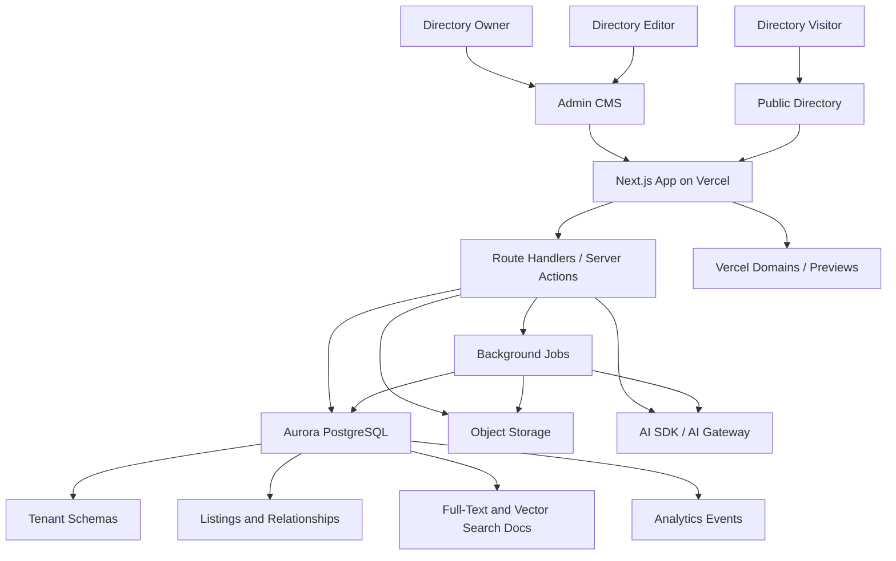

# DirectoryCMS White-Label Platform Spec

## 1. Purpose

This document specifies the product, architecture, data model, customization system, and implementation plan for evolving the current semantic search prototype into a white-label DirectoryCMS platform.

The target product is a multi-tenant CMS for launching searchable, monetizable niche directories. Directory owners define what their listings are, how listings relate to each other, how search should work, and how the public frontend should look. The platform then renders a custom public directory, admin CMS, hybrid search experience, lead capture, analytics, and monetization controls from that configuration.

The hackathon version should optimize for a strong Vercel/v0/AWS story:

- Vercel hosts the multi-tenant app, preview deployments, public directories, and admin UI.
- v0 accelerates controlled frontend template generation, layout variants, and owner-facing design iteration.
- Aurora PostgreSQL stores tenants, dynamic listing schemas, relationships, CMS content, search documents, analytics, and semantic vectors through pgvector.
- The demo shows a directory owner creating a custom schema, customizing the frontend, publishing a branded directory, and seeing search/lead analytics.

## 2. Product Summary

### 2.1 One-Sentence Pitch

DirectoryCMS lets teams launch white-label, monetizable niche directories with custom data models, relationship-aware pages, faceted and semantic search, previews, custom domains, lead capture, and analytics.

### 2.2 Target Users

**Directory owner**

- Creates and manages a directory.
- Defines listing types and relationships.
- Configures search, filters, branding, and monetization.
- Publishes the public directory under a subdomain or custom domain.

**Directory editor**

- Imports and edits listings.
- Reviews AI-generated summaries, categories, and field mappings.
- Publishes or schedules updates.

**Directory visitor**

- Searches, filters, compares, bookmarks, and explores listings.
- Submits leads, claims listings, or follows calls to action.

**Advertiser or listed business**

- Claims a profile.
- Purchases sponsored placement.
- Receives lead and performance analytics.

**Platform operator**

- Manages tenants, billing, usage limits, template library, compliance settings, and support tools.

## 3. Scope

### 3.1 MVP Scope

The MVP must include:

- Multi-tenant directory platform.
- Tenant-specific branding and subdomain routing.
- Dynamic listing types and fields.
- Dynamic relationships between listing types.
- CSV import with AI-assisted column mapping.
- Admin listing editor.
- Public directory homepage.
- Public listing search page.
- Public listing detail page.
- Relationship-aware content blocks.
- Faceted search from tenant-defined fields.
- Full-text search.
- Semantic search with vector embeddings.
- Active filters, sorting, pagination, empty states, and loading states.
- Lead capture form.
- Basic analytics for views, searches, filter usage, leads, and outbound clicks.
- Preview/publish workflow for layout and schema changes.
- Three polished demo directory templates.

### 3.2 Post-MVP Scope

- Custom domains through Vercel for Platforms.
- Listing claim flow.
- Sponsored listings.
- Stripe billing.
- Sandboxed custom code blocks.
- Automated SEO landing page generation.
- Saved searches and alerts.
- Review system.
- Team roles and audit logs.
- API access for enterprise tenants.

### 3.3 Non-Goals

- Per-tenant arbitrary production code generation at request time.
- Rebuilding a full Webflow-like design editor.
- Relying on Algolia as the primary search engine for the hackathon build.
- Supporting every possible database schema pattern in v1.
- Building a deep no-code relational database UI before the core directory use case works.

## 4. Current Project Assessment

The current app is a Vite/React frontend for WordPress-oriented search views:

- `/site` searches website records with custom Algolia calls.
- `/plugin` searches plugin records with Algolia InstantSearch.
- `/theme` searches theme records with Algolia InstantSearch.

Useful pieces to carry forward:

- Card-grid search mental model.
- Facet/refinement UI pattern.
- Autocomplete-based plugin-stack search concept.
- Existing public search/product-directory framing.

Pieces to replace:

- Vite-only frontend architecture.
- Algolia as the central search dependency.
- Hardcoded plugin/theme/site data model.
- Separate purpose-built pages for each entity type.
- Local static autocomplete arrays.
- Incomplete site theme filtering.
- Static card imagery and inconsistent pagination.

Target migration direction:

- Move to Next.js App Router on Vercel.
- Replace hardcoded entity views with schema-driven listing pages.
- Replace direct Algolia calls with backend search APIs backed by Aurora PostgreSQL.
- Use a component registry and layout DSL to render tenant-specific frontends safely.

## 5. Design Principles

1. **Configuration over arbitrary code**
   Tenant customization should be stored as structured configuration, not runtime-generated code.

2. **Dynamic data model, stable platform model**
   Tenants can define fields and relationships, but the core platform tables remain stable.

3. **Preview before publish**
   Schema, layout, branding, search, and page changes must support draft and published versions.

4. **Relationship-aware UX**
   The frontend should expose relationships visually and operationally, not just as foreign keys.

5. **Search is a product feature**
   Search should combine text, facets, vectors, ranking, explanation, analytics, and monetization.

6. **v0 generates templates, not unbounded runtime behavior**
   v0 should accelerate creation of vetted component variants, template packs, and copy/layout iterations.

7. **One engine, many verticals**
   AI tools, local services, software stacks, vendor marketplaces, job boards, portfolios, and WordPress directories should all run from the same engine.

## 6. Platform Architecture

### 6.1 Recommended Stack

**Frontend and app runtime**

- Next.js App Router.
- React Server Components for read-heavy public pages.
- Client components for search controls, admin editors, previews, and interactive visualizations.
- Tailwind CSS plus CSS variables for tenant themes.
- shadcn/ui or equivalent controlled component primitives.
- Vercel deployment with preview and production environments.

**Backend**

- Next.js route handlers for API endpoints.
- Server actions for admin mutations where appropriate.
- Background jobs for import, embeddings, analytics aggregation, and publishing.
- Queue: use a managed queue if available; for MVP, a jobs table with polling workers is acceptable.

**Database**

- Aurora PostgreSQL-compatible database.
- `pgvector` extension for embeddings and semantic search.
- PostgreSQL JSONB for dynamic listing fields.
- PostgreSQL full-text search for keyword search.
- GIN indexes for JSONB, arrays, and full-text search.
- RDS Proxy or a connection-pooling approach for serverless workloads.

**AI**

- Vercel AI SDK for server-side generation flows.
- Vercel AI Gateway for model routing, usage monitoring, budgets, and fallbacks.
- Embedding provider configurable by environment.

**Files**

- Vercel Blob, S3, or equivalent object storage for images, CSV imports, generated assets, and export files.

**Optional advanced execution**

- Vercel Sandbox for enterprise custom blocks and safe execution of untrusted or AI-generated code.

### 6.2 External Platform References

- Vercel for Platforms supports multi-tenant apps from one codebase, custom domains, wildcard subdomains, automatic SSL, REST API/SDK domain management, and preview support: https://vercel.com/docs/multi-tenant
- v0 creates real code and full-stack apps from prompts, with deploy or PR review flows: https://vercel.com/docs/v0
- Vercel AI SDK is the TypeScript toolkit for AI-powered apps: https://vercel.com/docs/ai-sdk
- Vercel AI Gateway provides unified model access, budgets, monitoring, fallbacks, and usage controls: https://vercel.com/docs/ai-gateway
- Vercel Sandbox safely runs untrusted or user-generated code in isolated environments: https://vercel.com/docs/sandbox
- Aurora PostgreSQL supports pgvector for vector storage and similarity search: https://aws.amazon.com/about-aws/whats-new/2023/07/amazon-aurora-postgresql-pgvector-vector-storage-similarity-search/
- AWS documents PostgreSQL JSON and full-text search patterns for CMS-style workloads: https://aws.amazon.com/blogs/database/postgresql-as-a-json-database-advanced-patterns-and-best-practices/
- RDS Proxy supports connection pooling and resiliency for serverless/database workloads: https://docs.aws.amazon.com/AmazonRDS/latest/AuroraUserGuide/rds-proxy.html

## 7. High-Level System Diagram



## 8. Multi-Tenant Model

### 8.1 Tenant Resolution

Resolve tenant from request host:

- `tenant-slug.directorycms.com`
- `www.tenant-domain.com`
- `preview-token.preview.directorycms.com`

Resolution sequence:

1. Read `Host` header.
2. Look up host in `tenant_domains`.
3. If no custom domain match, parse platform subdomain.
4. Load active published directory version.
5. Load theme tokens, layout configuration, schema, and search configuration.
6. Render public route from tenant config.

### 8.2 Tenant Isolation

All tenant-scoped tables must include `tenant_id`.

Application-level authorization must enforce:

- Admin users can access only tenant memberships they belong to.
- Public routes can read only published directory versions.
- Draft versions are accessible only to authenticated tenant users or signed preview URLs.

Use row-level security if feasible. If not implemented for MVP, enforce tenant scoping in all query helpers and add integration tests for cross-tenant access denial.

### 8.3 Tenant Lifecycle

Tenant states:

- `trial`
- `active`
- `past_due`
- `suspended`
- `deleted`

Directory publication states:

- `draft`
- `preview`
- `published`
- `archived`

## 9. Dynamic Data Model

### 9.1 Core Concept

The database uses a hybrid model:

- Stable relational tables for tenants, listing types, field definitions, relationship definitions, listings, relationships, versions, users, leads, and analytics.
- JSONB for tenant-defined field values.
- Generated search documents for performant search.
- Optional typed indexes for common field kinds.

This avoids schema migrations for each tenant while preserving enough structure for search, validation, facets, and relationships.

### 9.2 Entity Model

**Directory**

The tenant-level public product. One tenant may own multiple directories in a later version, but MVP can assume one primary directory per tenant.

**Listing type**

A tenant-defined entity type, such as:

- Tool
- Company
- Agency
- Provider
- Venue
- Service
- Location
- Integration
- Use case
- Case study

**Field definition**

A tenant-defined field on a listing type.

Supported field kinds:

- `short_text`
- `long_text`
- `rich_text`
- `number`
- `currency`
- `boolean`
- `date`
- `url`
- `email`
- `phone`
- `image`
- `gallery`
- `single_select`
- `multi_select`
- `rating`
- `location`
- `json`

**Listing**

A record of a listing type. Dynamic values live in `data`.

**Relationship definition**

A tenant-defined relationship between listing types.

Examples:

- Tool integrates with Tool
- Agency uses Tool
- Venue recommends Vendor
- Doctor works at Clinic
- Company belongs to Category
- Product has Alternative
- Service available in Location

**Relationship instance**

A concrete edge between two listings.

### 9.3 Relationship Kinds

Supported relationship cardinality:

- `one_to_one`
- `one_to_many`
- `many_to_one`
- `many_to_many`

Supported relationship semantics:

- `uses`
- `integrates_with`
- `alternative_to`
- `belongs_to`
- `located_in`
- `works_at`
- `recommended_by`
- `part_of`
- `compatible_with`
- `near`
- `parent_child`
- `custom`

Relationships must support:

- Directional labels.
- Reverse labels.
- Relationship metadata in JSONB.
- Weight or confidence.
- Manual or AI-generated provenance.
- Published/draft status.

### 9.4 Example Schema

```sql
create table tenants (
  id uuid primary key default gen_random_uuid(),
  slug text not null unique,
  name text not null,
  status text not null default 'trial',
  created_at timestamptz not null default now(),
  updated_at timestamptz not null default now()
);

create table tenant_domains (
  id uuid primary key default gen_random_uuid(),
  tenant_id uuid not null references tenants(id),
  hostname text not null unique,
  domain_type text not null check (domain_type in ('platform_subdomain', 'custom_domain', 'preview')),
  vercel_project_id text,
  vercel_domain_id text,
  verified_at timestamptz,
  created_at timestamptz not null default now()
);

create table listing_types (
  id uuid primary key default gen_random_uuid(),
  tenant_id uuid not null references tenants(id),
  api_name text not null,
  display_name text not null,
  plural_display_name text not null,
  icon text,
  description text,
  status text not null default 'active',
  created_at timestamptz not null default now(),
  unique (tenant_id, api_name)
);

create table field_definitions (
  id uuid primary key default gen_random_uuid(),
  tenant_id uuid not null references tenants(id),
  listing_type_id uuid not null references listing_types(id),
  api_name text not null,
  display_name text not null,
  field_kind text not null,
  required boolean not null default false,
  searchable boolean not null default false,
  facetable boolean not null default false,
  sortable boolean not null default false,
  filter_operator text,
  options jsonb not null default '[]',
  validation jsonb not null default '{}',
  ui_config jsonb not null default '{}',
  position integer not null default 0,
  created_at timestamptz not null default now(),
  unique (tenant_id, listing_type_id, api_name)
);

create table listings (
  id uuid primary key default gen_random_uuid(),
  tenant_id uuid not null references tenants(id),
  listing_type_id uuid not null references listing_types(id),
  slug text not null,
  title text not null,
  summary text,
  data jsonb not null default '{}',
  status text not null default 'draft',
  published_at timestamptz,
  created_at timestamptz not null default now(),
  updated_at timestamptz not null default now(),
  unique (tenant_id, listing_type_id, slug)
);

create table relationship_definitions (
  id uuid primary key default gen_random_uuid(),
  tenant_id uuid not null references tenants(id),
  api_name text not null,
  source_listing_type_id uuid not null references listing_types(id),
  target_listing_type_id uuid not null references listing_types(id),
  cardinality text not null,
  forward_label text not null,
  reverse_label text not null,
  relationship_kind text not null default 'custom',
  metadata_schema jsonb not null default '{}',
  ui_config jsonb not null default '{}',
  created_at timestamptz not null default now(),
  unique (tenant_id, api_name)
);

create table listing_relationships (
  id uuid primary key default gen_random_uuid(),
  tenant_id uuid not null references tenants(id),
  relationship_definition_id uuid not null references relationship_definitions(id),
  source_listing_id uuid not null references listings(id),
  target_listing_id uuid not null references listings(id),
  metadata jsonb not null default '{}',
  weight numeric not null default 1,
  provenance text not null default 'manual',
  status text not null default 'published',
  created_at timestamptz not null default now(),
  unique (tenant_id, relationship_definition_id, source_listing_id, target_listing_id)
);
```

### 9.5 Search Document Tables

```sql
create extension if not exists vector;

create table search_documents (
  id uuid primary key default gen_random_uuid(),
  tenant_id uuid not null references tenants(id),
  listing_id uuid not null references listings(id),
  listing_type_id uuid not null references listing_types(id),
  title text not null,
  body text not null,
  facets jsonb not null default '{}',
  sort_values jsonb not null default '{}',
  tsv tsvector,
  embedding vector(1536),
  popularity_score numeric not null default 0,
  freshness_score numeric not null default 0,
  monetization_score numeric not null default 0,
  updated_at timestamptz not null default now(),
  unique (tenant_id, listing_id)
);

create index search_documents_tenant_type_idx
  on search_documents (tenant_id, listing_type_id);

create index search_documents_tsv_idx
  on search_documents using gin (tsv);

create index search_documents_facets_idx
  on search_documents using gin (facets);

-- Vector index shape depends on selected embedding dimension and pgvector version.
-- Use HNSW or IVFFlat after loading enough production-like data.
```

Search documents are generated from:

- Listing title.
- Summary.
- Searchable dynamic fields.
- Selected relationship labels.
- Category/tag fields.
- AI-generated summary.
- Owner-defined boost fields.

## 10. Search System

### 10.1 Search Modes

Each directory can enable one or more search modes:

- Keyword search.
- Faceted search.
- Semantic search.
- Hybrid search.
- Map search.
- Comparison search.
- Relationship search.
- Guided wizard search.

### 10.2 Public Search API

Endpoint:

```http
POST /api/public/:tenantSlug/search
```

Request:

```json
{
  "listingType": "tool",
  "query": "tools for Shopify stores to automate customer support",
  "mode": "hybrid",
  "filters": [
    {
      "field": "pricing_model",
      "operator": "in",
      "value": ["freemium", "paid"]
    },
    {
      "field": "integrations",
      "operator": "contains",
      "value": "Shopify"
    }
  ],
  "relationshipFilters": [
    {
      "relationship": "integrates_with",
      "targetListingSlug": "shopify"
    }
  ],
  "sort": {
    "field": "relevance",
    "direction": "desc"
  },
  "page": 1,
  "pageSize": 20
}
```

Response:

```json
{
  "items": [
    {
      "id": "uuid",
      "slug": "gorgias",
      "title": "Gorgias",
      "summary": "Customer support automation for ecommerce brands.",
      "score": 0.91,
      "matchReasons": [
        "Matches ecommerce support intent",
        "Integrates with Shopify",
        "Tagged as customer support"
      ],
      "data": {},
      "relationships": {},
      "card": {}
    }
  ],
  "facets": [
    {
      "field": "pricing_model",
      "label": "Pricing",
      "values": [
        { "value": "freemium", "count": 12 },
        { "value": "paid", "count": 38 }
      ]
    }
  ],
  "pagination": {
    "page": 1,
    "pageSize": 20,
    "total": 94
  }
}
```

### 10.3 Ranking Formula

Hybrid ranking should combine:

- Full-text rank.
- Vector similarity.
- Exact title/name match boost.
- Facet match boost.
- Relationship match boost.
- Sponsored listing boost.
- Popularity boost.
- Freshness boost.
- Owner-defined boosts.

Example conceptual formula:

```text
final_score =
  0.45 * text_score +
  0.35 * semantic_score +
  0.08 * relationship_score +
  0.05 * popularity_score +
  0.04 * freshness_score +
  0.03 * monetization_score
```

Weights must be configurable per tenant and per search mode.

### 10.4 Search Analytics

Capture:

- Query text.
- Search mode.
- Filters used.
- Sort used.
- Result count.
- Clicked listing.
- Lead submitted after search.
- No-result searches.
- Conversion path.

Analytics table:

```sql
create table analytics_events (
  id uuid primary key default gen_random_uuid(),
  tenant_id uuid not null references tenants(id),
  session_id text,
  visitor_id text,
  event_type text not null,
  route text,
  listing_id uuid references listings(id),
  payload jsonb not null default '{}',
  occurred_at timestamptz not null default now()
);

create index analytics_events_tenant_time_idx
  on analytics_events (tenant_id, occurred_at desc);
```

## 11. Frontend Customization System

### 11.1 Core Model

The frontend is rendered from:

- Tenant theme tokens.
- Page templates.
- Layout DSL.
- Component registry.
- Field mappings.
- Relationship block mappings.
- Search configuration.
- Published directory version.

Tenants customize by editing structured config. v0 assists by generating candidate configs and internal component variants, but production rendering uses a known component registry.

### 11.2 Theme Tokens

Theme tokens:

```json
{
  "brand": {
    "name": "StackScout",
    "logoUrl": "https://...",
    "faviconUrl": "https://..."
  },
  "colors": {
    "background": "#ffffff",
    "foreground": "#111827",
    "primary": "#155EEF",
    "secondary": "#16A34A",
    "accent": "#F59E0B",
    "muted": "#F3F4F6",
    "border": "#E5E7EB"
  },
  "typography": {
    "headingFont": "Inter",
    "bodyFont": "Inter",
    "density": "comfortable"
  },
  "shape": {
    "radius": 8,
    "cardShadow": "subtle"
  },
  "layout": {
    "maxWidth": 1180,
    "navigationStyle": "topbar",
    "searchStyle": "faceted"
  }
}
```

CSS variables are generated server-side:

```css
:root {
  --dc-background: #ffffff;
  --dc-foreground: #111827;
  --dc-primary: #155EEF;
  --dc-radius: 8px;
}
```

### 11.3 Layout DSL

Page layout is a typed JSON document.

Example homepage layout:

```json
{
  "template": "directory_home",
  "version": 1,
  "sections": [
    {
      "type": "hero_search",
      "props": {
        "headline": "Find AI tools for ecommerce teams",
        "subheading": "Search by use case, integration, pricing, and company fit.",
        "searchMode": "hybrid",
        "primaryListingType": "tool"
      }
    },
    {
      "type": "featured_collections",
      "props": {
        "collectionSlugs": ["support-automation", "shopify-tools", "analytics"]
      }
    },
    {
      "type": "relationship_explorer",
      "props": {
        "sourceType": "use_case",
        "relationship": "solved_by",
        "targetType": "tool",
        "display": "tiles"
      }
    },
    {
      "type": "sponsored_listings",
      "props": {
        "placement": "homepage_featured",
        "limit": 6
      }
    }
  ]
}
```

Example listing detail layout:

```json
{
  "template": "listing_detail",
  "listingType": "tool",
  "sections": [
    {
      "type": "listing_hero",
      "props": {
        "titleField": "title",
        "subtitleField": "summary",
        "imageField": "logo",
        "ctaField": "website_url"
      }
    },
    {
      "type": "field_grid",
      "props": {
        "fields": ["pricing_model", "target_customer", "deployment", "rating"]
      }
    },
    {
      "type": "relationship_carousel",
      "props": {
        "relationship": "integrates_with",
        "title": "Integrations"
      }
    },
    {
      "type": "comparison_table",
      "props": {
        "relationship": "alternative_to",
        "fields": ["pricing_model", "rating", "support", "free_trial"]
      }
    },
    {
      "type": "lead_form",
      "props": {
        "formId": "default_tool_lead"
      }
    }
  ]
}
```

### 11.4 Component Registry

Every layout block maps to a vetted React component.

Core public components:

- `hero_search`
- `directory_nav`
- `listing_grid`
- `listing_card`
- `compact_listing_card`
- `visual_listing_card`
- `facet_sidebar`
- `active_filter_chips`
- `sort_control`
- `pagination`
- `map_results`
- `comparison_table`
- `relationship_carousel`
- `relationship_graph`
- `related_collections`
- `field_grid`
- `review_summary`
- `lead_form`
- `claim_listing_cta`
- `sponsored_listings`
- `seo_text_block`
- `faq_block`

Core admin components:

- `schema_builder`
- `field_editor`
- `relationship_builder`
- `layout_builder`
- `theme_editor`
- `import_wizard`
- `listing_editor`
- `preview_frame`
- `analytics_dashboard`
- `monetization_dashboard`

### 11.5 Field-To-UI Slot Mapping

Owners map dynamic fields into UI slots.

Example:

```json
{
  "listingType": "vendor",
  "card": {
    "title": "business_name",
    "subtitle": "short_description",
    "image": "logo",
    "badges": ["service_category", "city", "price_range"],
    "metrics": ["rating", "review_count"],
    "primaryCta": {
      "label": "Request quote",
      "action": "lead_form"
    }
  }
}
```

Validation:

- Slot field must exist on listing type.
- Slot field kind must be compatible with component requirement.
- Missing optional fields are hidden.
- Missing required fields block publish.

### 11.6 Relationship-Aware Blocks

Relationship blocks must understand:

- Source listing.
- Relationship definition.
- Direction.
- Target listing type.
- Relationship metadata.
- Display mode.

Supported display modes:

- Carousel.
- Grid.
- Compact list.
- Network graph.
- Map.
- Timeline.
- Comparison table.
- Bundle builder.
- Dependency tree.

Examples:

**Software stack directory**

- Company detail page shows "Tools used by this company".
- Tool detail page shows "Companies using this tool".
- Tool detail page shows "Alternatives".

**Local services directory**

- Venue detail page shows "Recommended vendors".
- Vendor detail page shows "Venues this vendor serves".
- Location page shows "Providers near this area".

**Medical directory**

- Doctor page shows "Works at clinics".
- Clinic page shows "Doctors at this clinic".
- Procedure page shows "Doctors offering this procedure".

## 12. v0 Integration Strategy

### 12.1 Role of v0

Use v0 to accelerate:

- Template pack creation.
- Page layout variants.
- Card component variants.
- Admin UI prototypes.
- Copy improvements.
- Design refinements.
- Generated PRs for reviewed code changes.

Do not use v0 to:

- Generate unreviewed production code per tenant.
- Let tenants execute arbitrary React components on public pages.
- Bypass schema validation or component registry constraints.

### 12.2 Owner-Facing AI Designer

The admin should expose a "Design Copilot" panel.

Owner prompts:

- "Make this look like a premium wedding vendor marketplace."
- "Use a map-first layout for local service providers."
- "Make cards compact and comparison-heavy."
- "Create a detail page that emphasizes integrations and alternatives."
- "Suggest filters based on my imported data."
- "Make the homepage feel like a curated editorial directory."

The system should convert prompts into:

- Theme token updates.
- Layout DSL changes.
- Field-slot mappings.
- Recommended template pack.
- Copy changes.
- Optional internal issue/PR for unsupported component needs.

### 12.3 Prompt-To-Config Flow

1. User submits prompt.
2. Backend loads tenant schema, sample listings, current layout, and component registry manifest.
3. AI proposes a structured config diff.
4. Validate config diff against JSON schema.
5. Render preview in admin.
6. User accepts, edits, or discards.
7. Accepted changes are saved to draft version.
8. User publishes after preview.

Example AI output:

```json
{
  "themePatch": {
    "colors": {
      "primary": "#0F766E",
      "accent": "#F97316"
    },
    "typography": {
      "density": "compact"
    }
  },
  "layoutPatch": [
    {
      "operation": "replace_section",
      "path": "homepage.sections[0]",
      "value": {
        "type": "hero_search",
        "props": {
          "headline": "Find ecommerce tools that fit your stack",
          "searchMode": "hybrid"
        }
      }
    }
  ],
  "fieldMappingPatch": {
    "card.badges": ["pricing_model", "integrations", "target_customer"]
  },
  "explanation": "The directory contains many integration and use-case fields, so this layout prioritizes stack-fit search and compact comparison cards."
}
```

### 12.4 Internal v0 Workflow

For platform developers:

1. Use v0 to generate new template variants.
2. Review generated code.
3. Normalize to the component registry API.
4. Add visual regression coverage.
5. Add the component to the registry manifest.
6. Release as a template pack option.

Registry manifest example:

```json
{
  "component": "relationship_graph",
  "version": "1.0.0",
  "category": "relationship",
  "allowedPageTypes": ["listing_detail", "relationship_explorer"],
  "requiredProps": ["relationship"],
  "optionalProps": ["display", "limit", "title"],
  "compatibleFieldKinds": [],
  "stable": true
}
```

## 13. Vercel Platform Workflows

### 13.1 Deployment Model

One Next.js application serves all tenants.

Public requests are resolved by host and route:

```text
tenant-a.directorycms.com/tools/gorgias
tenant-b.directorycms.com/vendors/modern-catering
custom-domain.com/agencies/example-agency
```

The route handler loads the tenant configuration and renders a dynamic page using the same codebase.

### 13.2 Preview Workflow

Draft changes create preview URLs:

```text
https://preview-abc123.directorycms.com
```

Preview token rules:

- Token maps to tenant and draft version.
- Token expires or can be revoked.
- Preview can require tenant authentication.
- Preview should not be indexed by search engines.

Preview should support:

- Schema changes.
- Layout changes.
- Theme changes.
- Search config changes.
- Imported data before publication.

### 13.3 Custom Domain Workflow

Post-MVP custom domain flow:

1. Tenant enters desired domain.
2. Backend calls Vercel domain API or SDK.
3. Store domain status in `tenant_domains`.
4. Show DNS verification instructions.
5. Poll or webhook domain verification state.
6. Mark domain verified.
7. Serve tenant from custom domain.

### 13.4 Edge Caching Strategy

Cache candidates:

- Published tenant config.
- Theme tokens.
- Listing detail pages.
- Collection pages.
- Static SEO pages.
- Facet metadata.

Avoid caching:

- Authenticated admin pages.
- Personalized visitor results.
- Lead forms after submission.
- Preview pages unless token-scoped.

Invalidate cache on:

- Directory publish.
- Listing publish/unpublish.
- Theme publish.
- Layout publish.
- Relationship changes affecting detail pages.

## 14. Admin CMS

### 14.1 Admin Navigation

Primary sections:

- Overview.
- Listings.
- Schema.
- Relationships.
- Search.
- Design.
- Imports.
- Leads.
- Analytics.
- Monetization.
- Settings.

### 14.2 Schema Builder

Required capabilities:

- Create listing type.
- Add/edit/reorder fields.
- Configure field validation.
- Configure searchable/facetable/sortable fields.
- Preview resulting card/detail form.
- Publish schema version.

Field editor must show:

- Display name.
- API name.
- Field kind.
- Required flag.
- Searchable flag.
- Facetable flag.
- Sortable flag.
- Help text.
- Options for select fields.
- Validation rules.
- UI display hints.

### 14.3 Relationship Builder

Required capabilities:

- Create relationship definition.
- Choose source listing type.
- Choose target listing type.
- Choose cardinality.
- Define forward/reverse labels.
- Define relationship metadata fields.
- Choose default public display block.
- Configure whether relationship contributes to search.

Example:

```text
Tool -> integrates with -> Tool
Reverse: integrated by
Cardinality: many_to_many
Display: carousel on detail page
Search boost: enabled
```

### 14.4 Listing Editor

Required capabilities:

- Create/edit listings.
- Validate dynamic fields from schema.
- Manage media.
- Manage relationships.
- Preview detail page.
- Save as draft.
- Publish.
- Archive.
- AI-generate summary.
- AI-suggest categories/tags.
- AI-detect duplicates.

### 14.5 Import Wizard

CSV import flow:

1. Upload CSV.
2. Select target listing type or create new type.
3. AI suggests field mappings.
4. User confirms field mappings.
5. User chooses create/update behavior.
6. Import preview shows validation issues.
7. Run import job.
8. AI suggests categories, summaries, and relationships.
9. User reviews changes.
10. Publish imported listings.

Supported import options:

- Create new records.
- Update existing records by slug, URL, or external ID.
- Skip duplicates.
- Archive missing records.

### 14.6 Design Builder

Tabs:

- Theme.
- Homepage.
- Search page.
- Listing cards.
- Listing detail pages.
- Relationship blocks.
- SEO.
- Advanced.

Capabilities:

- Select template pack.
- Edit theme tokens.
- Map fields to slots.
- Reorder page sections.
- Configure block props.
- Use Design Copilot prompt.
- Preview desktop/mobile.
- Save draft.
- Publish.

### 14.7 Search Builder

Capabilities:

- Choose search mode.
- Select searchable fields.
- Select facets.
- Configure facet order.
- Configure sorting options.
- Configure ranking weights.
- Enable semantic search.
- Configure relationship search.
- Configure "no results" suggestions.
- Preview search queries.

### 14.8 Analytics Dashboard

Metrics:

- Directory visits.
- Listing views.
- Searches.
- No-result searches.
- Top filters.
- Top listings.
- Leads.
- Outbound clicks.
- Sponsored listing impressions.
- Conversion rate by search query.
- Conversion rate by listing.

## 15. Public Directory UX

### 15.1 Homepage

Must support:

- Brand identity.
- Hero search.
- Featured categories.
- Featured listings.
- Relationship-based explorations.
- Sponsored slots.
- SEO content.
- Recent or trending listings.

### 15.2 Search Page

Must support:

- Query input.
- Facet sidebar or top filter bar.
- Active filter chips.
- Sorting.
- Result count.
- Hybrid search explanation.
- Listing cards.
- Pagination or infinite loading.
- Empty state with suggested filters and queries.
- Sponsored listings clearly labeled.
- Mobile filter drawer.

### 15.3 Listing Detail Page

Must support:

- Hero section.
- Key fields.
- Description.
- Dynamic field sections.
- Relationship blocks.
- Comparison/alternative blocks.
- Lead form or external CTA.
- Claim listing CTA.
- Related listings.
- SEO metadata.

### 15.4 Relationship Explorer

Optional but high-impact for demo.

Views:

- Graph.
- Table.
- Bundles.
- Map.
- Timeline.

Example queries:

- "Show tools used by companies like mine."
- "Show agencies that use Shopify and Klaviyo."
- "Show venues with recommended photographers."
- "Show doctors at clinics near Berlin."

## 16. AI Features

### 16.1 Admin AI Features

- CSV column mapping.
- Field type inference.
- Category/tag suggestions.
- Listing summaries.
- Duplicate detection.
- Relationship suggestions.
- SEO title/description generation.
- Template recommendations based on data shape.
- Design Copilot.
- Search facet recommendations.

### 16.2 Public AI Features

- Semantic search.
- "Why this result matched" explanations.
- Ask-the-directory answer mode.
- Guided search wizard.
- Natural language filter extraction.

### 16.3 AI Guardrails

- AI output must be reviewed for admin mutations unless confidence threshold is high and tenant permits auto-apply.
- AI layout changes must validate against layout schema.
- AI field mappings must validate against field definitions.
- Public answer mode must cite listings used as evidence.
- Do not invent listing data.
- Log AI usage per tenant for billing and abuse monitoring.

## 17. Monetization

### 17.1 Tenant Subscription

Plans:

- Free: one directory, platform subdomain, limited listings.
- Pro: more listings, custom domain, AI import, analytics.
- Business: sponsored listings, claim flow, team roles, API.
- Enterprise: custom templates, sandboxed custom blocks, SSO, audit logs.

### 17.2 Directory Monetization

Features:

- Sponsored listing placements.
- Claim listing.
- Lead capture.
- Paid category sponsorships.
- Featured collections.
- Premium profile upgrades.
- Affiliate links.
- Exportable lead reports.

### 17.3 Sponsored Ranking

Sponsored results must:

- Be labeled.
- Respect tenant-defined placement rules.
- Not fully override relevance.
- Be tracked for impressions and clicks.

## 18. API Surface

### 18.1 Admin APIs

```http
GET /api/admin/tenant
PATCH /api/admin/tenant

GET /api/admin/schema/listing-types
POST /api/admin/schema/listing-types
PATCH /api/admin/schema/listing-types/:id

GET /api/admin/schema/field-definitions
POST /api/admin/schema/field-definitions
PATCH /api/admin/schema/field-definitions/:id
DELETE /api/admin/schema/field-definitions/:id

GET /api/admin/schema/relationship-definitions
POST /api/admin/schema/relationship-definitions
PATCH /api/admin/schema/relationship-definitions/:id

GET /api/admin/listings
POST /api/admin/listings
GET /api/admin/listings/:id
PATCH /api/admin/listings/:id
POST /api/admin/listings/:id/publish
POST /api/admin/listings/:id/archive

POST /api/admin/imports
GET /api/admin/imports/:id
POST /api/admin/imports/:id/run

GET /api/admin/design
PATCH /api/admin/design/draft
POST /api/admin/design/preview
POST /api/admin/design/publish

POST /api/admin/ai/design-copilot
POST /api/admin/ai/suggest-schema
POST /api/admin/ai/map-import-columns
POST /api/admin/ai/suggest-relationships

GET /api/admin/analytics
GET /api/admin/leads
GET /api/admin/monetization
```

### 18.2 Public APIs

```http
GET /api/public/:tenantSlug/config
POST /api/public/:tenantSlug/search
GET /api/public/:tenantSlug/listings/:listingType/:slug
POST /api/public/:tenantSlug/leads
POST /api/public/:tenantSlug/events
```

## 19. Versioning And Publishing

### 19.1 Directory Versions

Store draft and published versions:

```sql
create table directory_versions (
  id uuid primary key default gen_random_uuid(),
  tenant_id uuid not null references tenants(id),
  version_number integer not null,
  status text not null check (status in ('draft', 'preview', 'published', 'archived')),
  schema_snapshot jsonb not null,
  layout_snapshot jsonb not null,
  theme_snapshot jsonb not null,
  search_snapshot jsonb not null,
  published_at timestamptz,
  created_at timestamptz not null default now(),
  unique (tenant_id, version_number)
);
```

Publishing rules:

- Validate schema references.
- Validate layout component names and props.
- Validate field-slot mappings.
- Validate search facets and sorts.
- Generate search documents for changed listings.
- Invalidate tenant cache.
- Promote draft to published.
- Keep previous published version for rollback.

### 19.2 Rollback

Owner can roll back to a prior published version.

Rollback affects:

- Theme.
- Layout.
- Search config.
- Schema config.

Rollback should not delete listing data. If a field no longer appears in rolled-back schema, data remains stored but hidden.

## 20. Security And Compliance

### 20.1 Authentication

Recommended:

- Auth.js, Clerk, or equivalent.
- Email/password and OAuth for MVP.
- Tenant membership table.
- Role-based authorization.

Roles:

- `owner`
- `admin`
- `editor`
- `analyst`
- `viewer`

### 20.2 Authorization

Every admin mutation must check:

- Authenticated user.
- Tenant membership.
- Required role.
- Tenant status.
- Plan limits.

### 20.3 Public Abuse Controls

- Rate limit search.
- Rate limit lead forms.
- CAPTCHA or managed challenge for suspicious lead form activity.
- Blocklist spam domains.
- Validate URLs and uploaded files.

### 20.4 Customization Safety

- Layout DSL must be schema-validated.
- Component props must be sanitized.
- Rich text must be sanitized.
- CSS customization limited to tokens and approved custom CSS scope.
- Custom blocks only in sandboxed enterprise workflow.

## 21. Performance

### 21.1 Public Pages

Targets:

- Search response under 500ms p95 for typical directories.
- Listing detail page under 2s LCP on production data.
- Cached public pages served at edge where possible.
- Search should degrade gracefully if semantic search is slow.

### 21.2 Database

Indexes:

- Tenant-scoped B-tree indexes on core tables.
- GIN index for JSONB facets.
- GIN index for full-text tsvector.
- Vector index for embeddings after data load.
- Composite indexes for common relationship traversal.

Avoid:

- Full table scans across tenants.
- Querying dynamic JSONB fields without planned indexes for faceted fields.
- Generating embeddings synchronously in request path.

### 21.3 Search Document Refresh

Refresh search documents when:

- Listing title/data changes.
- Searchable field definitions change.
- Relationship definitions included in search change.
- Relationship instances change.
- AI summaries change.

Use async jobs:

- `search_document_rebuild`
- `embedding_generate`
- `facet_recount`
- `analytics_rollup`

## 22. Observability

Track:

- API latency.
- Search latency by tenant.
- Search query volume.
- No-result query rate.
- Embedding job failures.
- Import job failures.
- Domain resolution failures.
- Preview publish failures.
- AI token usage by tenant.
- Database connection pressure.

Admin-visible health:

- Last import status.
- Search index freshness.
- Published version.
- Domain verification status.
- AI usage.

## 23. Demo Vertical Templates

### 23.1 AI Tools Directory

Listing types:

- Tool.
- Use case.
- Integration.
- Company.
- Category.

Relationships:

- Tool solves Use case.
- Tool integrates with Integration.
- Company uses Tool.
- Tool alternative to Tool.

Frontend:

- Hybrid search hero.
- Compact comparison cards.
- Integration filters.
- Use-case collections.
- Alternatives table on detail page.

Demo query:

```text
tools that help Shopify stores automate customer support
```

### 23.2 Local Services Directory

Listing types:

- Provider.
- Service.
- Location.
- Review.
- Package.

Relationships:

- Provider offers Service.
- Provider serves Location.
- Provider has Review.
- Provider offers Package.

Frontend:

- Map-first search.
- Location facets.
- Review/rating cards.
- Lead form CTA.
- Nearby providers block.

Demo query:

```text
wedding photographers near Austin under $3000
```

### 23.3 Software Stack Directory

Listing types:

- Company.
- Tool.
- Category.
- Stack.
- Integration.

Relationships:

- Company uses Tool.
- Tool belongs to Category.
- Tool integrates with Tool.
- Stack contains Tool.

Frontend:

- Relationship graph.
- Stack cards.
- Company detail shows tools used.
- Tool detail shows companies using it.
- Bundle builder.

Demo query:

```text
companies like mine using HubSpot with Shopify
```

## 24. Hackathon Demo Flow

The demo should be under three minutes.

1. Start in the admin dashboard with a blank directory.
2. Create "AI Tools for Ecommerce Teams".
3. Upload CSV with 50 tools.
4. AI maps fields and suggests categories.
5. Owner confirms schema and import.
6. Owner defines relationships: tools integrate with platforms and solve use cases.
7. Design Copilot prompt: "Make this a compact comparison directory for ecommerce operators."
8. Preview updates instantly.
9. Publish directory to tenant subdomain.
10. Public user searches "tools that help Shopify stores automate support".
11. Results show semantic matches, facets, match reasons, and integration filters.
12. User opens listing, sees alternatives and integrations, submits lead.
13. Admin analytics show search, listing view, outbound click, and lead.
14. Close with architecture: Vercel, Next.js, v0-assisted templates, Aurora PostgreSQL, pgvector, JSONB schema, AI Gateway.

## 25. Implementation Phases

### Phase 0: Migration Foundation

Goal: create clean Next.js foundation.

Tasks:

- Scaffold Next.js app.
- Set up TypeScript, linting, formatting, testing.
- Configure environment variables.
- Add database client.
- Add auth provider.
- Add tenant resolution middleware.
- Add base theme token system.
- Add public/admin route groups.

Acceptance:

- App runs locally.
- One seeded tenant renders a public homepage.
- Admin shell requires auth.
- Tenant is resolved from subdomain-like host in local dev.

### Phase 1: Dynamic Schema And Listings

Goal: owners can model and manage directory data.

Tasks:

- Create database migrations for tenants, users, listing types, fields, listings, relationship definitions, relationships.
- Build schema builder.
- Build listing editor.
- Build relationship builder.
- Add validation layer.
- Seed AI Tools demo schema.

Acceptance:

- Owner can create listing type.
- Owner can add fields.
- Owner can create listing records.
- Owner can create relationship definitions.
- Owner can connect listings.
- Public detail page can render dynamic fields.

### Phase 2: Search Engine

Goal: keyword, facets, semantic, and relationship search.

Tasks:

- Build search document generator.
- Add full-text search.
- Add JSONB facet filters.
- Add embedding generation job.
- Add vector search.
- Add hybrid ranking.
- Add public search API.
- Add search analytics event capture.

Acceptance:

- Public search returns relevant listings.
- Facets are generated from schema config.
- Semantic query returns intent-matched records.
- Search events are captured.
- No-result searches are logged.

### Phase 3: Customization Engine

Goal: schema-driven frontend customization.

Tasks:

- Implement component registry.
- Implement layout DSL validator.
- Implement theme token editor.
- Implement field-slot mapping.
- Implement public dynamic page renderer.
- Implement preview and publish version tables.
- Add three template packs.

Acceptance:

- Owner can change theme tokens.
- Owner can change card layout.
- Owner can reorder homepage sections.
- Owner can preview draft.
- Publish promotes draft to public view.
- Invalid layouts cannot publish.

### Phase 4: AI And v0-Assisted Workflows

Goal: AI improves setup and customization.

Tasks:

- Add AI SDK/Gateway integration.
- Build CSV import wizard.
- Add AI field mapping.
- Add AI summary/category suggestions.
- Add Design Copilot prompt-to-config.
- Add template recommendation from schema shape.
- Add "why this result matched" generation.

Acceptance:

- Import wizard maps CSV columns correctly.
- Design prompt creates validated config diff.
- Owner can accept/reject AI suggestions.
- Public semantic result includes match reasons.

### Phase 5: Monetization And Analytics

Goal: demonstrate B2B business model.

Tasks:

- Add lead capture forms.
- Add lead dashboard.
- Add outbound click tracking.
- Add sponsored placement config.
- Add analytics dashboard.
- Add simple plan limits.

Acceptance:

- Visitor can submit lead.
- Lead appears in admin.
- Search-to-lead funnel is visible.
- Sponsored listings render with labels.
- Plan limits are enforced for MVP dimensions.

### Phase 6: Vercel Platform Polish

Goal: strengthen hackathon platform story.

Tasks:

- Add preview URL flow.
- Add custom domain data model and mocked status if full API integration is out of scope.
- Add production deployment docs.
- Add architecture page or modal.
- Add sample screenshots or demo seed flow.

Acceptance:

- Demo can show preview/publish.
- Demo can show tenant subdomain.
- Submission can include proof of Vercel deployment and AWS database usage.

## 26. Testing Plan

### 26.1 Unit Tests

- Layout DSL validation.
- Field validation.
- Relationship cardinality validation.
- Search filter builder.
- Ranking score calculation.
- Tenant resolution.
- Permission checks.

### 26.2 Integration Tests

- Create tenant -> create schema -> create listing -> publish -> public render.
- Import CSV -> map columns -> create listings -> search.
- Create relationship -> render relationship block.
- Search query -> facet filters -> pagination.
- Draft design -> preview -> publish -> rollback.
- Cross-tenant access denial.

### 26.3 E2E Tests

- Admin creates AI tools directory.
- Visitor searches and submits lead.
- Owner views analytics.
- Design Copilot changes layout and publishes.

### 26.4 Visual Tests

- Homepage template packs.
- Search pages at desktop/mobile.
- Listing cards with long text.
- Detail pages with missing optional fields.
- Empty states.

## 27. Risks And Mitigations

### 27.1 Dynamic Schema Complexity

Risk:

- Dynamic fields can become hard to query and validate.

Mitigation:

- Keep stable platform tables.
- Use JSONB only for tenant-defined values.
- Materialize search documents.
- Add generated indexes for facetable fields later.

### 27.2 Runtime Customization Risk

Risk:

- Tenant customization can break pages.

Mitigation:

- Use layout DSL, component registry, JSON schema validation, preview, and rollback.

### 27.3 Search Performance

Risk:

- Hybrid search across JSONB, full-text, vectors, and relationships can be slow.

Mitigation:

- Search documents.
- Tenant-scoped indexes.
- Async embedding generation.
- Query limits.
- Cache facet metadata.
- Start with clear MVP scale assumptions.

### 27.4 AI Overreach

Risk:

- AI-generated content or layouts may be wrong.

Mitigation:

- Review-before-apply for admin mutations.
- Schema validation.
- Explain suggestions.
- Preserve rollback.
- Cite source listings in public answers.

### 27.5 Hackathon Scope

Risk:

- Building all features fully is too large.

Mitigation:

- Implement one polished vertical end to end.
- Stub or simplify custom domains and billing if needed.
- Prioritize dynamic schema, hybrid search, preview customization, and analytics.

## 28. MVP Acceptance Criteria

The MVP is ready for hackathon submission when:

- A user can create or use a seeded tenant.
- The tenant has dynamic listing types and fields.
- The tenant has dynamic relationships.
- The admin can import listing data.
- The admin can customize theme and layout.
- The admin can preview and publish.
- Public visitors can search with text, semantic intent, facets, and relationship filters.
- Public visitors can view listing details with relationship blocks.
- Public visitors can submit leads.
- Admin can view analytics.
- The app is deployed on Vercel.
- The database is Aurora PostgreSQL.
- The implementation visibly uses pgvector or can demonstrate vector search queries.
- The demo includes a clear business model.

## 29. Open Decisions

1. Auth provider: Auth.js, Clerk, or custom.
2. ORM/query layer: Drizzle, Prisma, Kysely, or direct SQL.
3. Background job runner: Vercel cron plus jobs table, external queue, or AWS-native queue.
4. Embedding provider and vector dimension.
5. Object storage: Vercel Blob or S3.
6. Custom domains in MVP: live Vercel API integration or credible mocked admin flow.
7. Whether to include Vercel Sandbox in hackathon demo or reserve for enterprise roadmap.
8. Billing provider and whether Stripe is included in MVP.

## 30. Recommended MVP Build Order

Build in this order:

1. Next.js app shell and seeded tenant.
2. Aurora schema and seed data.
3. Public directory pages from static config.
4. Dynamic listing schema and listing rendering.
5. Search document generation.
6. Keyword/facet search.
7. Semantic search.
8. Relationship blocks.
9. Theme/layout config.
10. Preview/publish.
11. CSV import with AI mapping.
12. Design Copilot prompt-to-config.
13. Lead capture.
14. Analytics.
15. Demo polish.

The first presentable milestone should be one seeded AI tools directory with hybrid search and relationship-aware detail pages. After that, make customization visible in the admin.

## 31. Submission Positioning

Position this as a B2B monetizable platform:

```text
DirectoryCMS turns dynamic data models into branded, searchable directory businesses.
Owners define their listing schema and relationships, then the platform generates a custom public directory with hybrid search, relationship-aware pages, previews, leads, analytics, and monetization.
```

The demo should make three things obvious:

- This is not just a search UI; it is a CMS-backed platform.
- This is not just a CMS; the data model drives search and frontend behavior.
- This is not just AI decoration; AI accelerates setup, customization, and search relevance.

