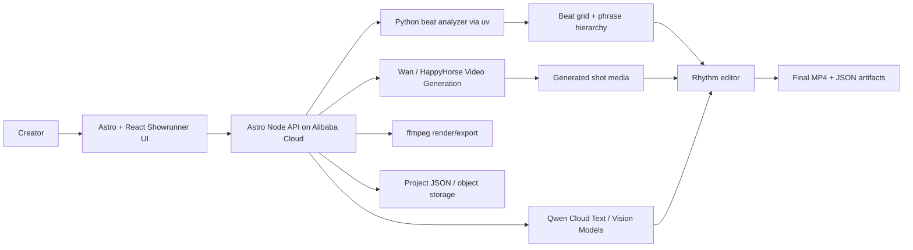

# Qwen Showrunner Hackathon Plan

Last updated: June 24, 2026

## 1. Executive Summary

Adapt this repository into **Bachata Showrunner**, a Qwen Cloud powered agent
that writes, directs, generates, critiques, and beat-edits short dance dramas.

The current project is a bachata clip slicer and annotator. Its strongest
technical asset is not the annotation UI; it is the temporal media pipeline:

- YouTube/video ingest
- WAV extraction
- beat, BPM, downbeat, and energy analysis
- 8-, 16-, and 32-count phrase construction
- clip generation and extraction with ffmpeg
- review, trim, merge, split, persistence, and export

For the Qwen Cloud AI Showrunner category, the product should become an
agentic short-drama production system:

> Given a story premise and music/video reference, Bachata Showrunner uses Qwen
> to plan a short dance-drama, generate storyboard shots, call Wan/HappyHorse
> video generation, critique continuity and rhythm, align shots to musical
> phrases, and export a final short video.

The core winning angle is **rhythm-aware AI showrunning**. Many submissions will
generate short videos. This one should demonstrate that the agent understands
story structure and musical timing, then edits to beat-aligned phrase
boundaries using the repo's existing analysis pipeline.

## 2. Verified Hackathon Facts

Source: <https://qwencloud-hackathon.devpost.com/>

- Event: Global AI Hackathon Series with Qwen Cloud.
- Deadline: July 9, 2026 at 2:00pm PDT.
- Theme: Build production-ready agents using Qwen Cloud.
- Required model usage: Build a project using Qwen models available on Qwen
  Cloud and submit into at least one track.
- Target track: Track 2, **AI Showrunner**.
- AI Showrunner track brief: Use video generation capabilities such as Wan or
  HappyHorse to build an agent that autonomously handles the short drama
  creation pipeline from scriptwriting and storyboarding to video generation
  and editing.
- Submission requirements:
  - public open-source code repository
  - open-source license visible at the repository top level
  - proof of Alibaba Cloud deployment
  - code file demonstrating use of Alibaba Cloud services and APIs
  - architecture diagram
  - public 3-minute demo video
  - text description of features and functionality
  - track identification
- Judging criteria:
  - Technical Depth and Engineering: 30%
  - Innovation and AI Creativity: 30%
  - Problem Value and Impact: 25%
  - Presentation and Documentation: 15%

Source: <https://qwencloud-hackathon.devpost.com/resources>

- Qwen Cloud API base URL:
  `https://dashscope-intl.aliyuncs.com/compatible-mode/v1`
- The API is OpenAI-compatible and can be called from Node.js, Python, or curl
  using OpenAI SDK style clients.

Source: <https://www.alibabacloud.com/help/en/model-studio/models>

- Alibaba Cloud Model Studio includes Qwen text and multimodal models.
- The model catalog includes video generation through Wan, including
  text-to-video, image-to-video, and video-to-video style workflows.

## 3. Product Positioning

### Product Name

**Bachata Showrunner**

### One-Line Pitch

A Qwen-powered AI showrunner that turns a short premise and song into a
beat-synchronized dance-drama, handling scriptwriting, storyboard planning,
video generation, critique, rhythm-aware editing, and export.

### Expanded Pitch

Most AI video demos treat each generated shot as a standalone prompt. Bachata
Showrunner treats a short video as a production pipeline. Qwen agents act as a
writers' room, director, prompt engineer, continuity critic, and rhythm editor.
The existing analyzer detects the musical beat grid, builds phrase boundaries,
and gives the editor agent a real temporal structure for deciding where cuts
should land.

### Why This Is a Better Hackathon Fit Than the Current App

The current repository is framed as an annotation and clip-review tool. That is
useful engineering, but it does not directly satisfy the AI Showrunner category.
The category asks for an autonomous creative pipeline: scriptwriting,
storyboarding, video generation, and editing.

The pivot keeps the hard technical assets and changes the product surface:

- From: "slice and annotate bachata clips"
- To: "autonomously produce beat-aligned dance-drama shorts"

## 4. Current Repository Assets to Reuse

### Existing Strengths

The README describes a pipeline that already:

- ingests YouTube URLs
- downloads source media and WAV audio
- runs a Python `beat_this` analyzer
- detects BPM, downbeat, beat timestamps, beat frames, and energy profile
- builds bachata cycle boundaries
- generates virtual clips
- supports review, trim, merge, split, and export

Relevant code:

- `src/pages/index.astro`
  - UI-driven ingest flow.
  - Currently chains ingest, analysis, and clip generation after a download
    completes.
- `src/pages/api/ingest.ts`
  - Downloads source media and extracts audio.
- `src/pages/api/analyze/[sourceId].ts`
  - Runs audio analysis and stores beat grid and cycle hierarchy.
- `src/pages/api/clips/generate.ts`
  - Generates beat-count clips and extracts preview MP4s.
- `src/services/audio-analysis-service.ts`
  - Runs `uv run python -m analyzer.analyze`.
- `src/services/cycle-builder.ts`
  - Builds 8-, 16-, and 32-count cycle/phrase structures.
- `src/services/clip-manager.ts`
  - Creates, merges, splits, and manages virtual clip definitions.
- `src/services/clip-extraction-service.ts`
  - Uses ffmpeg to extract clips with handles for later trimming.
- `src/services/export-service.ts`
  - Uses ffmpeg for final clip exports and sidecar metadata.
- `src/services/app-state.ts`
  - Holds shared project state and restores persisted runtime state.

### Technical Differentiator

The project can prove that the showrunner is not just prompting a video model.
It has deterministic media analysis and edit decisions:

- phrase-aware cuts
- generated shot durations constrained by beat counts
- agent decisions stored as structured data
- repeatable exports from an edit decision list
- human override for prompt, shot, and cut changes

## 5. MVP Definition

The MVP should support one highly polished vertical story:

> A 30-60 second bachata micro-drama generated from a premise, where each shot
> is planned by Qwen, generated through Wan/HappyHorse, critiqued by Qwen, and
> assembled on beat-aligned phrase boundaries.

### MVP User Workflow

1. User opens `/showrunner`.
2. User enters:
   - story premise
   - desired duration
   - tone
   - character count
   - dance style
   - optional YouTube/music reference
   - target beat phrase size: 8, 16, or 32 counts
3. The app creates a new show project.
4. Qwen generates a structured script plan.
5. Qwen generates a storyboard shot list.
6. Qwen generates Wan/HappyHorse prompts per shot.
7. Video generation jobs are submitted.
8. The app tracks generation status.
9. Generated clips are imported into the local media timeline.
10. Beat analysis builds a phrase grid from the music/reference.
11. Qwen creates an edit decision list constrained to phrase boundaries.
12. Qwen critic reviews:
    - narrative continuity
    - character consistency
    - shot variety
    - dance timing
    - prompt quality
    - cut rhythm
13. User can regenerate or accept each shot.
14. The app renders a final MP4.
15. The app exports:
    - final video
    - script JSON
    - storyboard JSON
    - generation prompt log
    - critique report
    - edit decision list

### MVP Non-Goals

Do not build these for the hackathon:

- multi-user collaboration
- a general-purpose video editor
- payments or accounts
- real-time collaboration
- a large prompt-template marketplace
- many dance styles
- many genres
- full multi-tenant production infrastructure
- automatic legal clearance of external media
- a general video dataset annotation platform

## 6. Agent Architecture

The showrunner should be implemented as a small multi-agent workflow, even if
each agent is a function calling the same Qwen model. This makes the system
easy to explain in the demo and scores better on agentic depth.

### Agent 1: Producer

Input:

- user premise
- target duration
- tone
- available media/music constraints
- estimated token/cost budget

Output:

- production brief
- success criteria
- constraints
- intended runtime
- model/tool choices

Responsibilities:

- keep the project scoped
- choose a shot count
- set duration per scene
- define narrative goal
- define visual style
- pass constraints to downstream agents

### Agent 2: Writer

Input:

- production brief
- user premise

Output:

- logline
- 3-act micro-script
- scene beats
- emotional arc
- optional dialogue or captions

Responsibilities:

- create a short-drama structure
- keep the story legible without requiring long exposition
- create moments that can be expressed visually through dance

### Agent 3: Storyboard Director

Input:

- script plan
- production brief
- phrase duration estimates

Output:

- shot list
- camera angles
- shot durations
- composition notes
- dance/choreography intent
- continuity dependencies

Responsibilities:

- convert story into visual shots
- map shots to beat phrases
- keep variety across wide, medium, close-up, and motion shots

### Agent 4: Prompt Engineer

Input:

- storyboard shot
- style bible
- character bible
- video model capability profile

Output:

- text-to-video prompt
- negative prompt
- duration
- aspect ratio
- seed preference if supported
- reference image/video inputs if available

Responsibilities:

- produce model-ready prompts
- keep character and style wording consistent
- avoid overlong prompts
- adapt prompt structure to Wan/HappyHorse capability

### Agent 5: Video Generation Runner

Input:

- generation prompt package

Output:

- generation job record
- status
- resulting media URL/path
- error messages

Responsibilities:

- submit async video generation jobs
- poll job state
- retry failed jobs where appropriate
- store outputs
- expose generation proof in project logs

### Agent 6: Rhythm Editor

Input:

- generated shot media
- music/reference beat grid
- storyboard duration constraints
- cycle hierarchy

Output:

- edit decision list
- cut points
- shot order
- phrase assignment
- trimming instructions

Responsibilities:

- align shot boundaries to beat and phrase structure
- prefer cuts on 8/16-count boundaries
- preserve story order
- avoid awkward shot lengths
- use deterministic beat data from the existing analyzer

### Agent 7: Continuity Critic

Input:

- script
- storyboard
- generated shot metadata
- edit decision list
- optional frame thumbnails

Output:

- critique report
- pass/fail per shot
- regeneration recommendations
- edit recommendations

Responsibilities:

- detect continuity drift
- identify unclear shots
- detect mismatch between script and generated output
- propose prompt changes
- explain why the final edit is acceptable

## 7. Data Model

Add a new type file:

```text
src/types/showrunner.ts
```

Recommended TypeScript model:

```ts
export interface ShowProject {
  id: string;
  title: string;
  createdAt: string;
  updatedAt: string;
  status: ShowProjectStatus;
  userBrief: UserBrief;
  productionBrief?: ProductionBrief;
  scriptPlan?: ScriptPlan;
  storyboard?: StoryboardShot[];
  generationJobs?: GenerationJob[];
  beatPlan?: BeatPlan;
  editDecisionList?: EditDecision[];
  critique?: CritiqueReport;
  exports?: ShowExport[];
}

export type ShowProjectStatus =
  | 'draft'
  | 'planning'
  | 'storyboarded'
  | 'generating'
  | 'generated'
  | 'editing'
  | 'critiqued'
  | 'exported'
  | 'failed';

export interface UserBrief {
  premise: string;
  tone: string;
  targetDurationSeconds: number;
  danceStyle: 'bachata';
  phraseSize: 8 | 16 | 32;
  aspectRatio: '9:16' | '16:9' | '1:1';
  musicReferenceUrl?: string;
}

export interface ProductionBrief {
  logline: string;
  visualStyle: string;
  characterBible: CharacterSpec[];
  constraints: string[];
  successCriteria: string[];
}

export interface CharacterSpec {
  id: string;
  name: string;
  visualDescription: string;
  role: string;
  continuityNotes: string[];
}

export interface ScriptPlan {
  title: string;
  logline: string;
  acts: ScriptAct[];
  captions: CaptionBeat[];
}

export interface ScriptAct {
  actNumber: 1 | 2 | 3;
  summary: string;
  beats: string[];
  targetDurationSeconds: number;
}

export interface StoryboardShot {
  id: string;
  actNumber: number;
  order: number;
  summary: string;
  camera: string;
  choreographyIntent: string;
  emotionalIntent: string;
  targetDurationSeconds: number;
  targetPhraseCount: number;
  promptPackage?: VideoPromptPackage;
}

export interface VideoPromptPackage {
  model: 'wan' | 'happyhorse';
  prompt: string;
  negativePrompt?: string;
  aspectRatio: string;
  durationSeconds: number;
  referenceMediaIds?: string[];
}

export interface GenerationJob {
  id: string;
  shotId: string;
  provider: 'qwen-cloud' | 'alibaba-model-studio';
  model: string;
  status: 'queued' | 'running' | 'succeeded' | 'failed';
  requestPayload: unknown;
  resultUrl?: string;
  localPath?: string;
  error?: string;
  startedAt?: string;
  completedAt?: string;
}

export interface BeatPlan {
  sourceId: string;
  detectedBpm: number;
  phraseSize: 8 | 16 | 32;
  phraseDurationSeconds: number;
  beatGridFrames: number[];
  cycleHierarchyId: string;
}

export interface EditDecision {
  id: string;
  shotId: string;
  sourceMediaPath: string;
  outputOrder: number;
  startFrame: number;
  endFrame: number;
  phraseStartIndex: number;
  phraseEndIndex: number;
  transition: 'cut' | 'fade' | 'match_cut';
  rationale: string;
}

export interface CritiqueReport {
  overallScore: number;
  narrativeScore: number;
  continuityScore: number;
  rhythmScore: number;
  issues: CritiqueIssue[];
  recommendations: string[];
}

export interface CritiqueIssue {
  severity: 'low' | 'medium' | 'high';
  shotId?: string;
  message: string;
  suggestedAction: 'accept' | 'trim' | 'regenerate' | 'rewrite_prompt';
}

export interface ShowExport {
  id: string;
  type: 'final_video' | 'script_json' | 'storyboard_json' | 'edl_json';
  path: string;
  createdAt: string;
}
```

## 8. Structured Qwen Outputs

All Qwen calls should return JSON validated against TypeScript schemas before
the app persists or renders them.

Do not let Qwen generate executable UI code. Qwen should generate structured
plans, prompts, critiques, and edit decisions. The app should render those with
trusted React components.

Recommended pattern:

1. Define schemas in `src/types/showrunner.ts` or `src/schemas/showrunner.ts`.
2. Call Qwen through a `qwen-client.ts` wrapper.
3. Parse JSON.
4. Validate.
5. Persist.
6. Render.

Example service boundaries:

```text
src/services/qwen-client.ts
src/services/showrunner-service.ts
src/services/video-generation-service.ts
src/services/edit-decision-service.ts
src/services/show-project-service.ts
```

### Qwen Client

Add:

```text
src/services/qwen-client.ts
```

Responsibilities:

- read `QWEN_API_KEY`
- read optional `QWEN_BASE_URL`
- default base URL to `https://dashscope-intl.aliyuncs.com/compatible-mode/v1`
- expose `generateJson<T>()`
- attach request IDs and timing information for demo logs
- avoid logging secrets

Environment variables:

```text
QWEN_API_KEY=
QWEN_BASE_URL=https://dashscope-intl.aliyuncs.com/compatible-mode/v1
QWEN_TEXT_MODEL=qwen-plus
QWEN_VISION_MODEL=qwen-vl
QWEN_VIDEO_MODEL=wan
```

The exact model names should be confirmed against the Qwen Cloud account before
submission.

## 9. Video Generation Integration

Add:

```text
src/services/video-generation-service.ts
```

Responsibilities:

- submit generation requests to Wan/HappyHorse through the chosen Qwen Cloud or
  Alibaba Cloud Model Studio API
- support async polling
- persist request payloads and job IDs
- download or register completed video outputs
- store failures in the project timeline

For hackathon risk control, implement two modes:

### Mode A: Live Generation

Used in the final demo if credits and latency allow.

- Calls Wan/HappyHorse.
- Polls status.
- Downloads generated clips.
- Passes generated clips to the edit pipeline.

### Mode B: Cached Generation

Used as backup and for reliable local demos.

- Stores generated result metadata in `showrunner-cache/`.
- Reuses previously generated clips.
- Still shows real request payloads and proof of Qwen Cloud integration.

This is not a fake mode. It is a production-friendly cache for expensive async
media jobs and a necessary safety mechanism for a timed demo.

## 10. Beat-Aware Editing

This is the core differentiator.

The existing system can identify beat frames and cycle boundaries. The
showrunner layer should use that to create an edit decision list.

### Rhythm Rules

The Rhythm Editor should prefer:

- shot starts on phrase boundaries
- shot ends on phrase boundaries
- 8-count phrases for quick moments
- 16-count phrases for normal story beats
- 32-count phrases for opening or resolution
- cuts near energy changes when the energy profile supports it

### Deterministic Constraints

The editor should not rely only on the language model. It should compute legal
cut candidates from the beat grid:

```text
legalCutFrame = beatGridFrames[phraseStartBeatIndex]
```

Then Qwen chooses among valid options and explains the rationale.

### Edit Decision List Flow

1. Load generated shots.
2. Load beat grid and cycle hierarchy.
3. Compute phrase windows.
4. Ask Qwen to assign shots to phrase windows.
5. Validate that assignments are legal.
6. If invalid, repair deterministically or ask Qwen to retry.
7. Render final sequence with ffmpeg.

## 11. UI Plan

Add a new page:

```text
src/pages/showrunner.astro
src/components/ShowrunnerApp.tsx
```

The first screen should be the working product, not a marketing page.

### Layout

Use a production-console layout:

- left column: show project list and current stage
- center: storyboard/timeline and media preview
- right column: agent outputs, prompts, critique, and controls

### Main Views

1. **Brief**
   - premise input
   - duration
   - tone
   - aspect ratio
   - phrase size
   - music/reference URL

2. **Script**
   - logline
   - 3-act structure
   - captions
   - regenerate/accept buttons

3. **Storyboard**
   - shot cards
   - target duration
   - phrase count
   - choreography intent
   - prompt preview

4. **Generation**
   - job queue
   - model name
   - status
   - result preview
   - retry/regenerate button

5. **Rhythm Edit**
   - beat grid
   - phrase blocks
   - shots snapped to phrases
   - cut rationales

6. **Critique**
   - continuity score
   - rhythm score
   - narrative score
   - issue list
   - suggested actions

7. **Export**
   - final MP4
   - JSON artifacts
   - architecture/proof links

### Demo-Visible Agent Trace

For scoring, make the agent trace visible:

- Producer: brief and constraints
- Writer: script
- Director: storyboard
- Prompt Engineer: generation prompts
- Generator: job statuses
- Rhythm Editor: phrase-aware cuts
- Critic: pass/fail report

## 12. API Routes

Recommended routes:

```text
POST /api/showrunner/projects
GET  /api/showrunner/projects
GET  /api/showrunner/projects/:id

POST /api/showrunner/projects/:id/plan
POST /api/showrunner/projects/:id/storyboard
POST /api/showrunner/projects/:id/prompts
POST /api/showrunner/projects/:id/generate
POST /api/showrunner/projects/:id/poll
POST /api/showrunner/projects/:id/edit
POST /api/showrunner/projects/:id/critique
POST /api/showrunner/projects/:id/export
```

Keep route handlers thin:

- parse request
- validate input
- call service
- return JSON

Put orchestration in `showrunner-service.ts`, not directly inside Astro route
files.

## 13. Persistence Plan

The existing project persists `project.json`, `manifest.json`, `sources/`, and
`exports/`. For the hackathon, add:

```text
showrunner-projects/
  {projectId}/
    show.json
    script.json
    storyboard.json
    prompts.json
    generation-jobs.json
    critique.json
    edl.json
    media/
      generated/
      final/
```

This is enough for a local and deployed prototype. If Alibaba Cloud storage is
available, mirror generated/final assets there and store cloud URLs in the same
JSON records.

## 14. Alibaba Cloud Deployment Proof

The hackathon requires proof that the backend is running on Alibaba Cloud and a
code file that demonstrates use of Alibaba Cloud services/APIs.

Minimum deployment proof:

- deploy the Astro Node server on Alibaba Cloud ECS or an equivalent Alibaba
  Cloud compute service
- configure environment variables for Qwen Cloud
- record a short screen capture showing:
  - Alibaba Cloud console instance
  - app URL
  - server logs receiving a showrunner request
  - Qwen API request path or code file

Repository proof files:

```text
docs/alibaba-deployment.md
docs/architecture.md
src/services/qwen-client.ts
src/services/video-generation-service.ts
```

The proof should avoid exposing API keys.

## 15. Architecture Diagram

Create `docs/architecture.md` with a Mermaid diagram:



## 16. Implementation Phases

### Phase 0: Repo Hygiene

Goal: make sure the existing app still works while adding the new track.

Tasks:

- run `npm test`
- run `uv run pytest`
- run `npm run build`
- document any failing external dependency such as ffmpeg, ffprobe, or uv
- avoid global installs; use `npm install` in repo root and `uv sync` for
  Python dependencies

### Phase 1: Showrunner Data and Persistence

Tasks:

- add `src/types/showrunner.ts`
- add `src/services/show-project-service.ts`
- create show project folders under `showrunner-projects/`
- add create/read/update helpers
- add tests for serialization round trips

Deliverable:

- project can create and reload a showrunner project without Qwen calls

### Phase 2: Qwen Structured Planning

Tasks:

- add `src/services/qwen-client.ts`
- add `src/services/showrunner-service.ts`
- implement Producer, Writer, Director, and Prompt Engineer steps
- validate generated JSON
- store every prompt and output

Deliverable:

- `/api/showrunner/projects/:id/plan` generates a structured script and
  storyboard from a user brief

### Phase 3: Showrunner UI

Tasks:

- add `/showrunner`
- build `ShowrunnerApp`
- show brief, script, storyboard, prompt packages, and agent trace
- add accept/regenerate controls

Deliverable:

- a user can run the planning pipeline from the browser

### Phase 4: Video Generation Integration

Tasks:

- add `video-generation-service.ts`
- implement live API mode
- implement cached fallback mode
- persist generation jobs
- display status in the UI

Deliverable:

- storyboard shots become generated media records

### Phase 5: Beat-Aware Edit Decisions

Tasks:

- connect generated media to existing beat analysis
- compute legal phrase windows
- ask Qwen to assign shots to windows
- validate the edit decision list
- render a preview sequence

Deliverable:

- app produces an EDL where cuts land on beat/phrase boundaries

### Phase 6: Critique and Regeneration Loop

Tasks:

- add Qwen critic prompt
- score narrative, continuity, and rhythm
- flag shots for regenerate/trim/accept
- allow user to apply one-click fixes

Deliverable:

- demo shows the agent improving its own show

### Phase 7: Export and Submission Polish

Tasks:

- render final MP4
- export JSON artifacts
- add docs
- add architecture diagram
- add deployment proof
- add license
- prepare Devpost text
- record 3-minute video

Deliverable:

- complete hackathon submission package

## 17. Testing Strategy

Focus tests on deterministic behavior and schema safety.

### Unit Tests

Add tests for:

- show project serialization
- Qwen JSON validation
- storyboard ordering
- edit decision validation
- phrase window computation
- invalid EDL rejection
- cached generation job loading

### Integration Tests

Add opt-in integration tests for:

- Qwen API call, gated by `QWEN_API_KEY`
- video generation submission, gated by a separate env var
- final export with ffmpeg

Do not make live paid API tests run by default.

### Golden Demo Test

Create a deterministic fixture:

```text
fixtures/showrunner/bachata-missed-cue/
```

Include:

- user brief
- expected script shape
- cached generated clip records
- beat grid fixture
- expected EDL validity

This allows a reliable demo even if a live generation API is slow.

## 18. Demo Script

Target: about 3 minutes.

### 0:00-0:20 - Problem

"AI video tools can generate clips, but a showrunner has to plan a story,
direct shots, keep continuity, and edit to rhythm. Bachata Showrunner does
that with Qwen Cloud."

### 0:20-0:50 - Input

Show `/showrunner`.

Prompt:

```text
A 45-second bachata micro-drama: two dancers miss their cue during a social
dance, recover on the next phrase, and turn the mistake into a playful finale.
Tone: warm, cinematic, hopeful.
```

### 0:50-1:20 - Agent Plan

Show:

- Producer constraints
- Writer script
- Director storyboard
- Prompt Engineer outputs

Narration:

"Qwen returns structured JSON, not executable UI code. Every step is validated
and stored."

### 1:20-1:50 - Video Generation

Show:

- generation jobs
- model name
- status
- generated shot previews

Narration:

"Each storyboard shot becomes a Wan/HappyHorse generation job."

### 1:50-2:20 - Rhythm Editing

Show:

- beat grid
- phrase blocks
- shots snapped to 8/16-count phrases
- EDL rationale

Narration:

"This is where the existing repository matters. The editor does not guess cut
points. It uses detected beats and phrase boundaries."

### 2:20-2:45 - Critique Loop

Show:

- continuity score
- rhythm score
- one issue
- regenerated or accepted fix

### 2:45-3:00 - Final Output and Architecture

Show:

- final MP4
- architecture diagram
- Alibaba Cloud/Qwen proof

Close:

"Bachata Showrunner is an agentic creative pipeline, not a single prompt. Qwen
plans, directs, critiques, and edits with rhythm-aware tooling."

## 19. Devpost Project Description Draft

### Short Description

Bachata Showrunner is a Qwen Cloud powered AI showrunner that turns a premise
and music reference into a beat-synchronized dance-drama, handling script,
storyboard, video generation, critique, rhythm-aware editing, and final export.

### Long Description

Bachata Showrunner demonstrates an end-to-end AI Showrunner pipeline. A user
enters a short premise and production constraints. Qwen agents generate a
production brief, micro-script, storyboard, generation prompts, continuity
critique, and edit decisions. Wan/HappyHorse style video generation produces
the shots. The app then uses a deterministic beat-analysis pipeline to detect
BPM, downbeats, beat frames, and 8/16/32-count phrase boundaries, allowing the
Rhythm Editor agent to snap cuts to musically meaningful moments.

The result is a short dance-drama where the creative planning is agentic and
the final assembly is grounded in measurable media structure.

### What Makes It Technically Interesting

- Multi-agent creative workflow on Qwen Cloud
- Structured JSON outputs validated before use
- Async video generation job orchestration
- Beat and phrase analysis from audio
- Rhythm-constrained edit decision list
- Critique and regeneration loop
- Final MP4 export plus reproducible project artifacts

### Track

Track 2: AI Showrunner

## 20. Scoring Strategy

### Technical Depth and Engineering - 30%

Show:

- Qwen client abstraction
- structured schemas
- agent trace
- async video generation orchestration
- deterministic beat-aware EDL validation
- Alibaba Cloud deployment
- tests for edit logic and schemas

### Innovation and AI Creativity - 30%

Show:

- Qwen acting as producer, writer, director, prompt engineer, critic, and editor
- short-drama story arc
- rhythm-aware dance editing
- self-critique and regeneration

### Problem Value and Impact - 25%

Position as:

- a production assistant for short-form creators
- a repeatable pipeline for music/dance content
- a framework for agentic video production with deterministic media constraints

Avoid claiming:

- fully autonomous professional filmmaking
- perfect choreography generation
- legal clearance of user-provided media

### Presentation and Documentation - 15%

Must include:

- clean README section for Bachata Showrunner
- architecture diagram
- deployment proof
- demo video
- examples of input/output artifacts
- clear setup instructions

## 21. Risk Register

### Risk: Video Generation Latency

Mitigation:

- implement cached generation mode
- pre-generate the final demo clips
- keep live generation to one short clip in the demo if latency is high

### Risk: Model Names or APIs Differ by Account

Mitigation:

- isolate all provider details in `qwen-client.ts` and
  `video-generation-service.ts`
- make model names environment variables
- document tested model names in `docs/alibaba-deployment.md`

### Risk: Final Render Fails on Deployment

Mitigation:

- keep local/cached final MP4 available
- add ffmpeg health check
- export EDL and clips even if final render fails

### Risk: Scope Creep

Mitigation:

- support only bachata
- support one primary story format
- support one target aspect ratio first, preferably 9:16
- support one polished demo project

### Risk: The App Still Looks Like an Annotator

Mitigation:

- make `/showrunner` the primary demo route
- rename visible UI text to showrunner language
- move annotation UI behind "Director Review" if used
- emphasize script, storyboard, generation, critique, and edit

## 22. Repository Changes Checklist

Core:

- [ ] Add `qwen_showrunner.md`
- [ ] Add `LICENSE`
- [ ] Add `docs/architecture.md`
- [ ] Add `docs/alibaba-deployment.md`
- [ ] Add `docs/demo-script.md`
- [ ] Add `src/types/showrunner.ts`
- [ ] Add `src/services/qwen-client.ts`
- [ ] Add `src/services/show-project-service.ts`
- [ ] Add `src/services/showrunner-service.ts`
- [ ] Add `src/services/video-generation-service.ts`
- [ ] Add `src/services/edit-decision-service.ts`
- [ ] Add `src/pages/showrunner.astro`
- [ ] Add `src/components/ShowrunnerApp.tsx`

API:

- [ ] Add `POST /api/showrunner/projects`
- [ ] Add `GET /api/showrunner/projects`
- [ ] Add `GET /api/showrunner/projects/:id`
- [ ] Add `POST /api/showrunner/projects/:id/plan`
- [ ] Add `POST /api/showrunner/projects/:id/storyboard`
- [ ] Add `POST /api/showrunner/projects/:id/prompts`
- [ ] Add `POST /api/showrunner/projects/:id/generate`
- [ ] Add `POST /api/showrunner/projects/:id/edit`
- [ ] Add `POST /api/showrunner/projects/:id/critique`
- [ ] Add `POST /api/showrunner/projects/:id/export`

Tests:

- [ ] Add show project serialization tests
- [ ] Add schema validation tests
- [ ] Add EDL validation tests
- [ ] Add phrase-window tests
- [ ] Add cached generation tests

Submission:

- [ ] Public repository
- [ ] License visible
- [ ] Alibaba Cloud deployment proof recording
- [ ] Qwen API usage code
- [ ] Architecture diagram
- [ ] 3-minute demo video
- [ ] Devpost text
- [ ] Track identified as AI Showrunner

## 23. Recommended Build Order

If time is tight, build in this order:

1. `qwen-client.ts`
2. structured script/storyboard generation
3. `/showrunner` UI
4. cached generation mode
5. beat-aware EDL
6. final export
7. live generation integration
8. critique loop
9. Alibaba Cloud deployment proof
10. docs and demo video

The minimum credible submission is not live video generation alone. It is:

- Qwen-generated script/storyboard/prompts
- visible agent trace
- generated or cached generated clips
- beat-aware edit decision list
- final MP4 export
- Alibaba Cloud/Qwen proof

## 24. Final Recommendation

Do not pitch this as a dance annotation system. Pitch it as an AI showrunner
with a rhythm-aware editing engine.

The strongest sentence for judges is:

> Bachata Showrunner uses Qwen Cloud agents to run the creative production
> pipeline, then grounds the final edit in deterministic beat and phrase
> analysis so the generated short drama cuts like dance content instead of a
> collection of disconnected AI clips.

